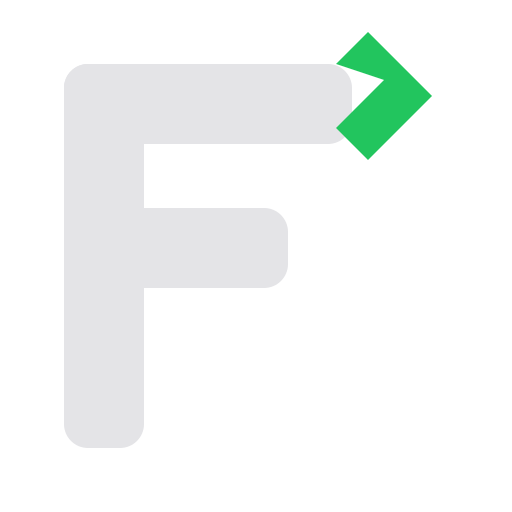

<p align="center">
  
</p>

# FlintTrade


> **Alpha v0.1.0** — Feature-complete for testing. Not ready for production trading.
> Use with sandbox/paper trading only.

Open-source modular trading platform for Indian markets, built on [OpenAlgo](https://openalgo.in). Supports 30+ brokers, equities, F&O, commodities, currency derivatives, and crypto.

## What is FlintTrade?

FlintTrade is a self-hosted trading platform that sits on top of OpenAlgo. OpenAlgo handles broker connections and order execution across 30+ Indian brokers. FlintTrade handles everything else: strategy execution, risk management, backtesting, real-time analysis, AI-powered signals, and multi-account orchestration.

The platform is organized into 13 independent packages (11 Python + 1 React + 1 Rust/PyO3). Use what you need — the option chain screener doesn't require the AI module, and the backtester doesn't require a live broker connection. Each package has its own source, tests, and documentation.

FlintTrade is not a broker, not a data vendor, and not a hosted service. It's a platform you run on your own hardware, with your own broker accounts, under your own control. It's designed for SEBI-compliant algorithmic trading in India.

## Architecture

```
┌──────────────────────────────────────────────────────┐
│                     FlintTrade                        │
│                                                      │
│  ┌────────────────────────────────────────────┐      │
│  │  terminal (React + TypeScript)              │      │
│  │  Dockview workspace, widget-composable UI   │      │
│  │  shadcn/ui, Zustand + Jotai, TanStack Query │      │
│  └────────────────────┬───────────────────────┘      │
│                       │                              │
│  ┌──────────┐ ┌───────┴──┐ ┌──────────┐             │
│  │  engine  │ │   core   │ │    ai    │  Python      │
│  │  safety  │ │  client  │ │  signals │  backend     │
│  │  router  │ │  models  │ │  RAG     │              │
│  └────┬─────┘ └─────┬────┘ └──────────┘             │
│       │             │                                │
│  ┌────┴─────┐ ┌─────┴────┐ ┌──────────┐             │
│  │screener  │ │   data   │ │historical│  Analysis    │
│  │backtest- │ │  audit   │ │ ditto    │  & data      │
│  │engine    │ │  ticks   │ │indicators│              │
│  └──────────┘ └──────────┘ └──────────┘             │
│                     │                                │
│  ┌──────────┐ ┌─────┴────┐                          │
│  │automaton │ │integratn │  Automation               │
│  │  cron    │ │ webhooks │  & hooks                  │
│  │ telegram │ │ flow     │                           │
│  └──────────┘ └──────────┘                          │
└────────────────────┬─────────────────────────────────┘
                     │ REST API + WebSocket
              ┌──────┴──────┐
              │   OpenAlgo  │  Managed service (port 5000)
              │  30+ brokers│
              └──────┬──────┘
                     │
              ┌──────┴──────┐
              │  Your Broker │  Dhan, Zerodha, Angel, Fyers,
              │   Account    │  Kotak, Upstox, Delta, 25+ more
              └─────────────┘
```

## Modules

| Module | Description | Status |
|--------|-------------|--------|
| **core** | OpenAlgo API client (45+ endpoints), config, models | ✅ Built |
| **engine** | Strategy execution, order routing, 5-layer safety system | ✅ Built |
| **data** | Tick capture, trade logs, DuckDB storage, SEBI audit trail | ✅ Built |
| **historical** | Multi-source downloader, free NSE data, DuckDB/Parquet pipeline | ✅ Built |
| **screener** | Option chain, OI analysis, futures quadrant, Greeks, IV | ✅ Built |
| **backtest-engine** | Event-driven simulator, 28 strategies, walk-forward optimizer | ✅ Built |
| **ai** | LLM client, RAG, ML signals, sentiment, MCP bridge | ✅ Built |
| **integration** | TradingView webhooks, ChartInk, visual flow builder | ✅ Built |
| **automation** | Cron jobs, Telegram bot, OpenClaw bridge | ✅ Built |
| **ditto** | Multi-account mirroring, margin calculator, trailing SL | ✅ Built |
| **indicators** | TA-Lib (batch, 150+ indicators) + Numba (streaming) + PineTS (Pine Script conversion) | ✅ Built |
| **tick-engine** | Rust/PyO3 tick-level backtest engine for high-performance simulation | ✅ Built |
| **terminal** | React + TypeScript trading terminal — Dockview workspace, widget-composable, scalper, option chain, charts | ✅ Built |
| Infrastructure | Makefile, systemd, Docker, deploy scripts | 🔨 In Progress |

## Current State

**What works:**
- 13 packages (11 Python + 1 React + 1 Rust/PyO3) with **1,018 passing tests** (982 Python + 36 terminal)
- Async OpenAlgo v2 API client with 45+ endpoint wrappers
- 5-layer safety system (order validation → position limits → portfolio risk → P&L limits → kill switch)
- Per-exchange market hours (NSE/NFO 15:30, CDS 17:00, MCX 23:30, DELTA 24/7)
- 28 backtest strategy templates with walk-forward optimizer
- React terminal with Dockview widget-composable workspace and 6 preset templates
- 20 FlintTrade backend endpoints (backtest execution, signals, sentiment, RAG, cron, audit, safety)
- Docker Compose for cross-platform development

**What's complete:**
- TypeScript strict mode migration (zero JSX/JS files remain)
- Dockview v5.1 widget-composable workspace with 21 widgets + 7 tools
- 10 routes: /welcome, /explore, /setup, /settings, /trade, /invest, /learn, /lab, /automate, /ai
- State architecture: Zustand 5 + Jotai + TanStack Query 5
- Cinematic welcome (/welcome), Explore mode (/explore), Setup wizard (/setup)
- Investor dashboard (/invest), Strategy Lab (/lab), Automation Hub (/automate), AI Center (/ai)
- 5 built-in themes (Midnight, Obsidian, Terminal Green, Ocean Blue, Light)
- 3 UI libraries: Tremor (dashboards), Magic UI (animations), Aceternity UI (visual effects)
- Full accessibility: WCAG AA landmarks, skip nav, ARIA tabs, reduced-motion support
- 100% OpenAlgo API coverage (45+ endpoints wired to UI)
- 20 FlintTrade backend endpoints for backtest, signals, safety, cron, audit, webhooks
- REST ticker fallback when WebSocket disconnects
- Error Boundary, 404 catch-all, mobile warning overlay
- Git submodules for OpenAlgo, OpenClaw, AlgoMirror
- Live WebSocket data feed with ping/pong heartbeat
- Indicators package (31 indicators, 150+ tests)
- CI: GitHub Actions (python-tests, node-tests, secrets-check)

**What's planned:**
- Live testing and performance optimization
- OpenClaw AI agent integration for autonomous trading
- Production monitoring and alerting

## Quick Start

```bash
git clone https://github.com/navaneeshnagarajan/FlintTrade.git
cd FlintTrade
pip install -r requirements.txt
python -m pytest packages/*/tests/ tests/ -v --import-mode=importlib  # 982 tests
```

Full `make setup` deployment is under development. See [CONTRIBUTING.md](CONTRIBUTING.md) for the development workflow.

### Docker (development)

```bash
cp .env.example .env
# Edit .env — add OPENALGO_API_KEY
docker compose up
```

## Roadmap

| Phase | What | Status |
|-------|------|--------|
| Foundation | Monorepo, 13 packages, 1,018 tests, CI | ✅ Complete |
| Infrastructure | Makefile, systemd, Docker, deploy scripts, git submodules | ✅ Complete |
| Live Connection | OpenAlgo sandbox trading, WebSocket data, REST fallback | ✅ Complete |
| Terminal UI | 21 widgets, 7 tools, 10 routes, Dockview v5.1, 6 presets | ✅ Complete |
| Full-Stack Wiring | 20 backend endpoints, all routes functional, 5 themes | ✅ Complete |
| UI/UX Polish | Accessibility, animations, responsive, error handling | ✅ Complete |
| AI Integration | OpenClaw agent skills, autonomous signals | 📋 Planned |
| Production | SEBI compliance verification, multi-broker, monitoring | 📋 Future |

## SEBI Compliance

FlintTrade is designed for SEBI-compliant algorithmic trading per [SEBI Circular Feb 4, 2025](https://www.sebi.gov.in/legal/circulars/feb-2025/safer-participation-of-retail-investors-in-algorithmic-trading_91773.html) (effective August 1, 2025, full enforcement April 1, 2026).

FlintTrade is a **personal White Box tool** for retail investors under Section I.c — below the OPS threshold, no algo provider registration required. Family use (self, spouse, dependent children, dependent parents) permitted.

- **Rate limiting** — 10 orders/second hard limit (5-layer engine safety system).
- **Kill switch** — Cancel all orders + close all positions. Triggers: Telegram `/kill`, UI button, auto P&L breach.
- **Audit trail** — Append-only JSONL with gzip rotation. 5-year retention. Logs every order, modification, cancellation, safety check, login/logout.
- **Static IP + OAuth + 2FA** — Enforced at broker level via OpenAlgo. Not FlintTrade's responsibility.
- **Open-source** — AGPL-3.0, all algo logic disclosed and replicable (White Box per Section V.a.i).

See [docs/SEBI_COMPLIANCE.md](docs/SEBI_COMPLIANCE.md) for the full compliance matrix.

## Prerequisites

| Requirement | Version | Notes |
|-------------|---------|-------|
| Python | 3.12+ | Backend, strategy engine, AI |
| Node.js | 22+ | React terminal UI |
| OpenAlgo | v2.0+ | Broker connectivity (runs as managed service) |
| DuckDB | 1.0+ | Analytics database (installed via pip) |
| Docker | 24+ | Optional — for cross-platform deployment |

## Contributing

See [CONTRIBUTING.md](CONTRIBUTING.md) for setup, branch strategy, and commit conventions.

During pre-release (v0.x), all work goes directly to `main`. Feature branches and pull requests activate at v1.0.0.

## License

[AGPL-3.0](LICENSE) — same license as OpenAlgo.

## Acknowledgements

Built on [OpenAlgo](https://openalgo.in) by [Rajandran R](https://github.com/marketcalls) and the OpenAlgo community.

### Upstream Projects
- [OpenAlgo](https://github.com/marketcalls/openalgo) — Broker gateway (AGPL-3.0)
- [AlgoMirror](https://github.com/marketcalls/algomirror) — Multi-account mirroring
- [OpenClaw](https://github.com/openclaw/openclaw) — AI agent framework
- [FastScalper](https://github.com/marketcalls/fastscalper-tauri) — Scalper UI patterns
- [OpenTerminal](https://github.com/marketcalls/OpenTerminal) — Terminal reference
- [OpenEngine](https://github.com/marketcalls/openengine) — Strategy engine

### Code Absorbed (with attribution)
FlintTrade absorbs and adapts code from these open-source projects:

| Project | Author | License | What We Used |
|---------|--------|---------|--------------|
| [openalgo-flow](https://github.com/marketcalls/openalgo-flow) | Marketcalls | AGPL-3.0 | Flow Builder tool (React Flow + node types) |
| [etftracker](https://github.com/marketcalls/etftracker) | Marketcalls | MIT | Investor dashboard patterns, sector rotation |
| [trading-journal](https://github.com/marketcalls/trading-journal) | Marketcalls | MIT | Trade Journal tool |
| [trading-strategies-openalgo](https://github.com/WINDY-WINDWARD/trading-strategies-openalgo) | WINDY-WINDWARD | MIT | Backtest strategies |
| [openalgo-portfoliogreeks](https://github.com/marketcalls/openalgo-portfoliogreeks) | Marketcalls | MIT | Greeks calculator patterns |
| [pyindicators](https://github.com/pyindicators/pyindicators) | PyIndicators | MIT | Indicator algorithm reference |
| [openalgo-chart](https://github.com/marketcalls/openalgo-chart) | Marketcalls | — | Sector heatmap, risk calculator patterns |
| [Historify](https://github.com/marketcalls/historify) | Marketcalls | — | Historical data patterns |

### Libraries
- [Dockview](https://github.com/mathuo/dockview) — Docking layout framework (MIT)
- [Lightweight Charts](https://github.com/nicfv/Lightweight-Charts) — Financial charting (Apache-2.0)
- [shadcn/ui](https://ui.shadcn.com/) — UI components (MIT)
- [Glide Data Grid](https://github.com/glideapps/glide-data-grid) — High-performance grid (MIT)
- [Tremor](https://tremor.so/) — Dashboard charts and KPI components (Apache-2.0)
- [Magic UI](https://magicui.design/) — Animated React components (MIT)
- [Aceternity UI](https://ui.aceternity.com/) — Visual effects components (MIT)
- [Framer Motion](https://motion.dev/) — Animation library (MIT)
