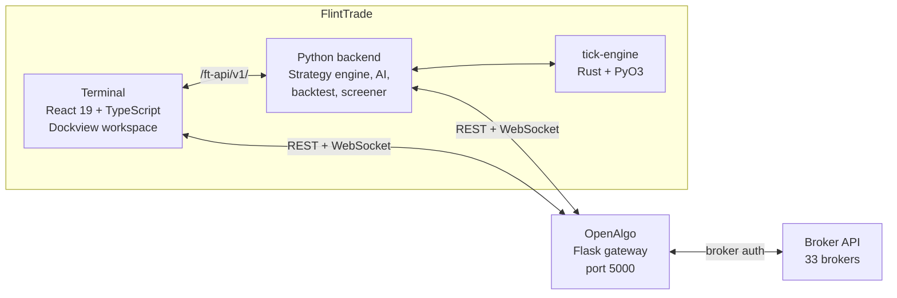

<p align="center">
  
</p>

# FlintTrade

> Open-source modular trading platform for Indian F&O, commodities, and crypto.

[](LICENSE)
[](VERSION)
[](https://github.com/navaneeshnagarajan/FlintTrade/actions/workflows/test.yml)
[](#)
[](https://github.com/navaneeshnagarajan/FlintTrade/stargazers)
[](https://github.com/navaneeshnagarajan/FlintTrade/commits/main)

A self-hosted trading workspace that turns 33 broker accounts, real-time tick streams, and a strategy engine into one keyboard-driven cockpit you actually own.

<p align="center">
  <a href="docs/screenshots/01-welcome.png"></a>
  <a href="docs/screenshots/04-trade.png"></a>
</p>
<p align="center">
  <a href="docs/screenshots/08-ai.png"></a>
  <a href="docs/screenshots/06-lab.png"></a>
</p>

## What it does

- **Intraday F&O scalping** — sub-second order entry, bracket orders, hotkey-driven OrderPad, kill switch wired to Telegram and the UI.
- **Multi-broker support** — one workspace across 33 Indian brokers via the OpenAlgo gateway; switch accounts without leaving the canvas.
- **Options analysis** — option chain with OI heatmaps, IV smile, max-pain, GEX, portfolio Greeks, payoff visualiser, and a futures quadrant.
- **Paper trading mode** — three-mode safety model (Explore / Practice / Live) with server-enforced isolation; learn without risking capital.
- **AI-assisted signals** — local LLM chat (LM Studio), ChromaDB RAG over your trades, LightGBM signal pipeline, news sentiment, and a multi-agent risk debate.
- **Custom strategies** — 94 backtest templates, Pine Script conversion, walk-forward optimisation, Monte Carlo, and tick-level simulation in Rust.
- **Automation flows** — visual flow builder, cron scheduler, TradingView and ChartInk webhooks, Telegram and WhatsApp alerts.
- **Multi-account orchestration** — Ditto module mirrors orders across child accounts with margin-aware sizing and trailing stop-loss.

## Supported brokers

33 brokers via the [OpenAlgo](https://github.com/marketcalls/openalgo) gateway — see [docs/COMPATIBILITY.md](docs/COMPATIBILITY.md) for the full list.

## Quickstart (5-minute Docker)

```bash
git clone https://github.com/navaneeshnagarajan/FlintTrade.git
cd FlintTrade
cp .env.example .env   # set OPENALGO_API_KEY
docker-compose up
```

Open <http://localhost:5173> and follow the welcome wizard.

> OpenAlgo must also be running on port 5000 for live data and order routing. Install it from the [OpenAlgo install docs](https://docs.openalgo.in/getting-started), or run `scripts/setup-test-deps.sh` for a local development copy.

---

## For developers

### Architecture



FlintTrade sits on top of OpenAlgo and never modifies it. Every machine runs its own OpenAlgo instance for development; production uses one shared gateway.

### Package map

16 packages — 12 Python, 1 React, 1 Rust/PyO3, 1 Chrome Extension, 1 Tauri desktop shell.

| Package | Language | Purpose |
|---|---|---|
| `ai` | Python | LLM client, RAG, ML signals, sentiment, MCP bridge, news scheduler |
| `automation` | Python | Cron jobs, Telegram bot, OpenClaw bridge, post-market analysis |
| `backtest-engine` | Python | Event-driven simulator, 94 strategy templates, walk-forward optimiser |
| `chrome-extension` | JavaScript | Browser extension for quick order entry from any tab |
| `core` | Python | Framework, OpenAlgo client (45+ endpoints), config, models, logging |
| `data` | Python | Tick capture, audit log (SEBI 5-year), trade logger, DuckDB storage |
| `desktop` | Rust (Tauri) | Native desktop shell wrapping the React terminal |
| `ditto` | Python | Multi-account mirroring, margin calculator, trailing stop-loss |
| `engine` | Python | 5-layer safety system, order router, scheduler, strategy registry |
| `gateway` | Python | Direct broker connections (33 brokers), adapter pattern, credential vault |
| `historical` | Python | OHLCV downloader, free NSE data, DuckDB/Parquet pipeline, expiry manager |
| `indicators` | Python | TA-Lib (batch, 150+ indicators) + Numba (streaming) + PineTS |
| `integration` | Python | TradingView, ChartInk, custom webhooks, visual flow builder |
| `screener` | Python | Option chain, OI analysis, PCR, max-pain, portfolio Greeks, IV smile |
| `terminal` | React + TS | Single-page workspace, 82 widgets, 7 tools, 13 layout presets |
| `tick-engine` | Rust + PyO3 | High-performance tick processing for tick-level backtests |

### Tech stack

| Layer | Tools |
|---|---|
| Frontend | React 19, TypeScript 5 (strict), Tailwind CSS v4, Dockview v5, shadcn/ui, Lightweight Charts v5, Glide Data Grid, Zustand 5, Jotai, TanStack Query 5 |
| Backend | Python 3.12, Flask, httpx (async), pydantic, DuckDB, structlog |
| Data | TA-Lib (batch indicators), Numba (streaming), Rust/PyO3 (tick engine), QuestDB (future) |
| AI | LM Studio (local LLM), ChromaDB (vector store), LightGBM (signals), MCP bridge |

### Three ways in

- **Try it** — follow the [5-minute Docker quickstart](#quickstart-5-minute-docker) above and explore in paper mode.
- **Build with it** — read the [Developer Guide](docs/DEVELOPER_GUIDE.md) for repo layout, adding widgets, and adding broker adapters.
- **Contribute** — see [CONTRIBUTING.md](CONTRIBUTING.md) for branch strategy, commit conventions, and good-first-issues.

---

## Project documentation

| Guide | What's inside |
|---|---|
| [User Guide](docs/USER_GUIDE.md) | Install, first connection, paper trade, workspace tour |
| [Developer Guide](docs/DEVELOPER_GUIDE.md) | Repo layout, dev setup, adding widgets and strategies |
| [Architecture](docs/ARCHITECTURE.md) | Diagrams, data flow, mode system, auth, WSGI |
| [API Reference](docs/API.md) | OpenAlgo passthrough plus `/ft-api/v1/` endpoints |
| [Changelog](CHANGELOG.md) | Release notes by version |
| [Security](SECURITY.md) | Disclosure policy, supported versions, threat model |

## Community

- [GitHub Discussions](https://github.com/navaneeshnagarajan/FlintTrade/discussions) — questions, ideas, show-and-tell.
- [GitHub Issues](https://github.com/navaneeshnagarajan/FlintTrade/issues) — bug reports and feature requests.
- [CONTRIBUTING.md](CONTRIBUTING.md) — how to propose changes, run tests, and open a PR.

## Credits

Built on [OpenAlgo](https://github.com/marketcalls/openalgo) by [Rajandran R](https://github.com/marketcalls) and the OpenAlgo community, and informed by [OpenClaw](https://github.com/openclaw/openclaw) for agent patterns. FlintTrade absorbs and adapts code from 215 open-source reference repositories — see [docs/REFERENCES.md](docs/REFERENCES.md) for the full attribution table.

## License

FlintTrade is released under [AGPL-3.0](LICENSE) — the same licence as OpenAlgo. If you modify and run FlintTrade as a network service, you must publish your modified source.

## Code of Conduct

This project follows the Contributor Covenant. By participating you agree to abide by [CODE_OF_CONDUCT.md](CODE_OF_CONDUCT.md). Report unacceptable behaviour via GitHub.

## Contributing

Issues and pull requests are welcome. Please read [CONTRIBUTING.md](CONTRIBUTING.md) before opening a PR — it covers branch naming, commit conventions, testing, and the documentation expectations for every change.
