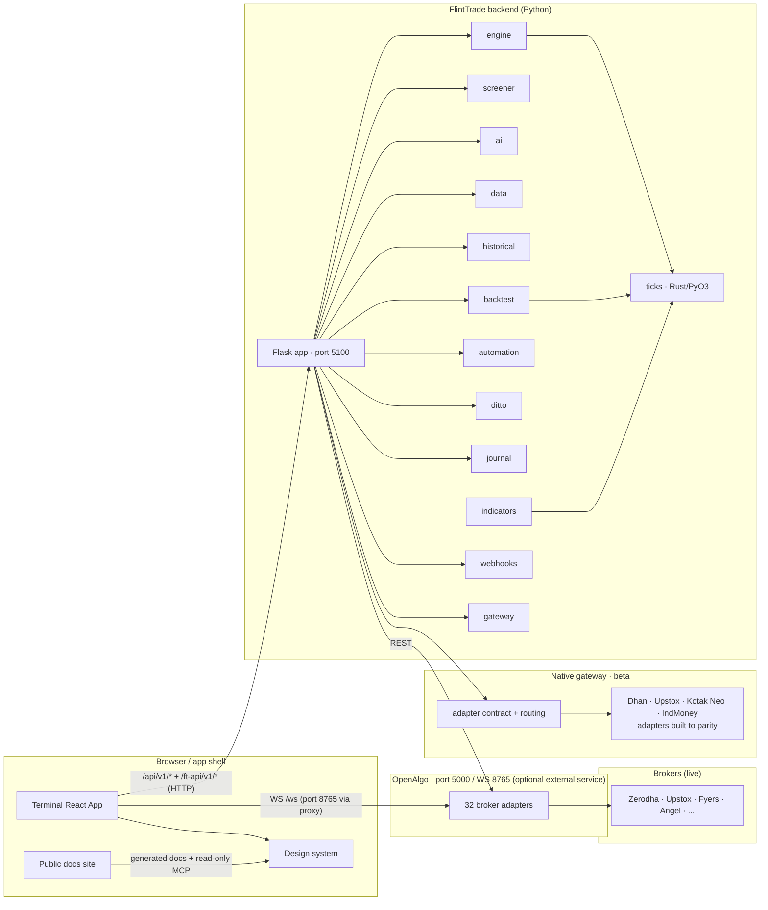
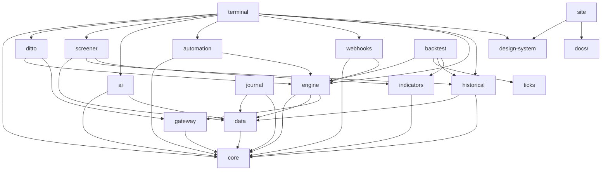
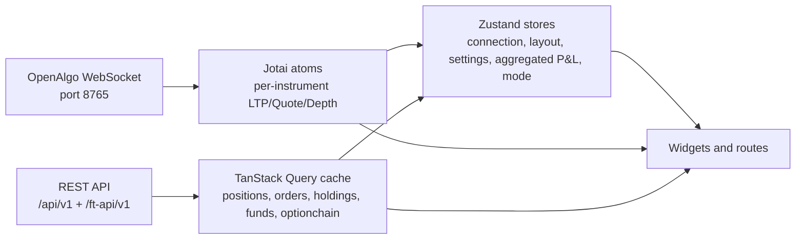

# FlintTrade Architecture

> Reflects `v0.6.0-beta`. 18 package surfaces (13 Python + 3 apps: React
> terminal, Tauri desktop shell, Next.js site + 1 shared TypeScript
> design-system package + 1 Rust/PyO3 tick engine).
> Run `make test` and terminal Vitest locally for the current test counts.

This document is the architectural reference for contributors. For a
user-facing overview, see [USER_GUIDE.md](USER_GUIDE.md). For HTTP /
WebSocket contracts, see [API.md](API.md). For repo conventions, see
[DEVELOPER_GUIDE.md](DEVELOPER_GUIDE.md).

---

## 1. High-level component diagram



The terminal always talks to FlintTrade on port 5100 through `/ft-api`.
OpenAlgo on 5000 and its WebSocket on 8765 are optional external integration
origins, proxied through Vite only when that bridge is enabled. The native
gateway contract and routing are present, and all four founder-broker adapters
(Dhan, Upstox, Kotak Neo, IndMoney) are built to full doc-grounded parity; the
remaining work is live-credential testing only.

---

## 2. Package dependency graph



Arrows point from dependent to dependency. Runtime code now lives under
`packages/{apps,core,integrations,services}`. The public site and terminal
both consume the shared design-system package; the site also consumes
repository docs and package READMEs to generate its pages, docs MCP, and
llms files.

---

## 3. Frontend architecture (terminal)

The terminal is a single React 19 + TypeScript application built with
Vite 6. Layout is managed by [Dockview v5.1](https://dockview.dev/),
which provides drag-and-drop panels, tabs, floating windows, and
serialisable layouts. Users compose their workspace from 95 widgets
(26 trading + 43 analysis + 26 utility) split across 12 routes.

### State architecture



**Boundary rules** — data enters through one path only and is never
duplicated:

- **Jotai atoms** — WebSocket real-time data only.
- **TanStack Query** — REST API responses only.
- **Zustand stores** — derived and UI state only (connection status,
  active layout, settings mirror, aggregated P&L, current mode).

### Frontend stack

| Category | Library | Why it's pinned |
|---|---|---|
| Language | TypeScript 5 (strict) | No `any`, no `@ts-ignore`. |
| Framework | React 19 | Server Actions, `use()`, the new compiler. |
| Build | Vite 6.4 | Fast HMR, ESM-first. |
| CSS | Tailwind CSS v4 | `@tailwindcss/vite` plugin, no `tailwind.config.js` for tokens. |
| Components | shadcn/ui | Copy-paste ownership, Radix accessibility primitives. |
| Layout | Dockview v5.1 | Floating, tabs, popout, JSON-serialisable. |
| Charts | Flint chart core over Lightweight Charts v5 | Runtime adapter, shared theme, drawing, indicator, and mini-chart contracts. |
| Streaming grid | Glide Data Grid | Canvas-rendered, 100K updates/sec. |
| Static grid | TanStack Table v8 | Headless, sortable, filterable. |
| State | Zustand v5 + Jotai + TanStack Query v5 | Separation of concerns by boundary. |
| Forms | react-hook-form + zod | Runtime validation, type inference. |
| Router | react-router-dom | Lazy-loaded route modules. |

### Chart ownership boundary

The terminal app does not create chart engines directly. Runtime value imports
from `lightweight-charts` are isolated to
`packages/apps/terminal/src/lib/lightweightChartRuntime.ts`, the runtime adapter
that bridges vendor APIs into Flint-owned chart contracts. The shared chart
surface lives in `packages/core/design-system/src/charts/`:

- `lightweight.ts` owns chart factories, theme application, canvas labelling,
  series registration contracts, and reusable layout constants such as
  `FLINT_TRANSPARENT_CHART_LAYOUT`.
- `theme.ts` owns the Flint market-chart palette derived from design-system
  tokens.
- `drawings.ts` owns drawing persistence, draft progression, hit-testing,
  movement, handles, render specs, and the drawing render-plan contract
  (`createFlintChartDrawingRenderPlan`) that maps drawings to line series,
  price lines, and markers. It also owns render-plan lifecycle diffing through
  `createFlintChartDrawingRenderPlanDiff`, so terminal hooks reconcile
  added, updated, unchanged, and removed drawing artefacts from core specs
  instead of rebuilding unchanged chart series.
- `indicators.ts` owns indicator defaults, periods, panes, colours,
  serialisation, static indicator line/histogram render specs, pane-aware
  series option contracts through `createFlintChartIndicatorSeriesRenderPlan`,
  series lifecycle diffing through
  `createFlintChartIndicatorSeriesRenderPlanDiff`, and OI overlay render
  semantics such as `createFlintChartOIProfileBarData`.
- `plotly.ts` owns `createFlintPlotlyTheme`, the shared default Plotly config,
  and layout merging for advanced charts that cannot use Lightweight Charts.
- `components.tsx` owns React-visible chart primitives such as legend rows,
  mini sparklines, donut breakdowns, and ranked bars.

Application widgets may pass data and user intent into these contracts, but
they should not call `createChart`, `chart.addSeries`, `createSeriesMarkers`,
or import Lightweight Charts runtime values directly. Terminal hooks may attach
or remove series through `lightweightChartRuntime.ts`, but render decisions must
come from the core contracts. The terminal regression test
`src/hooks/__tests__/flintChartCore.test.ts` enforces this boundary so new chart
work remains built on the core rather than around it.

Plotly is the explicit runtime exception for heavy 3D analysis surfaces that
Lightweight Charts cannot represent well, such as volatility surfaces. The
shared theme, modebar defaults, and axis/layout merge policy live in core via
`createFlintPlotlyTheme`, `FLINT_PLOTLY_DEFAULT_CONFIG`, and
`mergeFlintPlotlyLayout`. The terminal keeps only the heavy Plotly runtime
wrapper in `src/components/charts/PlotlyChart.tsx`, so Plotly stays lazy-loaded,
documented, and limited to analysis modules.

---

## 4. Backend architecture

FlintTrade's backend is a single Flask application registered as
`packages/core/core/src/flinttrade_core/app.py`. It binds to port 5100, mounts every package's
blueprints behind `/v1/*`, and exposes them externally under
`/ft-api/v1/*` thanks to the WSGI prefix-strip middleware (see §6).

### Safety layers

Every order placed through FlintTrade passes five safety layers in order
inside `packages/services/engine/`:

1. **Order validation** — price within ±5 % of LTP, quantity multiple of
   lot size.
2. **Position limits** — max five simultaneous positions, no single
   position over 60 % of free margin.
3. **Portfolio risk** — net delta and net vega caps across the book.
4. **Daily P&L** — pause at 3 % drawdown, kill at 15 % drawdown.
5. **Kill switch** — manual (UI button, Telegram bot) or automatic
   (daily P&L breach, OpenAlgo session loss, exchange holiday detector).

### Mode-system state machine

```mermaid
stateDiagram-v2
    [*] --> Explore
    Explore --> Practice: /auth/mode {mode:practice}
    Practice --> Live: /auth/mode {mode:live} + password\nconfirm
    Live --> Practice: /auth/mode {mode:practice}
    Practice --> Explore: /auth/mode {mode:explore}
    Live --> Explore: /auth/mode {mode:explore}\n(forces kill-switch)

    state Explore {
        [*] --> noOrders
        noOrders: All order paths return\nsimulated success without\ntouching OpenAlgo
    }
    state Practice {
        [*] --> sandbox
        sandbox: Orders routed to FlintTrade's\nnative sandbox engine
    }
    state Live {
        [*] --> realOrders
        realOrders: Orders routed to a native broker\nadapter or OpenAlgo-compatible endpoint;\nsafety layers active
    }
```



Each transition issues a fresh JWT with the new `mode` claim and revokes
the old token's `jti`. The guard lives at
`packages/services/engine/src/flinttrade_engine/mode_guard.py`.

---

## 5. Data flow

```mermaid
flowchart TD
    Tick[OpenAlgo WS tick] --> Atom[Jotai atom\nltpAtomFamily(symbol)]
    Atom --> Derived[Derived atoms\nPCR · straddle · greeks]
    Derived --> UI1[Charts · Option Chain · Order Pad]

    REST[REST poll · TanStack Query] --> Cache[Query cache\npositions · orders · holdings]
    Cache --> UI2[Positions · Orderbook · Funds]

    UI1 --> Order[Order placement\nthrough engine]
    UI2 --> Order
    Order --> Safety[5-layer safety system]
    Safety --> ModeGuard[Mode guard]
    ModeGuard --> Router[Broker router]
    Router --> Sandbox[Native sandbox\npractice mode]
    Router --> Adapter[Native adapter or\nOpenAlgo-compatible API]
    Adapter --> Broker[Broker]
    Broker -. fill .-> Tick
```

Ticks fan in to per-instrument Jotai atoms which power every chart and
quote widget. REST data populates a separate query cache. Orders flow
out through the safety layers and the mode guard. Practice orders stay
inside FlintTrade's native sandbox; live orders route through a native
broker adapter or an OpenAlgo-compatible endpoint. Fills come back through
the tick stream and reconcile with the REST cache via
`packages/services/engine/src/flinttrade_engine/reconciliation.py`.

---

## 6. WSGI prefix strip

The terminal calls `/ft-api/v1/X`. The Vite dev proxy and the production
reverse proxy forward that to the FlintTrade backend on port 5100. The
WSGI middleware in `packages/core/core/src/flinttrade_core/app.py` strips the `/ft-api`
prefix before URL dispatch:

```
External:  GET /ft-api/v1/gex?symbol=NIFTY
            │
            ▼  (Vite proxy or reverse proxy)
Backend:   GET /v1/gex?symbol=NIFTY
            │
            ▼  (Flask URL map)
Handler:   screener.analysis_routes:gex_handler
```

This means a blueprint registered at `url_prefix="/v1"` (or
`url_prefix="/api/v1"`, depending on the route family) answers requests
at the external `/ft-api/v1/…` path automatically. **Never
double-prefix.** Routes documented in [API.md](API.md) as
`/ft-api/v1/X` are the external view; routes documented as `/v1/X` are
the internal view of the same endpoint.

---

## 7. Configuration architecture

Two tiers. No exceptions.

### Tier 1: `.env` — infrastructure only

Lives in the repo root, never committed. FlintTrade can run locally without
OpenAlgo; OpenAlgo variables are used only for the optional OpenAlgo-compatible
bridge/live passthrough path.

| Variable | Purpose |
|---|---|
| `FLINTTRADE_API_KEY` | Optional backend API key. If absent, loopback-only local requests are allowed for fresh desktop/dev installs. |
| `OPENALGO_HOST` | OpenAlgo server URL. |
| `OPENALGO_PORT` | OpenAlgo server port. |
| `OPENALGO_API_KEY` | OpenAlgo API key (not your broker's key). |
| `OPENALGO_WS_PORT` | OpenAlgo WebSocket port (default `8765`). |

Broker credentials are configured **in OpenAlgo**, not in FlintTrade.
FlintTrade never sees them.

### Tier 2: `workspace.json` — user preferences

Lives in a platform-specific workspace directory:

| Platform | Location |
|---|---|
| Linux | `~/.flinttrade/` |
| macOS | `~/Library/Application Support/flinttrade/` |
| Windows | `%APPDATA%/flinttrade/` |
| Override | `FLINTTRADE_HOME` env var |

`workspace.json` contains:

- **Storage paths** — `storage.fast` (SSD) and `storage.archive` (HDD).
- **Enabled modules** — which packages are active.
- **UI preferences** — theme, default exchange, time zone, density.
- **LLM config** — provider, host, model.
- **Notification config** — Telegram bot settings.
- **SEBI settings** — rate limits, audit retention, kill-switch.

API keys and tokens are stored as `_ref` fields (references). Actual
secrets live in the OS keyring or in environment variables, never in
`workspace.json`.

### How packages read config

```python
from packages.core.src.config import FlintTradeConfig

config = FlintTradeConfig.from_env()
config.settings.openalgo_host     # from .env
config.workspace.fast_data_dir    # from workspace.json
config.workspace.get("ui.theme")  # dot-notation access
```

Packages never read `os.environ` for data paths directly. They use the
`Workspace` class, which resolves paths from `workspace.json` with
fallbacks.

---

## 8. Authentication

### FlintTrade JWT

- Issued on `/ft-api/v1/auth/login` after argon2id password
  verification.
- Optional second factor: TOTP enrolment with Fernet-encrypted seed.
- **Expires at 8 AM IST the next day.** No refresh tokens — sign in
  again.
- Carries `sub` (user), `exp` (expiry), `mode` (Explore / Practice /
  Live), `jti` (unique ID).
- Revocation blocklist keyed by `jti` in
  `packages/core/core/src/flinttrade_core/auth_state.py`.

### Server-side mode enforcement

Every order-path endpoint asks `mode_guard` whether the JWT permits a
live action. Trying to place a live order on a Practice JWT returns
`MODE_NOT_ALLOWED` immediately — the request never reaches OpenAlgo.

### OpenAlgo X-API-Key

OpenAlgo's own endpoints use API-key auth, forwarded as the
`X-API-KEY` header by `packages/core/core/src/flinttrade_core/openalgo_client.py`. The key
comes from `.env`.

---

## 9. Infrastructure and deployment

### Makefile

`Makefile` is the primary interface:

```bash
make setup      # first-time install (deps, workspace)
make start      # start FlintTrade backend
make stop       # stop FlintTrade backend
make status     # show service and port status
make test       # run all Python tests
make test-fast  # stop on first failure
make lint       # run ruff
make dev        # start React dev server + FlintTrade backend
make health     # health check
make clean      # remove build artefacts
make update     # update Python + Node deps
```

OpenAlgo and OpenClaw are external services; they are NOT git submodules
and are NOT bundled. For local development, run
`scripts/setup-test-deps.sh` once per machine to clone local-dev copies
into `.local/external/`.

### External test dependencies

| Service | Local-dev path | Source | Role |
|---|---|---|---|
| OpenAlgo | `.local/external/openalgo/` | [marketcalls/openalgo](https://github.com/marketcalls/openalgo) | Broker gateway. |
| OpenClaw | `.local/external/openclaw/` | [openclaw/openclaw](https://github.com/openclaw/openclaw) | AI agent gateway. |

AlgoMirror is intentionally absent — its mirroring patterns are reimplemented
natively in `packages/services/ditto/` (our own code; the upstream repo is not
tracked, pulled, or called at runtime).

### Scripts

| Script | Purpose |
|---|---|
| `infra/scripts/setup.sh` | First-time installation. |
| `infra/scripts/openalgo/start-openalgo.sh` | Start OpenAlgo as a background process. |
| `infra/scripts/openalgo/stop-openalgo.sh` | Stop OpenAlgo gracefully. |
| `infra/scripts/status.sh` | Service status, ports, disk usage. |
| `infra/scripts/health-check.sh` | Health check (exit 0/1). |
| `scripts/setup-test-deps.sh` | Clone OpenAlgo and OpenClaw to `.local/external/`. |
| `scripts/reset-flinttrade-state.sh` | Wipe the FlintTrade workspace for a fresh-user test. |

### Docker

```bash
make docker-up     # start all services
make docker-down   # stop
make docker-build  # rebuild images
```

### Production

Production deployments use `systemd` units under `infra/systemd/`. See
[setup/linux.md](setup/linux.md) for the canonical recipe.

---

## 10. Where to read more

- HTTP and WebSocket contract — [API.md](API.md)
- How to contribute — [DEVELOPER_GUIDE.md](DEVELOPER_GUIDE.md)
- Per-version change notes — [releases/](releases/)
- CI behaviour — [CI.md](CI.md)
- Supported brokers / exchanges / platforms — [COMPATIBILITY.md](COMPATIBILITY.md)
- SEBI compliance — [SEBI_COMPLIANCE.md](SEBI_COMPLIANCE.md)
