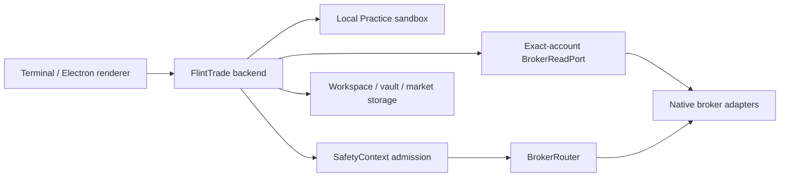
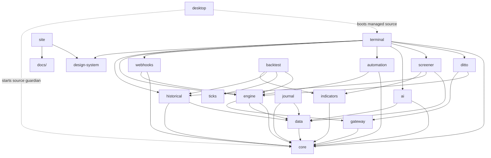
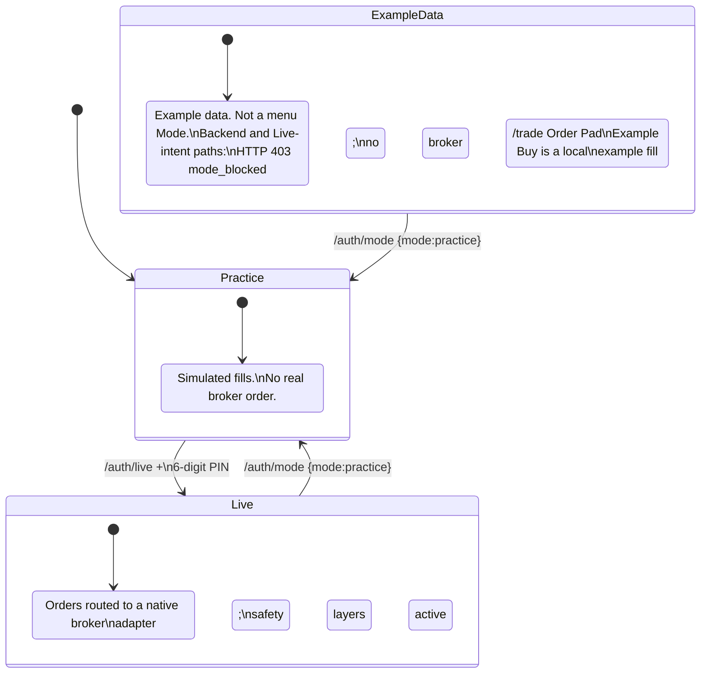

# FlintTrade Architecture

Broker connections use five native adapters: Dhan, Upstox, Kotak Neo,
INDmoney and Groww. Availability remains evidence-gated. Native broker HTTP
mutations and reads remain frozen until Task 9D and Task 7C.2; a broker session
cannot currently be established through the terminal. Practice uses the local
sandbox. Funded Live placement remains unproven and fail-closed.


> Reflects `v0.0.1`. 18 package surfaces (13 Python + 3 apps: React
> terminal, Electron desktop shell, Next.js site + 1 shared TypeScript
> design-system package + 1 Rust/PyO3 tick engine).
> Run `python scripts/ft.py test` and terminal Vitest locally for the current
> test counts.

This document is the architectural reference for contributors. For a
user-facing overview, see [USER_GUIDE.md](USER_GUIDE.md). For first-party HTTP
contracts, see [API.md](API.md). For repo conventions, see
[DEVELOPER_GUIDE.md](DEVELOPER_GUIDE.md).

---

## 1. High-level component diagram


```mermaid
flowchart LR
    terminal[Terminal / Electron renderer] --> backend[FlintTrade backend]
    backend --> practice[Local Practice sandbox]
    backend --> reads[Exact-account BrokerReadPort]
    backend --> gate[SafetyContext admission]
    gate --> router[BrokerRouter]
    reads --> native[Native broker adapters]
    router --> native
    backend --> storage[Workspace / vault / market storage]
```

The native HTTP connection and read surfaces remain frozen. The diagram shows
the internal safety boundaries; it does not imply operator availability.

The Electron shell has machine authority but no trading authority. It owns
tool acquisition, the managed checkout, source promotion, the source guardian,
native windows and shell updates. The renderer receives named
`window.flintDesktop` methods only. The Python backend continues to own all
trading, authentication, configuration and durable user data.

Desktop source lives at `~/.flinttrade/src/FlintTrade` and verified tools at
`~/.flinttrade/tools`. User data remains in the platform workspace. First
launch builds a sibling candidate with the frozen repository locks, promotes it
only after the build completes, then requires both the guardian's exact ready
sentinel and a loopback `/api/v1/ping` response before the main window opens.
Updates use the same separation: the running checkout is immutable, candidate
health proof uses an isolated temporary workspace, and promotion retains one
last-known-good source for rollback.

The Electron installer is not the application runtime. The source-built web app
is distinct from Electron-shell installers, and source/runtime updates remain
separate from shell-installer updates. A release is accepted only when it
contains all four canonical installers plus `SHA256SUMS.txt`; retired Tauri and
PyInstaller assets never satisfy this architecture.

When the operator selects managed Ollama, the backend owns an on-demand sidecar
process. FlintTrade selects an unpredictable free high loopback port, starts
Ollama there, and accepts the endpoint only after proving process-tree listener
ownership. A competing bind makes startup fail closed. FlintTrade downloads the pinned runtime only after explicit
confirmation, verifies its SHA-256 digest before extraction, disables Ollama
cloud access, and stores models under the platform workspace. Accepted model
digests are stored separately from Ollama's model store. Explicit acceptance
creates a digest-derived locked alias, which each inference verifies before the
request and against the loaded digest afterwards before releasing output. Cloud
and custom OpenAI-compatible providers remain available;
intentionally self-hosted servers belong under the `custom` provider.
Runtime releases live in separate version directories. A stopped update stages
and verifies the preferred release before atomically selecting it, retaining one
fully rehashed rollback release. Uninstall transactionally quarantines only
fully verified releases recognised by the current build, recovers an interrupted
transaction at the next startup, and preserves models and trust metadata. Every
lifecycle mutation holds an owner-only cross-process workspace lease. Lifecycle,
receipt-journal and operation-owner lease paths reject links, reparse points,
non-regular files and foreign POSIX ownership before use. A backend restart never
signals an inherited PID; if Ollama survives its owner, lifecycle changes fail
closed until the operator terminates that process. Model reclamation is
API-driven: exact unselected names and unreferenced FlintTrade locked aliases can
be removed, but FlintTrade never traverses Ollama's blob store to delete files.
Browser mutations carry a durable client admission ID, making a lost or timed-out
HTTP response idempotently reconcilable through status. A bounded detailed
receipt journal compacts older terminal admission IDs into a fail-closed spent-ID
filter; corrupt journals and unknown outcomes never reopen admission. Shutdown consumes one
deadline across config-lock and runtime-state admission, operation cancellation,
inference drain and teardown. Destructive model operations hold the runtime-state
lock through live inventory and trust reconciliation, so shutdown either cancels
before the irreversible request or waits for its verified result. Windows production
children are contained in a private Job Object;
POSIX process-group identifiers are never signalled after the retained root has
been reaped.

---

## 2. Package dependency graph


```mermaid
flowchart TD
    desktop -. "boots managed source" .-> terminal
    desktop -. "starts source guardian" .-> core
    terminal --> core
    terminal --> ditto
    terminal --> screener
    terminal --> ai
    terminal --> automation
    terminal --> webhooks
    terminal --> engine
    terminal --> historical
    terminal --> designSystem[design-system]

    site --> designSystem
    site --> docs[docs/]

    engine --> core
    engine --> data
    engine --> gateway
    backtestEngine[backtest] --> engine
    backtestEngine --> tickEngine[ticks]
    backtestEngine --> historical
    backtestEngine --> indicators

    screener --> data
    screener --> historical
    screener --> indicators

    ai --> core
    ai --> data
    journal --> data
    journal --> core

    webhooks --> core
    webhooks --> engine

    automation --> core
    automation --> engine

    ditto --> engine
    ditto --> gateway

    historical --> data
    historical --> core

    data --> core
    indicators --> core
    gateway --> core
```

Solid arrows point from dependent to dependency. The dashed desktop edges are
runtime orchestration, not JavaScript or Python package imports. Runtime code lives under
`packages/{apps,core,integrations,services}`. The public site and terminal
both consume the shared design-system package; the site also consumes
repository docs and package READMEs to generate its pages, docs MCP, and
llms files.

---

## 3. Frontend architecture (terminal)

The terminal is a single React 19 + TypeScript application built with
Vite 8. Layout is managed by [FlexLayout 0.11](https://github.com/caplin/FlexLayout),
which provides drag-and-drop panels, tabs, floating windows, and
serialisable layouts. Users compose their workspace from 71 widgets
(18 trading + 31 analysis + 22 utility) split across 12 routes.

### State architecture

**Boundary rules** — data enters through one path only and is never
duplicated:

- **Jotai atoms** — WebSocket real-time data only.
- **TanStack Query** — REST API responses only.
- **Zustand stores** — derived and UI state only (connection status,
  active layout, settings mirror, aggregated P&L, current mode).

### Market session clock (FT-CORE-001)

TopBar market status and the Market Clock widget are CAS-aware (as of
Aug 2026). Phases are Continuous, CAS, Matching, Post-close, and Closed
— one TopBar chip active; tooltip/title is the window (for example
`CAS · 15:15–15:35 (as of Aug 2026)`). Cash is never green "open" after
15:15 IST; CAS is not Closed. When equity F&O still runs after cash
continuous ends, a secondary `F&O open · till 15:40` chip appears.
Non-CAS cash still trades continuous to 15:30. The clock helpers
(`packages/apps/terminal/src/lib/market.ts` and
`packages/core/ticks/src/session.rs`) must not treat a flat NSE
09:15–15:30 window as "open until 15:30". Closing-price copy is not
"VWAP last 30 min". The September 2026 consultation stays out of the UI.

### Frontend stack

For dependency purposes across the backend, desktop, website, and native tick
engine, see [Technology Stack and Dependencies](TECH_STACK.md). Its source links
identify the exact resolved versions; the table below describes version families.

| Category | Library | Why it's pinned |
|---|---|---|
| Language | TypeScript 7 (strict) | No `any`, no `@ts-ignore`. |
| Framework | React 19 | Current React release for the terminal SPA. |
| Build | Vite 8 | Fast HMR, ESM-first. |
| CSS | Tailwind CSS v4 | `@tailwindcss/vite` plugin, no `tailwind.config.js` for tokens. |
| Components | shadcn/ui | Copy-paste ownership, Radix accessibility primitives. |
| Layout | FlexLayout 0.11 | Tabs, splits, drag-dock, JSON-serialisable. |
| Interop | FDC3 user channels (in-process) | Colour-coded widget linking + ViewChart/CreateOrder intents. |
| Analytics | FINOS Perspective 3.8 | WASM streaming pivot engine behind the Portfolio Pivot widget. |
| Charts | Flint chart core over Lightweight Charts v5 | Runtime adapter, shared theme, drawing, indicator, and mini-chart contracts. |
| Streaming grid | Glide Data Grid | Canvas-rendered, 100K updates/sec. |
| Static grid | TanStack Table v9 | Headless, sortable, filterable. |
| State | Zustand v5 + Jotai + TanStack Query v5 | Separation of concerns by boundary. |
| Forms | react-hook-form + zod | Runtime validation, type inference. |
| Router | react-router (v8; RouterProvider from `react-router/dom`) | Lazy-loaded route modules. |

### Chart ownership boundary

The terminal app does not create chart engines directly. Runtime value imports
from `lightweight-charts` are isolated to
`packages/apps/terminal/src/lib/lightweightChartRuntime.ts`, the runtime adapter
that bridges vendor APIs into Flint-owned chart contracts. The shared chart
surface lives in `packages/core/design-system/src/charts/`:

- `lightweight.ts` owns chart factories, theme application, canvas labelling,
  series registration contracts, and reusable layout constants such as
  `FLINT_TRANSPARENT_CHART_LAYOUT`.
- `theme.ts` owns the Flint market-chart palette derived from design-system
  tokens.
- `drawings.ts` owns drawing persistence, draft progression, hit-testing,
  movement, handles, render specs, and the drawing render-plan contract
  (`createFlintChartDrawingRenderPlan`) that maps drawings to line series,
  price lines, and markers. It also owns render-plan lifecycle diffing through
  `createFlintChartDrawingRenderPlanDiff`, so terminal hooks reconcile
  added, updated, unchanged, and removed drawing artefacts from core specs
  instead of rebuilding unchanged chart series.
- `indicators.ts` owns indicator defaults, periods, panes, colours,
  serialisation, static indicator line/histogram render specs, pane-aware
  series option contracts through `createFlintChartIndicatorSeriesRenderPlan`,
  series lifecycle diffing through
  `createFlintChartIndicatorSeriesRenderPlanDiff`, and OI overlay render
  semantics such as `createFlintChartOIProfileBarData`.
- `plotly.ts` owns `createFlintPlotlyTheme`, the shared default Plotly config,
  and layout merging for advanced charts that cannot use Lightweight Charts.
- `components.tsx` owns React-visible chart primitives such as legend rows,
  mini sparklines, donut breakdowns, and ranked bars.

Application widgets may pass data and user intent into these contracts, but
they should not call `createChart`, `chart.addSeries`, `createSeriesMarkers`,
or import Lightweight Charts runtime values directly. Terminal hooks may attach
or remove series through `lightweightChartRuntime.ts`, but render decisions must
come from the core contracts. The terminal regression test
`src/hooks/__tests__/flintChartCore.test.ts` enforces this boundary so new chart
work remains built on the core rather than around it.

Plotly is the explicit runtime exception for heavy 3D analysis surfaces that
Lightweight Charts cannot represent well, such as volatility surfaces. The
shared theme, modebar defaults, and axis/layout merge policy live in core via
`createFlintPlotlyTheme`, `FLINT_PLOTLY_DEFAULT_CONFIG`, and
`mergeFlintPlotlyLayout`. The terminal keeps only the heavy Plotly runtime
wrapper in `src/components/charts/PlotlyChart.tsx`, so Plotly stays lazy-loaded,
documented, and limited to analysis modules.

---

## 4. Backend architecture

FlintTrade's backend is a single Flask application registered as
`packages/core/core/src/flinttrade_core/app.py`. Source/browser mode defaults to
port 5100; the Electron source guardian explicitly selects a dynamic loopback
port instead. Blueprints mount at `/v1/*` *or* `/api/v1/*` (match the
prefix the frontend uses). The Vite/dev proxy exposes them under
`/ft-api/…` and WSGI middleware strips that prefix (see §6).

**One backend process per workspace.** In-memory job/runner state (scheduler
jobs, download queues, sandbox runtime, session registries) assumes a single
authoritative process. That constraint is enforced, not assumed:
`backend_instance.py` acquires a kernel-backed workspace lock before the
runtime starts (both the `run()` and WSGI entrypoints), and a second launch
against the same workspace fails fast with `BackendInstanceAlreadyRunning`.
The HTTP server (waitress) is single-process/threaded, so no multi-worker
deployment can split that state.

### Safety layers

Every order FlintTrade submits goes through admission when it's placed.
Every **Live** order placed through FlintTrade is then checked by five
safety layers inside `packages/services/engine/`. Practice orders skip this
safety chain. The submit routes are `POST /api/v1/orders/place`,
`POST /api/v1/orders/<broker>/place` (Live only),
`POST /api/v1/positions/exit-all` (a server reduce-only proof, then the
flatten verb), and `POST /api/v1/orders/bracket` when the body has exactly
one stop-loss or one target. Each bracket leg is admitted, then placed
through SafetySystem. Practice on that route is HTTP 403
`practice_unsupported`. GTT, a broker-held variety, a stop-loss and a
target together, and a trailing stop are refused before that admission.
Example-data placement is refused by the backend
(HTTP 403 `mode_blocked`,
`Orders are not available for Example. Switch to Practice or Live to trade.`)
and does not enter `Laya.admit`.
Order Pad Example Buy is a local client fill (`Example order placed`, id starting `SAMPLE-`; no HTTP
order route, no Laya admit, no SafetySystem). Operator and automate
**place** run the mode guard, then `Laya.admit`. Live place is checked
by Laya admission and then SafetySystem L1–L5, `gate_order`, and
`BrokerRouter` on that place. `"variety": "gtt"` is HTTP 422
`gtt_unsupported` before that admission, on place, routed place,
exit-all, and a bracket. A refusal or a quantity clamp stops before SafetySystem.
Practice place is admitted before the Practice fill path and does not enter
those Live layers. A named contract must be a positive multiple of its lot
from the broker instrument master; a missing lot is refused before the fill.
Practice square-off is place. That book cancels and modifies; it does not
place. `cancel-all` only cancels. Explore remains `mode_blocked` and does
not enter `Laya.admit`. Other Live write verbs still reach SafetySystem
without this admission. See
[ORDER_SAFETY.md](ORDER_SAFETY.md).

`_check_order_locked` fail-fasts in this runtime order (not L1–L5
numerical order), so the first SafetySystem refusal an operator sees is
the earliest of:

1. **L5 Kill switch** — an explicit operator action (UI button, API, or Telegram)
   that cancels open orders and requests position flattening through the gated
   broker path. The account MTM circuit breaker is a separate automatic path.
2. **L4 Daily P&L** — pause new orders at 3 % drawdown and latch a new-order
   hard stop at 15 % drawdown. Layer 4 does not cancel or flatten.
3. **L1 Order validation** — price within ±5 % of LTP, quantity must be
   positive and within the per-exchange quantity cap.
4. **L2 Position limits** — max five simultaneous positions, no single
   position over 60 % of free margin.
5. **L3 Portfolio risk** — net delta and net vega caps across the book.

Laya admits operator and automate place before SafetySystem (Live) or the
sandbox (Practice). It does not place an order and does not mint
`gate_order`, and it does not replace L1–L5. A refusal or a quantity
clamp stops before those next steps. Admit checks Down, then the hard
rules, then typed free-text questions on the opt-in decision sidecar.
The model can deny or clamp only. Only Down mutes Live place. Degraded leaves Live open and enforces a tighter
quantity ceiling. Chat is not an admission source. Modify, cancel,
smart, multi, forever modify and cancel, and the other non-place write verbs still reach SafetySystem without this place admission. `POST /api/v1/orders/forever` does not place. A valid body is HTTP 501 `Orders are placed through /api/v1/orders/place.` and the route does not call a broker. A GTT body is HTTP 422 `gtt_unsupported` before Laya, SafetySystem, and any broker call. No submit route reaches a broker forever or super-order endpoint. The Kotak Neo adapter refuses a `gtt` place. Laya starts Down; the three statuses are Ready, Degraded, and Down. `GET /health` records them from the sidecar when one is registered. The desk ping publishes the stored Live-facing status and does not invent Ready. A base checkpoint is not qualified for Live, so Live stays Down until a qualification record matches the pinned revision and policy. See [ORDER_SAFETY.md](ORDER_SAFETY.md).

### Broker reads versus gated writes

Live **writes** still mint a `SafetyContext` through `gate_order` /
`gate_broker_write` and dispatch through `BrokerRouter`. Read operations do
not go through the write router.

### Broker account transaction foundation

The native account foundation provides immutable transaction contracts, an
encrypted vault participant, a workspace commit witness and one app-lifetime
runtime owner. Its coordinator is exercised with synthetic drivers. Production
native account mutations still return `503` and native HTTP reads still return
`409`; this foundation does not install a provider driver or complete the
Task 9D / Task 7C.2 cutovers.

Vault schema 4 retains credential incarnation and operation evidence while
anchoring the current ledger and audit outbox in an authenticated head digest.
Replaying an older individually valid operation row cannot reopen a settled
unknown authentication outcome. Workspace recovery checks both participants;
unknown or conflicting outcomes retain their claim and require a later explicit
resolution policy. Recovery does not authenticate or recreate provider sessions.

Read generations pin enrolment from validated vault state and consult the
workspace coherence verifier. Removing the document marker cannot select a
legacy read path, and an older legacy generation loses authority when durable
enrolment begins. Shutdown stops rotation admission and drains its workers
before retiring account-owned broker dependencies.

Each terminal receipt and its pending audit event are persisted atomically.
The event uses stable, vault-keyed references for the operation, selector,
actor and session, and exports only terminal state and version counters.
Credentials, labels, raw account IDs and exception messages are excluded.
Audit export uses bounded batches outside vault and publication locks. Delivery
is acknowledged only after the sink verifies the exact stable event ID and full
evidence in an intact audit chain. Failed or lost acknowledgements remain
pending and retry the same event without repeating the account mutation.

### Mode-system state machine


```mermaid
stateDiagram-v2
    [*] --> Practice
    Practice --> Live: /auth/live +\n6-digit PIN
    Live --> Practice: /auth/mode {mode:practice}
    ExampleData --> Practice: /auth/mode {mode:practice}

    state ExampleData {
        [*] --> noLiveOrders
        noLiveOrders: Example data. Not a menu Mode.\nBackend and Live-intent paths:\nHTTP 403 mode_blocked;\nno broker call.\nException: /trade Order Pad\nExample Buy is a local\nexample fill
    }
    state Practice {
        [*] --> practiceFills
        practiceFills: Simulated fills.\nNo real broker order.
    }
    state Live {
        [*] --> realOrders
        realOrders: Orders routed to a native broker\nadapter;\nsafety layers active
    }
```

A downgrade to Practice issues a fresh JWT with the new `mode` claim and
revokes the old token's `jti`. Practice → Live is `POST /v1/auth/live` (PIN
re-auth plus authenticator enrolment), and that route is the only way into
Live. Quick unlock `POST /v1/auth/pin` restores the existing session and
keeps its Mode. `/v1/auth/mode` accepts only `{ "mode": "practice" }`. Any
other value returns HTTP 400 with `Only a downgrade to practice is allowed
here. Switch to Live via POST /v1/auth/live with PIN verification.` and
leaves the current session in place. That call does not latch the kill
switch. The Mode menu lists Practice, Connected (read), and Live. A fresh
browser, account setup, and a finished password sign-in open in Practice.
Example data is not a menu Mode. The guard lives at
`packages/services/engine/src/flinttrade_engine/mode_guard.py`.

Example data has no Live broker order authority: backend and Live-intent
order paths still refuse with `mode_blocked` and never call a broker.
The exception is Order Pad Example Buy on `/trade`, which records a
local example fill (`Example order placed`, id starting `SAMPLE-`; no HTTP order route, no SafetySystem,
no broker). Practice remains simulated fills; Live remains the
gated broker path.

---

## 5. Data flow

Ticks fan in to per-instrument Jotai atoms which power every chart and
quote widget. REST data populates a separate query cache. Orders hit the
mode guard first. Operator and automate place then run `Laya.admit`.
Example data is refused as `mode_blocked` and does not enter that admission.
An allowed Practice place stays inside FlintTrade's native sandbox and
never enters SafetySystem or `BrokerRouter`. Other Practice verbs skip
`Laya.admit` and stay in that sandbox. An allowed Live place then
runs the safety layers and the gated broker router, and routes through a
native broker adapter. Other Live
writes still go from the mode guard to SafetySystem without `Laya.admit`.
Fills come back through the tick stream and reconcile with the REST
cache via
`packages/services/engine/src/flinttrade_engine/reconciliation.py`.

---

## 6. WSGI prefix strip

The terminal calls FlintTrade through the `/ft-api` prefix. The Vite
dev proxy and the production reverse proxy forward that to the FlintTrade
backend on port 5100. The WSGI middleware in
`packages/core/core/src/flinttrade_core/app.py` strips `/ft-api` before
URL dispatch.

A blueprint at `url_prefix="/v1"` answers `/ft-api/v1/…`:

```
External:  GET /ft-api/v1/auth/status
            │
            ▼  (Vite proxy or reverse proxy)
Backend:   GET /v1/auth/status
            │
            ▼  (Flask URL map)
Handler:   flinttrade_core.auth_routes:auth_status
```

A blueprint at `url_prefix="/api/v1"` answers `/ft-api/api/v1/…` after
the same strip — for example `POST /ft-api/api/v1/gex` reaches
`screener.analysis_routes:gex_endpoint`. **Never double-prefix** a `/v1`
blueprint as `/api/v1` (or the reverse): a handler registered at `/v1/X`
will 404 if the terminal calls `/api/v1/X`. Match the prefix the
frontend helper actually uses.

Routes documented in [API.md](API.md) as `/ft-api/…` are the external
view; the path after `/ft-api` is the Flask URL.

---

## 7. Configuration architecture

Workspace-first with a dev/server fallback.

### Tier 1: `workspace.json` — UI-owned runtime configuration

- **Storage paths** — `storage.fast` (SSD) and `storage.archive` (HDD).

- **Enabled modules** — which packages are active.

- **UI preferences** — theme, default exchange, time zone, density.

- **LLM config** — provider and model from the catalogue-driven profiles in
  `llm_provider_profiles.py` (generated into the terminal as
  `serviceProviders.ts`). The managed Ollama endpoint is owned internally and
  is not persisted; custom OpenAI-compatible providers retain an editable
  host. NVIDIA NIM is in the catalogue with an intentionally blank unpinned
  default model. Inert LLM connection records can also be stored through
  `GET`/`POST`/`PATCH`/`DELETE` `/v1/services/connections` without invoking
  the provider; the static provider catalogue is `GET /v1/services/providers`.

- **Notification config** — Telegram bot settings.

- **Order-safety settings** — rate limits, audit retention, kill-switch.

Lives in a platform-specific workspace directory:

| Platform | Location |
|---|---|
| Linux | `~/.flinttrade/` |
| macOS | `~/Library/Application Support/flinttrade/` |
| Windows | `%APPDATA%/flinttrade/` |
| Override | `FLINTTRADE_WORKSPACE_DIR`, then `FLINTTRADE_HOME` (in that precedence order) |

`workspace.json` contains:

### Tier 2: `.env` — advanced dev/server fallback

### How packages read config

Feature packages do not read `os.environ` for data paths themselves. They
use the `Workspace` class, which resolves the platform workspace directory
(`FLINTTRADE_WORKSPACE_DIR`, then `FLINTTRADE_HOME`, then the OS default)
and `storage.fast` / `storage.archive` from `workspace.json`. Those workspace
paths are distinct from specialised env overrides: `DATA_DIR` only affects
`ditto_accounts_path()` and does not rewrite `config.workspace.fast_data_dir`;
`AUDIT_LOG_DIR` is read by `audit_log_dir()`; `DUCKDB_PATH` is read by
`duckdb_path()`.

---

## 8. Authentication

### FlintTrade JWT

- Issued on `/ft-api/v1/auth/login` after argon2id password
  verification, with `mode` `practice`. Account setup mints the same
  Practice session. `POST /v1/auth/setup/resume` is public: a reload
  mid-setup proves the password and mints a setup-session JWT again.
  `POST /v1/auth/setup/complete` needs that session. Login is
  password-only until authenticator enrolment is confirmed
  (`totp_enabled`); a TOTP or backup code is required only after that.
- Optional second factor: TOTP enrolment with Fernet-encrypted seed
  (`POST /v1/auth/totp/enable`). `POST /v1/auth/live` refuses with
  `totp_required` until enrolment is confirmed. Quick Unlock of a session
  that is already Live keeps that check and keeps Live.
- **Expires at 8 AM IST the next day.** No refresh tokens — sign in
  again.
- Carries `sub` (user), `exp` (expiry), `mode` (`explore` for example data, `practice`, or
  `live`), `jti` (unique ID), plus `oid` and `epoch`. Operators see Example, Practice, or Live. Connected (read) is a broker status on a Practice session, not a session Mode.
- PIN unlock (`POST /v1/auth/pin`) revokes the presented `jti` and
  returns a new token. The previous token stops working. The Live
  switch does the same rotation when it enters Live.
- Reset of a finished account needs an active session. Once an
  authenticator is enrolled it also needs the password and the current
  authenticator code. The wipe bumps `epoch`, so other sessions end. A
  signed-out reset with no authenticator enrolled is refused with
  "Sign in to reset this account. You'll need your password." With an
  authenticator enrolled it is "Sign in to reset this account. You'll
  need your password and authenticator code." Recovery asks for an
  authenticator code only once one is enrolled.
- Revocation blocklist keyed by `jti` in
  `packages/core/core/src/flinttrade_core/auth_state.py`.
- Non-public routes accept a session JWT or `FLINTTRADE_API_KEY`. The
  session JWT is read from `Authorization: Bearer` or from
  `X-FlintTrade-Token`. An API key on `X-FlintTrade-Token` does not pass.
  An API key is not a session. `GET /healthz` and `GET /readyz` are public
  and return status only. `GET /health` is not public. The allowlist is
  `flinttrade_core.public_routes.PUBLIC_ROUTES`. `POST /csp-report`
  accepts `application/csp-report` and `application/reports+json`.

### Server-side mode enforcement

The core `/api/v1/orders/*` proxy fans out by JWT mode: example data is
HTTP 403 `mode_blocked`
(`Orders are not available for Example. Switch to Practice or Live to trade.`),
Practice routes to the Practice fill path, and
Live requires `live_mode_unlocked` plus the gated `BrokerRouter`.
Executor-direct engine routes (basket, split, bracket, options-strategy)
use `mode_guard.require_live_unlocked`: example data is `mode_blocked`,
Practice is `practice_unsupported` (no Practice parity yet), and Live
without PIN unlock is `live_locked`. A Live bracket with exactly one
stop-loss or one target places through that guard. Basket, split, and
options-strategy place return HTTP 501 and do not place. Order Pad Example Buy on `/trade`
with example data is a local example fill (`Example order placed`, id starting `SAMPLE-`) — no HTTP order route,
SafetySystem, or broker.

---

## 9. Infrastructure and deployment

### Task runner

`scripts/ft.py` is the primary interface. It is stdlib-only and behaves
identically on Windows, macOS and Linux — no make and no bash required. After
an install, the shim exposes the same subcommands as `flinttrade <subcommand>`.

```bash
python scripts/ft.py setup      # first-time install (deps, workspace)
python scripts/ft.py start      # start FlintTrade backend
python scripts/ft.py stop       # stop FlintTrade backend
python scripts/ft.py status     # show service and port status
python scripts/ft.py test       # run all Python tests
python scripts/ft.py test-fast  # stop on first failure
python scripts/ft.py lint       # ruff + the terminal react-hooks ESLint gate
python scripts/ft.py dev        # start React dev server + FlintTrade backend
python scripts/ft.py clean      # remove build artefacts
```

### External test dependencies

| Service | Local-dev path | Source | Role |
|---|---|---|---|

AlgoMirror is intentionally absent — its mirroring patterns are reimplemented
natively in `packages/services/ditto/` (our own code; the upstream repo is not
tracked, pulled, or called at runtime).

### Scripts

| Script | Purpose |
|---|---|
| `infra/scripts/setup.sh` | First-time installation. |
| `infra/scripts/status.sh` | Service status, ports, disk usage. |
| `infra/scripts/health-check.sh` | Health check (exit 0/1). |
| `scripts/reset-flinttrade-state.sh` | Wipe the FlintTrade workspace for a fresh-user test. |

### Docker

Docker is an advanced self-hosting path, not the quickstart: these targets need
make (POSIX only) and Docker. A `.env` file is optional — the default profile
starts only the app services (backend, terminal build, nginx serving the UI at
http://localhost:8080); the observability stack sits behind the `monitoring`
compose profile and does require real GlitchTip secrets in `.env`.

```bash
make docker-up             # start the app services
make docker-up-monitoring  # start the app plus the monitoring profile
make docker-down           # stop (all profiles)
make docker-build          # rebuild images
```

### Production

Production deployments use `systemd` units under `infra/systemd/`. See
[setup/linux.md](setup/linux.md) for the canonical recipe.

---

## 10. Where to read more

- HTTP and WebSocket contract — [API.md](API.md)
- How to contribute — [DEVELOPER_GUIDE.md](DEVELOPER_GUIDE.md)
- Per-version change notes — [releases/](releases/)
- CI behaviour — [CI.md](CI.md)
- Supported brokers / exchanges / platforms — [COMPATIBILITY.md](COMPATIBILITY.md)
- Order safety notes — [ORDER_SAFETY.md](ORDER_SAFETY.md)
