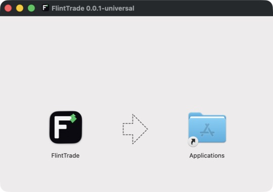

# FlintTrade Desktop

FlintTrade is a self-hosted web app first. The backend serves the terminal and
API from one origin, and a normal browser remains the primary supported way to
run it. The desktop package is a small Electron 43 shell around that same local
application.

> **Installer availability:** previous Tauri and PyInstaller assets do not
> satisfy the Electron source-bootstrap contract. The public
> [download surface](https://flinttrade.vercel.app/download) distinguishes the
> source-built web-app install from Electron-shell installers.
> It withholds Electron commands and download buttons unless one release
> contains the complete asset set (four installers plus `SHA256SUMS.txt`). Use the
> [source web-app setup](setup/QUICKSTART.md) or build the Electron shell locally
> whenever that complete set is unavailable.

## Delivery model

An Electron release contains exactly four shell installers plus one checksum
file:

| Platform | Canonical asset |
|---|---|
| macOS, Apple Silicon and Intel | `FlintTrade-<version>-mac-universal.dmg` |
| Windows x64 | `FlintTrade-<version>-win-x64.exe` |
| Linux x64 | `FlintTrade-<version>-linux-x64.AppImage` |
| Linux ARM64 | `FlintTrade-<version>-linux-arm64.AppImage` |
| All platforms | `SHA256SUMS.txt` |

The macOS, Windows, Linux and tray assets are generated from the same canonical
FlintTrade angular `F` and green flint-spark mark used by the terminal and
public site.



The installer contains Electron, the local splash, bootstrap resources and
licence notices. It does not contain a frozen Python backend, a prebuilt
terminal, or a separately downloaded runtime payload. The shell builds an
inspectable source checkout on first launch.

The shell and application runtime therefore have separate update lifecycles:

- **Source/runtime update:** stage and build a sibling source checkout, health
  prove it against an isolated temporary workspace, drain the current backend,
  atomically promote the candidate, and retain one last-known-good checkout for
  rollback.
- **Electron shell update:** select a newer release on the current stable or
  prerelease channel only when its canonical platform installer and
  `SHA256SUMS.txt` are present, cryptographically verify the installer's GitHub
  Sigstore provenance against the exact public repository, tag and release
  workflow, and hand its attested name and digest to the packaged install
  script before the shell exits. The script re-hashes the downloaded bytes
  against that app-provided digest, so replacing the asset after attestation
  verification cannot change what is installed.

The app launches each shell installer from a unique owner-private directory
under the shell profile. Failed, cancelled, pre-launch-failed and successful
stages are all deliberately retained for forensic review. There is currently
no automatic stage purge. Neither the app nor an exited installer treats a
re-derived pathname as authority for recursive deletion after the original
filesystem identity has been relinquished. Path replacements are therefore
always preserved rather than treated as cleanup targets.

There is no payload feed, rolling updater release, renderer-owned manifest, or
generic native-command bridge.

## First launch

The Electron shell owns machine-level bootstrap and lifecycle work. On first
launch it:

1. acquires the application singleton and provisions the owner-only
   `master_password` file in the platform workspace;
2. resolves the managed source at `~/.flinttrade/src/FlintTrade` and tools at
   `~/.flinttrade/tools` (under the current user's home on every platform);
3. acquires the official source with system Git, or uses the official HTTPS
   archive fallback when Git is unavailable;
4. provisions checksum-verified pinned `uv` and Node 22 distributions into the
   managed tools directory regardless of system Node availability; `uv` then
   provisions Python 3.12 and Corepack activates the repository-pinned pnpm
   10.34.5;
5. runs the frozen Python and JavaScript installs, then builds the terminal;
6. promotes the completed candidate only after all build steps pass;
7. starts `packaging/desktop_backend.py` from the managed virtual environment
   and waits for both `FLINTTRADE_BACKEND_READY port=<n>` and a successful
   loopback `/api/v1/ping` before opening the main window.

Bootstrap progress is available as pushed events and a polled snapshot. The
splash keeps a visible heartbeat during long work, redacts durable logs, and
offers bounded retry or cancellation after failure. A partially built candidate
never replaces the active source.

The application source and user data are separate:

| Platform | User workspace |
|---|---|
| macOS | `~/Library/Application Support/flinttrade/` |
| Windows | `%APPDATA%\flinttrade\` |
| Linux | `~/.flinttrade/` |

`FLINTTRADE_WORKSPACE_DIR` and `FLINTTRADE_HOME` remain explicit advanced
overrides. Source promotion, rollback, shell update and ordinary uninstall do
not mutate the workspace.

## Desktop lifecycle

- Closing the main window hides it to the system tray; it does not stop the
  backend.
- The tray exposes Show and Quit, and a tray click toggles visibility.
- `CommandOrControl+Shift+F` toggles the window globally.
- macOS dock activation restores a hidden window.
- Backend lines in the form `FLINTTRADE_NOTIFY\t<title>\t<body>` become native
  notifications after strict parsing.
- Explicit quit starts the backend's bounded asynchronous drain. Electron
  requests graceful shutdown first and then closes the owned process
  containment if proof does not arrive.
- A crashed backend replaces the remote terminal with the local recovery
  surface instead of leaving a stale page.

The main window loads only the backend's selected `127.0.0.1` origin. Electron
uses context isolation, renderer sandboxing and no Node integration. The
preload exposes named `window.flintDesktop` methods only; every IPC handler
validates the sender frame, and navigation, downloads, webviews, permissions
and unexpected child windows are denied.

## Install after an Electron release is available

The public [download surface](https://flinttrade.vercel.app/download)
distinguishes the source-built web-app install from Electron-shell installers.
It exposes the supported one-command Electron paths only when one release
contains all four canonical installers plus `SHA256SUMS.txt`:

```bash
# macOS or Linux
curl -fsSL https://flinttrade.vercel.app/install.sh | bash
```

```powershell
# Windows 10/11
irm https://flinttrade.vercel.app/install.ps1 | iex
```

The scripts enumerate official GitHub releases, require an internally
consistent semantic-version channel, verify that the current platform's exact
canonical asset and `SHA256SUMS.txt` are both present, and verify the downloaded
installer before changing the installed shell. An in-app update additionally
requires GitHub's Sigstore artifact attestation; a direct first install remains
usable with the release checksum because no trusted FlintTrade app exists yet
to perform that provenance check. `--ref <tag>` selects an exact
release and fails closed when that release is incomplete. `--no-launch` skips
the final launch. `--build-from-source` / `-BuildFromSource` is a separate
contributor path that packages only the shell from a trusted checkout. That
path also compiles the packaged native filesystem boundary: macOS requires the
system `/usr/bin/clang` and Node's installed N-API headers, Linux requires
`/usr/bin/cc` plus those headers, and Windows requires the x64 .NET Framework
`csc.exe`. The installer checks these prerequisites before changing a checkout.

The install scripts record exact shell identity in owner-private local state.
Updates and ordinary uninstalls refuse unknown same-name applications, links,
reparse aliases, changed executables or integration files that are not proved
by that receipt.

### If the download site returns an error

Use this whenever an install command above fails. The hosted URLs are only a
convenience redirect to the scripts in this repository, and a deployment
without an immutable source commit answers `503` for all four routes rather
than redirecting. Fetch the same installer straight from GitHub:

```bash
# macOS or Linux
curl -fsSL https://raw.githubusercontent.com/navaneeshnagarajan/FlintTrade/main/scripts/install/flinttrade-install.sh | bash
```

```powershell
# Windows
irm https://raw.githubusercontent.com/navaneeshnagarajan/FlintTrade/main/scripts/install/flinttrade-install.ps1 | iex
```

Or run the same file from a clone — see [`scripts/install/`](../scripts/install/):

```bash
# macOS or Linux
bash scripts/install/flinttrade-install.sh
```

```powershell
# Windows
powershell -ExecutionPolicy Bypass -File scripts\install\flinttrade-install.ps1
```

Every flag documented above (`--ref`, `--no-launch`, `--build-from-source`, and
their PowerShell spellings) works identically on this path — but note that
`curl … | bash` and `irm … | iex` give the script no argument vector. To pass a
flag, use `bash -s --` (for example
`curl -fsSL <url> | bash -s -- --ref v1.2.3`), the scriptblock form on Windows
(`& ([scriptblock]::Create((irm <url>))) -Ref v1.2.3`), or run the file from a
clone as shown above.

### macOS boundary

Local `make desktop-package` and `pack:mac` builds always force an **ad-hoc
seal**: `codesign --verify --deep --strict` proves bundle integrity, but the app
has no Developer ID trust and is not notarised. A manually downloaded local
build can therefore be blocked by Gatekeeper and may require the Privacy &
Security override. Do not describe an ad-hoc seal as Apple signing.

Only the release workflow can use distribution signing and notarisation. When
all distribution-signing secrets are present, CI requires the complete
notarisation trio too; without those complete sets it produces an ad-hoc-sealed
DMG, and partial configuration fails the release instead of publishing an
ambiguously signed build.

### Windows boundary

The Windows asset is an Electron-builder NSIS x64 installer and installs per
user. Windows 11 on ARM uses x64 emulation. Electron includes Chromium, so the
shell does not download or depend on the retired WebView2-based desktop
runtime. Authenticode signing is not currently configured.

Source apply and rollback use a packaged native filesystem helper rather than
claiming a Node directory-flush guarantee. The helper binds every managed
directory to its Windows volume serial and 128-bit file ID, rejects reparse or
aliased paths, and commits same-volume journal and promotion renames through
exact no-delete-share handles plus a native parent-directory flush. Journal
replacement and removal bind the target to its expected file ID and SHA-256
digest, deny compatible writers while that evidence is authenticated, and
require the reserved `.previous` name to be absent. A normal commit may use
that name transiently for the already-pinned target, but deletes it through the
same handle only after verifying the replacement. Before inspecting or mutating
the logical journal, the helper reconciles only an exact canonical transaction
receipt whose recorded target, temporary replacement, prior identity and
replacement identity match the files still present. This lets a crash after
`.previous` was published finish or roll back deterministically. A `.previous`
without that complete receipt-bound evidence, an invalid or changed fixed
`.transaction` receipt, or an ambiguous target/previous/temporary state is
preserved and blocks mutation instead of being adopted as cleanup authority.

Windows source cleanup pins the managed parent, renames the exact
identity-bound root to its deterministic quarantine and flushes the parent
before reclamation. The packaged helper then snapshots every direct child by
native file ID, reopens that exact identity without following reparse points,
and deletes only handles whose canonical parent remains inside the pinned
quarantine. A reparse entry itself may be removed, but its external target is
never traversed. Late, changed, locked, over-budget or ambiguous evidence leaves
the exact quarantine in place rather than widening deletion authority.

The managed target is absent while retained evidence is tracked in
`.flinttrade-source-cleanup.json` or
`.flinttrade-preserved-source-quarantines.json`. Startup and the next source
apply retry entries in the source-cleanup inventory; a successful native
reclamation prunes its row, so ordinary failed candidates and staging roots do
not accumulate until the metadata cap denies future updates. Preserved
last-known-good promotion evidence remains manual-forensics evidence: recovery
only proves an already removed quarantine absent before pruning that inventory.
Each inventory remains independently capped at 64 entries as an integrity
bound. Evidence which stays locked or changes identity may still require the
documented manual archive-and-remove procedure. A changed identity or ambiguous
target/quarantine arrangement is never adopted as deletion authority.

The helper executable is SHA-256-bound into the Electron main bundle at build
time. The Windows Job supervisor opens and hashes that exact ordinary file,
denies write/delete sharing, and retains the handle through `CreateProcess` so
the verified helper cannot be replaced between authentication and execution.

### Linux boundary

Linux publishes separate x64 and ARM64 AppImages. The install script uses a
per-user destination, desktop entry and command wrapper without `sudo`. If
FUSE 2 is unavailable, it attempts an installer-owned AppImage extraction and
runs the extracted `AppRun` instead.

## Uninstall

After an Electron release is installed with the one-command installer, ordinary
uninstall removes only the identity-proved shell and the integration files
named by that installer's receipt:

```bash
# macOS or Linux
curl -fsSL https://flinttrade.vercel.app/uninstall.sh | bash
```

```powershell
# Windows
irm https://flinttrade.vercel.app/uninstall.ps1 | iex
```

The workspace, Electron profile, managed source and tools, and legacy desktop
data are retained so a reinstall can recover them. The uninstaller refuses to
delete a same-name path without the exact receipt and executable/integration
identity.

A manual macOS Finder copy from the DMG deliberately has no installer receipt.
Quit FlintTrade and move that `FlintTrade.app` to Trash in Finder; the workspace,
Electron profile, managed source and tools remain available for reinstall. Once
the unreceipted app is gone, the purge command below can still remove recognised
FlintTrade data. The script will not claim an unreceipted same-name application
as its deletion authority.

`--purge` on macOS/Linux, or `-Purge` on Windows, additionally requests deletion
of recognised FlintTrade data. Purge is irreversible, requires typed or
explicit scripted confirmation, stays within the current user's home and
fails closed on links, reparse points, foreign ownership or an unproved custom
workspace:

```bash
# macOS or Linux
curl -fsSL https://flinttrade.vercel.app/uninstall.sh | bash -s -- --purge
```

```powershell
# Windows
& ([scriptblock]::Create((irm https://flinttrade.vercel.app/uninstall.ps1))) -Purge
```

### If the download site returns an error

The hosted URLs are only a convenience redirect to the scripts in this
repository. If `https://flinttrade.vercel.app/uninstall.sh` or
`https://flinttrade.vercel.app/uninstall.ps1` returns an error, fetch the same
uninstaller straight from GitHub:

```bash
# macOS or Linux
curl -fsSL https://raw.githubusercontent.com/navaneeshnagarajan/FlintTrade/main/scripts/install/flinttrade-uninstall.sh | bash
```

```powershell
# Windows
irm https://raw.githubusercontent.com/navaneeshnagarajan/FlintTrade/main/scripts/install/flinttrade-uninstall.ps1 | iex
```

Or run the same uninstaller directly from a clone (or from the managed source
checkout at `~/.flinttrade/src/FlintTrade`):

```bash
# macOS or Linux
bash scripts/install/flinttrade-uninstall.sh
```

```powershell
# Windows
powershell -ExecutionPolicy Bypass -File scripts\install\flinttrade-uninstall.ps1
```

Both accept the same `--purge` / `-Purge` flag. These are the same files the
site serves — see [`scripts/install/`](../scripts/install/).


## Build and verify locally

Shell development requires Git and Node 22.12 or newer. Use the repository's
pinned pnpm 10.34.5; Rust is needed only for the optional `core/ticks` package,
not for Electron packaging.

These lines run unchanged in bash, zsh and Windows PowerShell:

```bash
pnpm install --frozen-lockfile
python scripts/ft.py desktop-test     # Electron TypeScript + Vitest
python scripts/ft.py desktop-build    # verify resources, test, and bundle main/preload
python scripts/ft.py desktop-package  # package and verify this host's installer
```

On POSIX, `make desktop-test`, `make desktop-build` and `make desktop-package`
are aliases for the same three targets.

Installer output lands in `packages/apps/desktop/release/electron/`.

Package-specific commands are also available:

```bash
pnpm --filter @flinttrade/desktop typecheck
pnpm --filter @flinttrade/desktop test:electron
pnpm --filter @flinttrade/desktop bundle
pnpm --filter @flinttrade/desktop pack:mac
pnpm --filter @flinttrade/desktop pack:win
pnpm --filter @flinttrade/desktop pack:linux:x64
pnpm --filter @flinttrade/desktop pack:linux:arm64
```

Only the command matching the host platform is expected to work locally. A Mac
package does not prove Windows or Linux runtime behaviour. The local macOS
command always uses the ad-hoc seal; Apple distribution signing and notarisation
are release-CI-only paths.

## Release CI

`.github/workflows/desktop-release.yml` is the release authority. Release
Please dispatches it from the immutable version tag and expected commit SHA, or
a maintainer can dispatch it without a tag for build-only artefacts. The matrix
runs:

- macOS universal on `macos-14`;
- Windows x64 on `windows-latest`;
- Linux x64 on `ubuntu-22.04`;
- Linux ARM64 on `ubuntu-22.04-arm`.

The two Linux legs stay on 22.04 deliberately, and are the one place in CI
exempt from the supported-runner floor in `flint.toml`. They compile the
native addon that ships inside the installer, so the runner's glibc becomes
the minimum glibc of the published binary — raising the runner would raise
the floor for every user. The jobs that compile nothing (`validate`,
`publish`, `electron-desktop-tests`) track the supported floor instead.

Each job installs the frozen JavaScript workspace, verifies the bootstrap tool
manifest, bundles Electron, builds the installer and verifies the packaged
security contract. Publication refuses an existing non-empty release, creates
`SHA256SUMS.txt`, attests each asset's provenance, and rechecks the exact
five-asset set. The in-app updater fetches attestations by exact installer
digest and requires the `desktop-release.yml` `workflow_dispatch` identity at
the selected tag, GitHub's public Fulcio issuer, and valid Rekor and certificate
transparency proofs before installer handoff.

`test.yml` runs the Electron TypeScript, Vitest, bundle and hardened Linux
directory-package gate on normal code changes. The weekly/manual
`nightly-cross-platform.yml` packages Electron on macOS, Windows and Linux.
Windows and Linux runtime semantics remain CI/contributor-owned evidence; a
single local Mac run is not cross-platform proof.

## Relevant source

| Path | Role |
|---|---|
| [`packages/apps/desktop/electron/`](../packages/apps/desktop/electron/) | Electron main/preload, bootstrap, updates, lifecycle and tests |
| [`packages/apps/desktop/splash/`](../packages/apps/desktop/splash/) | Local bootstrap/recovery surface |
| [`packages/apps/desktop/resources/bootstrap/`](../packages/apps/desktop/resources/bootstrap/) | Packaged bootstrap entrypoints and verified tool manifest |
| [`packaging/desktop_backend.py`](../packaging/desktop_backend.py) | Source guardian and backend process owner |
| [`scripts/install/`](../scripts/install/) | Identity-bound shell install and uninstall scripts |
| [`.github/workflows/desktop-release.yml`](../.github/workflows/desktop-release.yml) | Four-installer build and publication |

## Troubleshooting

- **The download page does not show Electron install commands or downloads.**
  This is expected unless one release contains all four canonical installers
  plus `SHA256SUMS.txt`. Use the distinct source-built web-app setup or build
  the Electron shell locally when the complete set is unavailable.
- **First launch remains on the splash.** Read the redacted bootstrap log in
  the workspace's `logs/` directory. Retry resumes through a new attempt; a
  failed candidate does not replace the active source. FlintTrade durably caps
  first-run allocation at three retained attempts (the initial attempt plus two
  retries) and stops before allocating another candidate, download, snapshot or
  extraction tree. The app never pathname-deletes this forensic evidence; use
  the explicit uninstall purge flow if all three attempts fail.
- **A source update is refused.** The updater rejects dirty, foreign or changed
  active checkouts. Keep personal source work outside the managed active path.
  On Windows, close programs holding files in the managed checkout and retry;
  FlintTrade preserves the journal instead of deleting around a lock. A
  filesystem which refuses the native parent flush is unsupported and the
  update remains fail-closed.
- **Windows reports too many preserved source-operation lease quarantines.**
  These are `.flinttrade-bootstrap-operation.lock.stale-*` directories left by
  interrupted bootstrap or update ownership, not either source-cleanup
  inventory. FlintTrade revalidates them but does not pathname-delete them on
  Windows, and blocks after 64 are retained. Stop FlintTrade, archive the exact
  directories for diagnosis, then remove only confirmed stale quarantine
  directories; never remove the active `.flinttrade-bootstrap-operation.lock`.
- **macOS reports an unidentified developer.** The current boundary is an
  ad-hoc seal, not Developer ID signing or notarisation. Use the documented
  Privacy & Security override for a locally built package.
- **Linux cannot mount the AppImage.** Use the one-command installer after a
  release is available; it attempts the FUSE-less extracted layout.
- **Port 5100 is already in use.** The desktop guardian starts the managed
  backend with `--port 0`, so a contributor backend on 5100 does not conflict.
