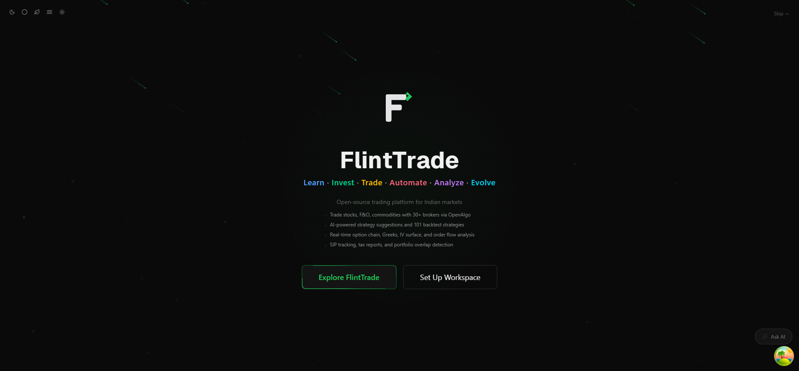
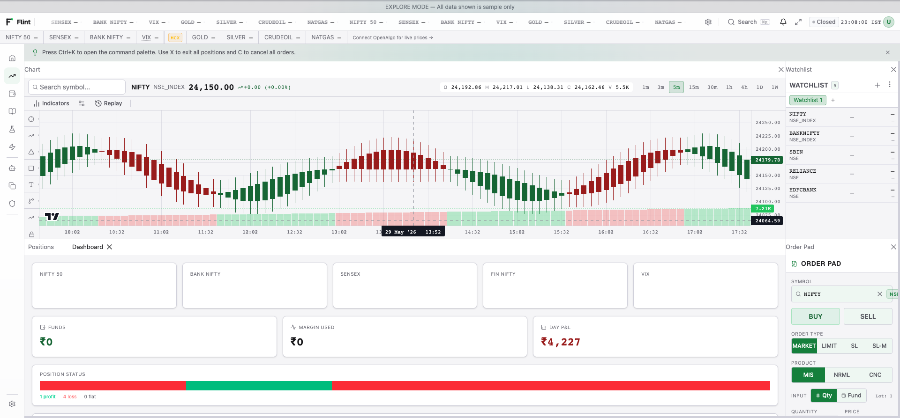
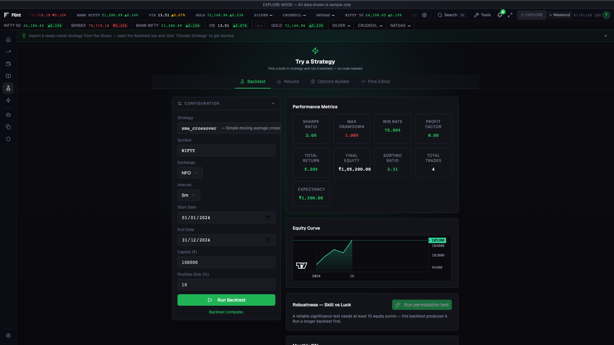
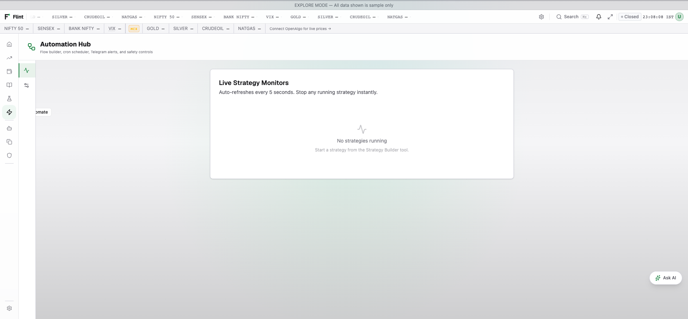
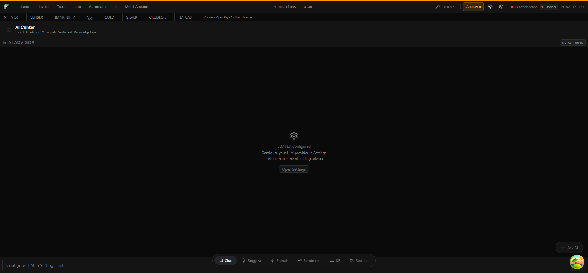
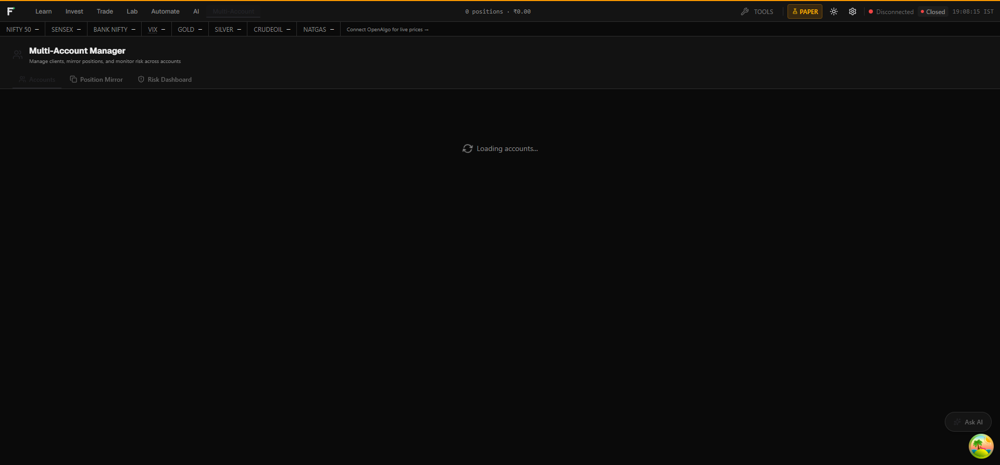
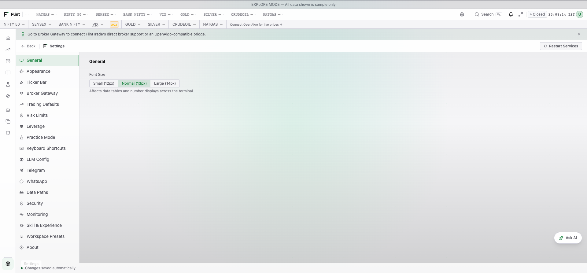

# FlintTrade User Guide

This guide walks you from a fresh install to local setup, sandbox workflows,
and Live-mode safeguard verification. The default reading order is top-to-bottom
— every section builds on the one before it. If you already have FlintTrade running, jump to the
[Workspace tour](#workspace-tour) or use the section list in the sidebar.

> **Beta software.** FlintTrade `v0.0.1` is not production ready and
> does not provide financial advice. Read [disclaimer.md](../disclaimer.md)
> before connecting a broker or switching to Live mode.

> **Multiple workflows, one local app.** FlintTrade has route groups for order
> workflow testing, portfolio-style records, and guided learning. Pick `/trade`,
> `/invest`, or `/learn` from the top bar to switch workspaces without losing
> context.

---

## 1. Installation

FlintTrade runs on Windows, macOS, and Linux (including Raspberry Pi). It is
a **self-hosted web app first**: one backend process serves the full terminal
UI and API on a single origin (port 5100), usable from any browser. The
desktop apps are convenience wrappers around that same backend for people who
prefer a one-click install.

### Self-hosted web app (the primary path)

```bash
git clone https://github.com/navaneeshnagarajan/FlintTrade.git
cd FlintTrade
uv sync && pnpm install
make start        # backend + terminal UI on http://127.0.0.1:5100
```

Or run it in Docker with `make docker-up`. Open the printed URL in a browser
and follow the first-time Setup flow — no `.env` file is required.

### Native desktop (Electron convenience shell)

The desktop package is a small Electron shell. It verifies pinned tools and
builds an inspectable local source checkout on first launch instead of
downloading a frozen backend payload. Its release contract is one universal
macOS DMG, one Windows x64 NSIS installer, Linux x64 and ARM64 AppImages, and
`SHA256SUMS.txt`.

No complete, checksum-published Electron release exists yet. The
branch-local [download page](https://flinttrade.vercel.app/download) will hide
the commands below until all five assets are present once this branch is
deployed. The currently deployed beta.13 page predates that gate and still
advertises the retired packaging; do not use those instructions as an Electron
source-bootstrap install. After the cutover and the gate opens, the supported
commands are:

```bash
# macOS / Linux
curl -fsSL https://flinttrade.vercel.app/install.sh | bash
```

```powershell
# Windows 10/11
irm https://flinttrade.vercel.app/install.ps1 | iex
```

The installed shell builds the hash-verified, integrity-locked source on first
launch (progress on the splash; needs internet), creates the OS workspace, and
opens Setup only after the source guardian is healthy. Source/runtime updates
are staged and health-proved separately from Electron-shell installer updates.
Manual downloads and per-OS caveats are covered in [DESKTOP.md](DESKTOP.md).

Contributors can package the shell locally:

```bash
pnpm install --frozen-lockfile
make desktop-test
make desktop-package
```

Install the generated package from `packages/apps/desktop/release/electron/`,
launch FlintTrade, and follow the first-time Setup flow. Local macOS output is
always ad-hoc sealed and has no Developer ID trust. Only release CI can use
complete Apple distribution-signing and notarisation secrets.

### Contributor source mode

Use this only when developing FlintTrade itself. It requires Python 3.12+,
Node.js 22+, Git, and optionally Rust for `core/ticks`.

```bash
make setup
make dev
```

Open `http://localhost:5173` once the dev server is ready.

### Platform-specific setup

For step-by-step instructions tailored to each operating system, see:

- [Windows setup](setup/windows.md)
- [macOS setup](setup/macos.md)
- [Linux setup](setup/linux.md)
- [Raspberry Pi setup](setup/raspberry-pi.md)
- [Quick start (cross-platform)](setup/QUICKSTART.md)


*The /welcome route — first-time cinematic introduction with persona pickers.*

---

## 2. First broker connection

FlintTrade supports two broker paths: the recommended OpenAlgo-compatible bridge
for users who already run OpenAlgo, and the native FlintTrade gateway for
currently verified first-party adapters.

### Steps

1. **Choose a path.** Use OpenAlgo for the recommended community-tested broker
   path, or use the native gateway only for currently verified native brokers
   (Dhan and Upstox today). Brokers shown as "coming soon" are
   catalogued but not yet enabled for native connect.
2. **Configure your broker in OpenAlgo when using the bridge.** Open `http://localhost:5000`,
   choose your broker from the dropdown, paste your API key and secret, and
   complete the broker's login flow (TOTP / OAuth / OTP — depends on the
   broker). OpenAlgo persists the session. Skip this step for Explore mode,
   Practice mode, and native FlintTrade gateway work that does not use the
   OpenAlgo-compatible bridge.
3. **Optional: generate an OpenAlgo API key.** From the OpenAlgo dashboard,
   copy the generated API key. This is the key FlintTrade uses for the
   OpenAlgo-compatible bridge only (not your broker's key).
4. **Set the OpenAlgo key in FlintTrade.** Open Setup → OpenAlgo Bridge, or
   Settings → Broker Gateway, then paste the OpenAlgo URL and API key. The app
   stores these settings in the OS workspace and hot-reloads the backend client.
   If the URL does not include a port, set REST Port (default `5000`); the
   WebSocket Port defaults to `8765`.
5. **Verify the bridge.** Use the Test Connection button in the same UI. Source
   contributors can open `http://localhost:5173/setup`; desktop users use the
   in-app setup window.

For native connect, use Setup → Brokers or Settings → Brokers. Only Dhan and
Upstox are currently enabled. Upstox Developer Apps analytics tokens connect as
read-only sessions. INDmoney uses a dashboard-generated token that resets at the
daily 06:00 IST dashboard cycle, but remains disabled until its smart-parent,
atomic reduce-only, and live order-safety blockers clear. Kotak Neo and Groww
retain their displayed activation blockers; Kotak Neo still needs live
login/read and order-safety proof, and Groww may also require approving the
API-key session in Groww Cloud before FlintTrade can mint a token.
Localhost postback URLs are for diagnostics unless you expose FlintTrade through
a broker-reachable tunnel or public URL.

The same Brokers screen also shows **Broker MCP assistants** for OpenAlgo, Dhan,
Upstox, and Groww when catalogue metadata is available. These cards copy the
broker-hosted MCP URLs and client configurations, and label read-only surfaces
such as Upstox MCP. Broker MCP tools run in the external MCP client; FlintTrade
automation and live order placement still use the normal guarded OpenAlgo or
native broker path.

### Why two layers?

The two-layer design lets existing OpenAlgo users keep their broker setup while
FlintTrade keeps its own backend, native sandbox, analytics, automation, and
first-party broker gateway for verified native adapters.

---

## 3. First sandbox order (Practice mode)

Before enabling any order-capable integration, exercise the order path in
**Practice mode**. FlintTrade has a three-mode system:

| Mode | Order behaviour | Best for |
|---|---|---|
| **Explore** | No orders sent; demo data only | First-time visitors, screenshots, docs |
| **Practice** | Orders simulated by FlintTrade's native sandbox | Strategy tests and integration checks |
| **Live** | Real orders sent through the configured broker path | Gated broker integration, only after user review |

The current mode is shown in the top bar and is server-enforced via the JWT
claim — switching to Live requires a deliberate confirmation step.

### Walkthrough

1. Open `http://localhost:5173/trade`.
2. Click the mode badge in the top bar → choose **Practice**. A modal
   confirms the switch.
3. From the dock sidebar, drag the **Order Pad** widget into the workspace
   (or pick a preset that contains it).
4. Type `NIFTY` into the symbol field; FlintTrade autocompletes the current
   front-month future. Select it.
5. Set Quantity = 1 lot (50). Choose **MARKET**. Side = **BUY**.
6. Click **Place Order**. The order appears in the **Positions** widget
   immediately; the **Orderbook** widget shows it as filled (simulated).
7. Close the position from the Positions widget. Confirm your simulated
   P&L is recorded in the **Intraday P&L** widget.

You have just exercised the full FlintTrade order path — front-end → JWT
guard → mode guard → FlintTrade sandbox → simulated fill →
WebSocket back to the front-end. No real money moved.


*The /trade workspace with Dockview tabs, order pad, positions, and chart.*

---

## 4. Live-mode safeguard verification

Live mode can send real orders through a configured broker path. This guide
does not recommend or instruct a live order; use this section to verify the
software safeguards, prompts, and recovery controls in a local setup.

### Pre-flight checklist

- [ ] Broker or OpenAlgo session is current if you are intentionally testing a
      live-capable integration.
- [ ] Your FlintTrade JWT is fresh — it expires daily at 8 AM IST.
- [ ] The 5-layer safety system is active (see
      [DEVELOPER_GUIDE.md](DEVELOPER_GUIDE.md#safety-layers)).
- [ ] Daily P&L pause and hard-stop percentages are configured in Settings → Risk.
- [ ] You have read the risk and user-responsibility notes in
      [disclaimer.md](../disclaimer.md).

### Walkthrough

1. Click the mode badge in the top bar → choose **Live**. A modal warns
   that real orders will be placed and asks for password re-entry.
2. Cancel the modal unless you are deliberately performing your own broker-side
   test outside this guide.
3. Confirm the UI clearly shows Live mode, the active account, and the
   configured safety thresholds before any order-capable action is available.
4. Return to **Practice** mode and repeat the order-path walkthrough in the
   sandbox before continuing development work.

If anything looks wrong during live-capable testing, hit the **Kill Switch** in
the top bar. It cancels open orders and asks the configured broker path to close
positions via the supported close-position endpoint. The kill switch fires only
when you explicitly activate it from the UI, API, or configured Telegram
command. Layer 4 daily-loss thresholds block subsequent new orders but do not
cancel orders or flatten positions.

---

## 5. Workspace tour

FlintTrade's workspace is a [Dockview](https://github.com/mathuo/dockview)
canvas. Every widget is a panel you can drag, tab, stack, float, or pop out
into its own window. Layouts persist in `~/.flinttrade/workspace.json` and
sync across sessions.

### The 12 routes

| Route | Purpose |
|---|---|
| `/welcome` | First-time cinematic introduction (smart-redirects after first visit). |
| `/explore` | Demo mode with sample data — no broker connection needed. |
| `/setup` | First-time wizard (Quick / Guided / Advanced paths). |
| `/settings` | Standalone settings page (workspace.json editor with form UI). |
| `/trade` | Order-workflow workspace — Dockview canvas, widgets, and presets. |
| `/invest` | Portfolio-record workspace — holdings, net worth, SIPs, and mutual-fund tracker. |
| `/learn` | Learning workspace — courses, glossary, examples, and sandbox workflows. |
| `/lab` | Strategy Lab — backtest, forward test, optimise. |
| `/automate` | Automation Hub — flows, cron, monitors, logs. |
| `/ai` | AI Centre — chat, signals, sentiment, RAG. |
| `/ditto` | Multi-account management — mirror, margin, risk. |
| `/admin` | Admin panel (development builds only) — security, health, traffic. |

### The widgets (82)

Widgets are organised into three categories — Trading / Analysis / Utility —
under `packages/apps/terminal/src/widgets/`. The lists below are generated
from the widget registry
(`packages/apps/terminal/src/layout/widgetFactory.tsx`) and are exhaustive:

- **Trading** — Dashboard, Scalper, Positions, Orders, Holdings, Trade Book, Order
  Pad, Intraday P&L, MTM Monitor, Action Center, Trade Copier, Smart
  Order, Portfolio Allocation, Quick Trade, Session Stats, Risk,
  Trade Log, Trade Performance, Strategy Monitor, DOM / Ladder,
  Forever (GTT) Orders, Super Orders, and Conditional Triggers
- **Analysis** — Chart, Option Chain, Historical Chain, OI Analytics, Straddle &
  Implied Move, Greeks, Sector Map, FII Long/Short, Dealer Gamma,
  Arbitrage Scanner, Index Contribution, Pattern Detection, Tape &
  Microstructure, Vol Surface, IV Smile & Skew, Straddle P&L, Order
  Flow, Three-Panel Chart, Portfolio Optimiser, Condition Scanner,
  Pivot Points, Market Breadth, Volatility Cone, Heat Calendar, VWAP
  Bands, Correlation Pairs, Multi-Timeframe, PCR Trend, Instrument
  Compare, Greeks Matrix, Gap Analysis, Options Flow, Correlation
  Matrix, Sector Performance, and DOM Heatmap
- **Utility** — Watchlist, Calculator, News Feed, Ticker, AI Advisor, AI Backends,
  AI Team, Obsidian Vault, Price Alerts, System Health,
  Reconciliation, Funding Rates, Currency Converter, Earnings
  Calendar, Global Indices, Strategy Templates, Audit Trail,
  Economic Calendar, Expiry Countdown, Market Clock, Trade Ideas,
  Tick Speed, Market Summary, and Trade Journal
Every widget is registered in `packages/apps/terminal/src/layout/widgetFactory.tsx`.

### The 15 workspace presets

A preset is a pre-built layout you can apply instantly from the command
palette (Ctrl + K → "preset"). Built-in presets include:

- **Scalper Zone** — chart, level-2 depth, order pad, positions, scalper panel.
- **Options Desk** — option chain, chart, Greeks, positions, straddle P&L.
- **Market Watch** — multi-symbol watchlist, chart, price ticker, dashboard.
- **Analysis** — chart with indicators, OI chart, depth, positions, news.
- **Risk Monitor** — dashboard, risk panel, MTM monitor, positions, orders.
- **Investor View** — chart, watchlist, holdings, dashboard (SIPs, net worth
  and mutual funds live on the Invest page).
- … plus eight more.

Presets are serialised via the Dockview API. You can save your own custom
preset from Settings → Workspace.

---

## 6. Screener walkthrough

The screener lives under the **Analysis** widget category and shares the
workspace with everything else — no separate route. The four headline tools:

### Option Chain

Streaming option-chain widget rendered with
[Glide Data Grid](https://github.com/glideapps/glide-data-grid) for
60+ FPS updates even on a 50-strike chain.

1. Drag the **Option Chain** widget into the workspace.
2. Pick a symbol (e.g. `NIFTY`, `BANKNIFTY`, `RELIANCE`).
3. The expiry row auto-fills from OpenAlgo's `/expiry` endpoint.
4. Calls on the left, Puts on the right, ATM strike highlighted.
5. Hover any cell — sparkline shows the last-100-tick history.

### OI Profile

Plots Open Interest changes by strike across CE and PE legs for local analysis
and UI testing.

### Max Pain

Calculates the strike at which option writers lose the least if expiry hit
right now. Updates every minute from OpenAlgo's `optionchain` feed.

### IV Smile

Implied-volatility curve across strikes, with skew and term-structure
indicators. Useful for spotting unusual options activity.

---

## 7. Strategy Lab walkthrough

Open `/lab`. The Strategy Lab is split into three sub-tools:

### Backtest

1. **Pick a template.** 94 templates ship under
   `packages/services/backtest/src/flinttrade_backtest/strategies/` — ranging
   from simple EMA crossover to complex options-spreads strategies.
2. **Configure parameters.** Each template exposes a parameter form
   (built with `react-hook-form` + `zod`).
3. **Pick a date range.** Historical OHLCV data is sourced from your
   configured providers (OpenChart, yfinance, or a licensed feed).
4. **Run.** The backtest engine processes ticks vector-wise (VectorBT for
   exploration, Rust/PyO3 `ticks` for tick-level precision when
   you opt in).
5. **Review.** Equity curve, Sharpe, Sortino, max drawdown, win rate,
   trade list, Monte Carlo confidence band.

### Forward Test

Same as Backtest, but runs in Practice mode against live ticks. Use it to
validate the software path before any Live-mode use.

### Optimise

Walk-forward optimisation across a parameter grid. Outputs a heatmap of
performance per parameter combination plus an out-of-sample evaluation.



---

## 8. Automation Hub walkthrough

Open `/automate`. Three sub-tools:

### Flows

Visual flow builder (drag-and-drop nodes) for "when X happens, do Y"
automations. Nodes include market-data events, broker events, and actions such
as sending a notification or running a local script.

### Cron

Time-based automations. Examples:

- Run pre-market screener at 9:00 AM IST every weekday.
- Snapshot positions to a CSV at 3:30 PM IST.
- Write a daily P&L summary to local storage at end-of-day.

Cron jobs run inside the FlintTrade backend (`packages/services/automation`).

### Monitors

Watchdog rules that fire alerts (Telegram, sound, on-screen). Lighter
than Flows — single-event triggers without action chains.



---

## 9. AI Centre walkthrough

Open `/ai`. Four sub-tools backed by `packages/services/ai`:

### Chat

Local AI analysis and debugging tools. The default local provider is FlintTrade's
managed Ollama sidecar on a backend-only dynamic loopback endpoint. Settings -> AI
requires separate confirmation before downloading the pinned runtime or any model;
cloud and custom providers remain optional. Runtime update, rollback and uninstall
are offered only while Ollama is stopped. Uninstall preserves models and accepted
digests. The model inventory can delete one unselected model name or prune only
unused digest-locked aliases created by FlintTrade; configured models are protected.
If a timed-out mutation has an outcome FlintTrade cannot prove, Settings blocks
later runtime changes and shows the exact operation and admission IDs. Explicit
acknowledgement records that the unknown result was reviewed; it does not retry
the action or label it successful.

### Signals

Rule-based and ML-derived software outputs. Includes an executor that runs
multiple generators in parallel and aggregates diagnostics. These outputs are
educational and are not financial advice.

### Sentiment

News and social-media sentiment scoring per symbol. Driven by a
news-scheduler that polls RSS, Twitter (X), and Reddit on a configurable
interval.

### RAG

Retrieval-augmented question answering over local user-provided documents
(for example notes, statements, or research PDFs). The runtime is off by
default and the vector store/embedding libraries are loaded only when installed
locally and enabled, so ordinary launches do not download models, embed
documents, or carry optional AI dependencies. Set `FLINTTRADE_RAG_ENABLED=true`
when you want the RAG runtime available, or `FLINTTRADE_RAG_AUTO_INDEX=true`
when you intentionally want `docs/` indexed at startup.



---

## 10. Ditto multi-account walkthrough

Open `/ditto`. Ditto is FlintTrade's multi-account orchestration module for
testing account relationships, sizing rules, and risk overrides in one local
workspace.

### Three views

- **Mirror** — set up follower → master relationships, choose
  proportional or fixed-lot sizing.
- **Margin** — pre-trade margin calculator across all linked accounts.
- **Risk** — per-account risk limits, kill-switch propagation, trailing
  stop-loss governor.

Position mirroring patterns originally came from AlgoMirror; they now run
in-process inside `packages/services/ditto/` (no external service required).



---

## 11. Settings reference

FlintTrade has two layers of configuration:

### Layer 1: `workspace.json` (user preferences and integration settings)

Lives in your platform-specific workspace directory:

| Platform | Path |
|---|---|
| Linux | `~/.flinttrade/workspace.json` |
| macOS | `~/Library/Application Support/flinttrade/workspace.json` |
| Windows | `%APPDATA%/flinttrade/workspace.json` |
| Override | `FLINTTRADE_HOME` environment variable |

The Setup and Settings UI write `workspace.json`. Key
sections:

| Section | Maps to | Configures |
|---|---|---|
| **General** | `ui.theme`, `ui.density` | Theme (Graphite / Midnight / Ember), light / dark / system, UI density. |
| **Workspace** | `storage.fast`, `storage.archive` | SSD vs HDD paths for tick data vs archive. |
| **AI** | `llm.provider`, `llm.host`, `llm.model` | Managed Ollama runtime plus OpenAI, Anthropic, Groq, Hermes, and custom endpoints. |
| **Notifications** | `telegram.*`, `whatsapp.*` | Telegram bot token, chat ID, kill-switch enable. |
| **Risk** | `risk.daily_pnl_pause_pct`, `risk.daily_pnl_kill_pct` | Daily P&L percentages for a reversible new-order pause and a latched new-order hard stop; neither activates Layer 5. |
| **Order safety** | `sebi.rate_limit_*` | Per-endpoint rate limits and kill-switch settings. (The audit log is append-only with operator-controlled retention — there is no automatic purge.) |

Settings → **Report Bug** prepares a GitHub issue without background telemetry.
The form keeps runtime/error diagnostics out of the public draft by default;
enable the diagnostic-summary switch only after reviewing the displayed
metadata. **Download diagnostics** writes a local JSON bundle that excludes raw
request bodies, messages, tracebacks, account/user identifiers, entry ids and
URL queries. Opening GitHub sends the displayed draft in the URL. Oversized
drafts are copied for manual pasting, and security reports open the private
GitHub Security Advisory form instead of a public issue.

### Layer 2: `.env` (advanced dev/server fallback)

Native desktop users do not need `.env`. The repo-root `.env.example` exists
only for Docker/systemd deployments, CI experiments, and contributor fallback
testing when a setting cannot be supplied through the app UI.

Secrets are stored as `_ref` fields — references to the OS keyring or to
environment variables. They are never written to `workspace.json` in clear
text.



---

## 12. Troubleshooting

### "Connection refused" on the OpenAlgo port

OpenAlgo is not running, or it is bound to a different port. In Settings →
Broker Gateway, keep the port in the Gateway URL or set REST Port when the URL
omits it.

```bash
make status          # shows FlintTrade backend health and optional OpenAlgo status
make start-openalgo  # boots the optional local-dev OpenAlgo clone when present
```

If you installed OpenAlgo separately, start it via its own start script
(`python app.py` from the OpenAlgo repo root, or its systemd unit).

### "Port 5100 already in use"

FlintTrade's backend listens on port 5100 (deliberately separate from
OpenAlgo's multi-instance range 5000-5009). Find and kill the conflicting
process:

```bash
# Linux / macOS
lsof -i :5100
kill <pid>

# Windows (PowerShell)
Get-NetTCPConnection -LocalPort 5100 | Select-Object OwningProcess
Stop-Process -Id <pid>
```

### "Token expired" when placing an order

FlintTrade JWTs expire daily at 8 AM IST. Refresh the token by signing in
again — the front-end will redirect you to the login screen automatically
when it detects the 401.

### Orders not arriving / silently dropped

1. Check the mode badge in the top bar. If it says **Explore**, no orders
   are sent at all (by design).
2. Open the **Orderbook** widget and look at the rejection reason column.
3. Check the FlintTrade backend logs (where you ran `python
   packages/core/core/src/flinttrade_core/app.py` or `make start`) — every rejected order is
   logged with the safety-layer that blocked it.

### Front-end shows stale prices

The WebSocket on port 8765 has dropped. The top bar status indicator turns
red when this happens. FlintTrade auto-reconnects with exponential
back-off; if the indicator stays red for more than 30 seconds, restart the
terminal (`Ctrl-C` then `npm run dev`).

### "Cannot find module '@/...'"

The path alias `@` → `packages/apps/terminal/src/` is configured in
`tsconfig.json` and `vite.config.ts`. If your editor's TypeScript server
disagrees, restart it. If `vitest` complains, ensure
`packages/apps/terminal/vitest.config.ts` extends the same alias.

### Settings page won't save

`workspace.json` may be read-only or in a folder the process cannot write
to. Check the path printed in the FlintTrade backend startup log and
ensure the running user has write access.

### Where to get help

- **Settings → Report Bug** — prepare a bounded issue draft and optional local
  diagnostic bundle from inside FlintTrade.
- **Question issue template** — for focused usage questions and setup help.
- **GitHub Issues** — for bugs and feature requests (use the templates in
  `.github/ISSUE_TEMPLATE/`).
- **security.md** — for security issues (private disclosure via GitHub
  Security Advisories).

If your issue requires a backend log, run with
`FLINTTRADE_LOG_LEVEL=DEBUG` and attach the relevant lines (redact any
broker account IDs or tokens first).
