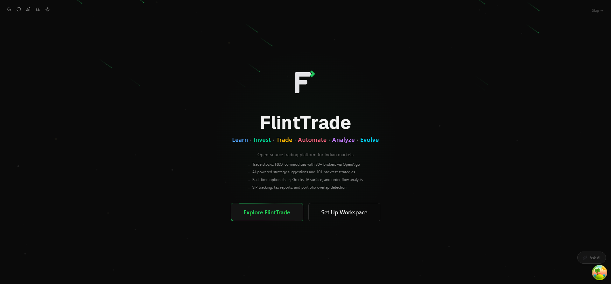
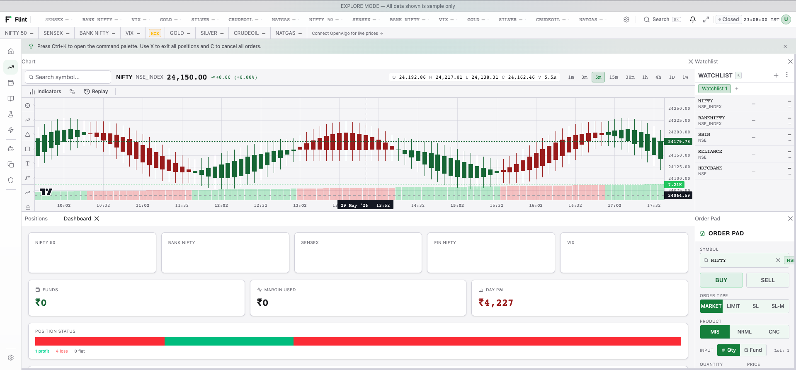
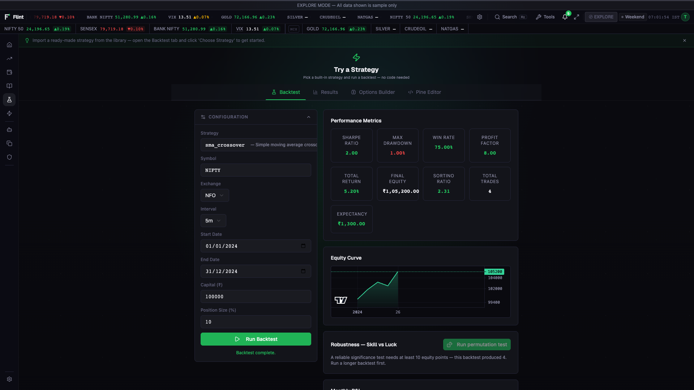
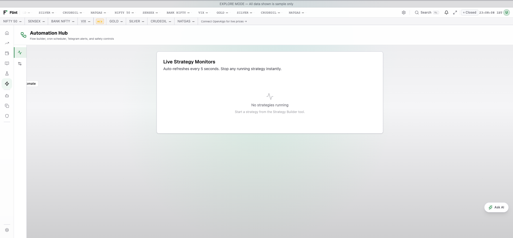
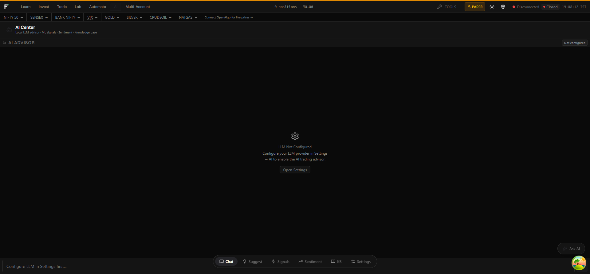
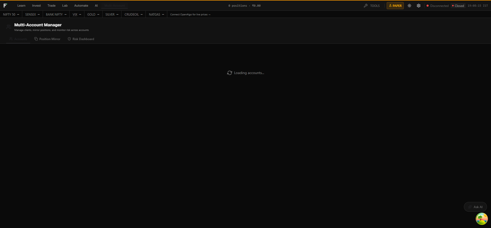
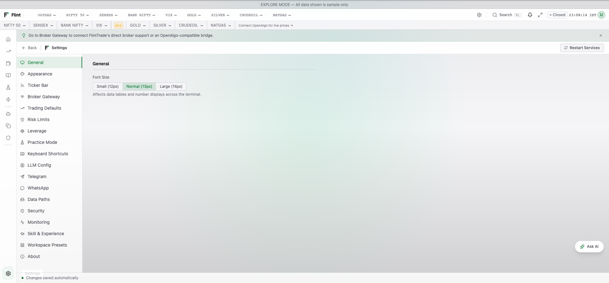

# FlintTrade User Guide

This guide walks you from a fresh install to local setup, sandbox workflows,
and Live-mode safeguard verification. The default reading order is top-to-bottom
— every section builds on the one before it. If you already have FlintTrade running, jump to the
[Workspace tour](#5-workspace-tour) or use the section list in the sidebar.

> **Beta software.** FlintTrade `v0.0.1` is not production ready and
> does not provide financial advice. Read [disclaimer.md](../disclaimer.md)
> before connecting a broker or switching to Live mode.

> **Multiple workflows, one local app.** FlintTrade has route groups for order
> workflow testing, portfolio-style records, and guided learning. Pick `/trade`,
> `/invest`, or `/learn` from the sidebar to switch workspaces without losing
> context.

---

## 1. Installation

FlintTrade runs on Windows, macOS, and Linux (including Raspberry Pi). It is
a **self-hosted web app first**: one backend process serves the full terminal
UI and API on a single origin (port 5100), usable from any browser. The
desktop apps are convenience wrappers around that same backend for people who
prefer a one-click install.

### One-line install (recommended — no prerequisites)

The web-app installer runs in the shell your OS already ships (bash or zsh on
macOS and Linux, built-in PowerShell on Windows) and needs no other toolchain:
no Python, no Node, no git and no make.

```bash
# macOS / Linux
curl -fsSL https://flinttrade.vercel.app/web-install.sh | bash
```

```powershell
# Windows 10/11
# Run in a normal (non-Administrator) PowerShell window
irm https://flinttrade.vercel.app/web-install.ps1 | iex
```

It provisions a pinned, checksum-verified toolchain (`uv`, Python 3.12, Node
and pnpm) under `~/.flinttrade/tools`, builds FlintTrade from a managed source
checkout at `~/.flinttrade/web-src/FlintTrade`, and installs a `flinttrade-web`
launcher — `~/.local/bin/flinttrade-web` on macOS and Linux,
`%LOCALAPPDATA%\Programs\FlintTradeWeb\flinttrade-web.cmd` plus a **FlintTrade
Web** Start Menu shortcut on Windows. The Electron desktop shell keeps its own
launcher, Start Menu entry and source checkout, so the two installs never
collide and can be run in either order. Open http://127.0.0.1:5100 and follow the first-time Setup flow
— no `.env` file is required.

Removing it again is covered in [Uninstall](#13-uninstall).

#### If the site is unreachable (repo-direct fallback)

Use this whenever the command above fails. The hosted URLs are only a redirect
to the scripts in this repository, so a site outage or a deployment without an
immutable source commit answers `503` — and piping that error page into a shell
does nothing useful. These commands fetch the same script straight from GitHub
and depend on no deployment:

```bash
# macOS / Linux
curl -fsSL https://raw.githubusercontent.com/navaneeshnagarajan/FlintTrade/main/scripts/install/flinttrade-web-install.sh | bash
```

```powershell
# Windows 10/11
# Run in a normal (non-Administrator) PowerShell window
irm https://raw.githubusercontent.com/navaneeshnagarajan/FlintTrade/main/scripts/install/flinttrade-web-install.ps1 | iex
```

To read the script before running it, clone the repository and run it from the
checkout instead:

```bash
git clone https://github.com/navaneeshnagarajan/FlintTrade.git
cd FlintTrade
bash scripts/install/flinttrade-web-install.sh
```

On Windows, run the checkout copy with
`powershell -ExecutionPolicy Bypass -File scripts\install\flinttrade-web-install.ps1`.

### Run from source (contributors)

Use this when you are developing FlintTrade itself. It expects you to supply
the toolchain yourself: git, Python 3.12+, Node 22.22.2+, `uv` and `pnpm`.

```bash
git clone https://github.com/navaneeshnagarajan/FlintTrade.git
cd FlintTrade
uv sync
pnpm install
pnpm --filter @flinttrade/terminal build
python scripts/ft.py start
```

The same six lines run unchanged in Windows PowerShell — do not join them with
`&&`, which Windows PowerShell 5.1 does not support.
`python scripts/ft.py <target>` is the cross-platform runner (no make and no
bash needed); `make <target>` is the POSIX alias.

The terminal build step is not optional: the backend serves the UI only when
`packages/apps/terminal/dist/index.html` exists, so skipping it leaves you with
an API and no interface.

Docker (`make docker-up`) is an advanced, POSIX-only path — it needs make and
Docker, so it is not a zero-prerequisite way in. A `.env` file is optional:
the default profile starts the backend, the terminal build and nginx, and the
UI is served at http://localhost:8080 (override with `FLINTTRADE_HTTP_PORT`).

### Native desktop (Electron convenience shell)

The desktop package is a small Electron shell. It verifies pinned tools and
builds an inspectable local source checkout on first launch instead of
downloading a frozen backend payload. Its release contract is one universal
macOS DMG, one Windows x64 NSIS installer, Linux x64 and ARM64 AppImages, and
`SHA256SUMS.txt`.

The public [download surface](https://flinttrade.vercel.app/download)
distinguishes the source-built web-app install above from Electron-shell
installers. It withholds Electron commands and downloads unless one release
contains all four canonical installers plus `SHA256SUMS.txt`. For a release
that passes that gate, the supported commands are:

```bash
# macOS / Linux
curl -fsSL https://flinttrade.vercel.app/install.sh | bash
```

```powershell
# Windows 10/11
irm https://flinttrade.vercel.app/install.ps1 | iex
```

If the site is unreachable, the same desktop installer runs repo-direct — swap
`flinttrade-web-install` for `flinttrade-install` in the fallback commands under
[If the site is unreachable](#if-the-site-is-unreachable-repo-direct-fallback).

The installed shell builds the hash-verified, integrity-locked source on first
launch (progress on the splash; needs internet), creates the OS workspace, and
opens Setup only after the source guardian is healthy. Source/runtime updates
are staged and health-proved separately from Electron-shell installer updates.
Manual downloads and per-OS caveats are covered in [DESKTOP.md](DESKTOP.md).

The matching desktop uninstall is in [Uninstall](#13-uninstall).

Contributors can package the shell locally (these lines run unchanged in bash,
zsh and Windows PowerShell):

```bash
pnpm install --frozen-lockfile
python scripts/ft.py desktop-test
python scripts/ft.py desktop-package
```

On POSIX, `make desktop-test` and `make desktop-package` are aliases for the
same targets. Install the generated package from
`packages/apps/desktop/release/electron/`, launch FlintTrade, and follow the
first-time Setup flow. Local macOS output is always ad-hoc sealed and has no
Developer ID trust. Only release CI can use complete Apple
distribution-signing and notarisation secrets.

### Terminal dev server (contributors)

When you are changing terminal code, run the Vite dev server alongside the
backend instead of the built UI. It requires Python 3.12+, Node.js 22.22.2+, Git,
and optionally Rust for `core/ticks`.

```bash
python scripts/ft.py setup
python scripts/ft.py dev
```

Open `http://localhost:5173` once the dev server is ready. On POSIX,
`make setup` and `make dev` are aliases for the same targets.

### Platform-specific setup

For step-by-step instructions tailored to each operating system, see:

- [Windows setup](setup/windows.md)
- [macOS setup](setup/macos.md)
- [Linux setup](setup/linux.md)
- [Raspberry Pi setup](setup/raspberry-pi.md)
- [Quick start (cross-platform)](setup/QUICKSTART.md)


*The /welcome route — first-time cinematic introduction. Get Started opens Setup. Try with example data opens sample data, labelled Example.*

---

## 2. First broker connection

FlintTrade supports two broker paths: the recommended OpenAlgo-compatible bridge
for users who already run OpenAlgo, and a first-party native gateway that is
**not usable on this unreleased line**. Native broker HTTP is frozen until
Task 9D (account mutations) and Task 7C.2 (read-port cutover). That is an
accepted product decision: native broker UX stays down on `main` until those
tasks land. The terminal still calls the frozen routes, so Setup → Brokers and
Settings → Brokers will fail rather than connect or refresh a native session.

Use the OpenAlgo-compatible bridge for a working broker session. Do not treat
the native Brokers screen, `/api/v1/native/*` writes, or native HTTP account
reads as a working operator path.

### Steps

1. **Use the OpenAlgo path.** The community-tested bridge is the working
   operator path. The native gateway is catalogued (Dhan, Upstox, and
   Kotak Neo are evidence-gated as connectable; Kotak Neo is Connected
   (read) / API smoke only; Groww and INDmoney stay disabled / coming
   soon) but its HTTP connect and read surfaces are frozen.
2. **Configure your broker in OpenAlgo.** Open `http://localhost:5000`,
   choose your broker from the dropdown, paste your API key and secret, and
   complete the broker's login flow (TOTP / OAuth / OTP — depends on the
   broker). OpenAlgo persists the session. Skip this step for Example data
   and for Practice.
3. **Optional: generate an OpenAlgo API key.** From the OpenAlgo dashboard,
   copy the generated API key. This is the key FlintTrade uses for the
   OpenAlgo-compatible bridge only (not your broker's key).
4. **Set the OpenAlgo key in FlintTrade.** Broker connect is not a required
   first-run step. After the Practice desk is open, use the optional broker
   panel (**OpenAlgo Bridge**) or Settings → Broker Gateway, then paste the
   OpenAlgo URL and API key. The app stores these settings in the OS workspace
   and hot-reloads the backend client. If the URL does not include a port, set
   REST Port (default `5000`); the WebSocket Port defaults to `8765`.
5. **Verify the bridge.** Use the Test Connection button in the same UI.
   Source contributors open that optional broker panel, or Settings → Broker
   Gateway; desktop users use the in-app window.

**Native HTTP freeze.** Broker-account mutations (`/v1` account and auth
writes, native connect / login / set-primary / delete, and OAuth start /
callback) return `503` with `broker_account_cutover_unavailable` until Task 9D
migrates the handlers. Native HTTP account and market-data reads return `409`
with zero provider calls until the Task 7C.2 / 8B cutover onto the in-process
`BrokerReadPort`. Exact broker reads that already exist are that in-process
port, not a working terminal Brokers screen. Service connections are an inert
control plane only.

When native connect returns, Dhan, Upstox, and Kotak Neo are evidence-gated
as enabled in the catalogue. Kotak Neo is Connected (read) / API smoke only
after persisted REST smoke evidence — never placeable Live;
Neo has no sandbox (`Live read only until funded unlock.`). Kotak Neo's v3
async market and order feeds are wired and locally tested with synthetic SDK
clients, but no live-account or market-hours stream proof has been recorded.
The previous non-funded Connected (read) evidence covers REST reads only. Upstox Developer Apps analytics tokens
would connect as read-only sessions. INDmoney uses a dashboard-generated token that resets
at the daily 06:00 IST dashboard cycle, but remains disabled until its
smart-parent, atomic reduce-only, and live order-safety blockers clear. Groww
retains its displayed activation blockers and may also require approving the
API-key session in Groww Cloud before FlintTrade can mint a token. Native HTTP
remains frozen until Task 9D / Task 7C.2 — Setup → Brokers still fails on the
frozen routes; MSI static-IP host native read smoke uses the in-process
native read path, not a restored Brokers HTTP session. Localhost postback URLs are for diagnostics
unless you expose FlintTrade through a broker-reachable tunnel or public URL.

The Brokers screen also shows **Broker MCP assistants** for OpenAlgo, Dhan,
Upstox, and Groww when catalogue metadata is available. These cards copy the
broker-hosted MCP URLs and client configurations, and label read-only surfaces
such as Upstox MCP. Broker MCP tools run in the external MCP client; FlintTrade
automation and live order placement still use the guarded OpenAlgo path while
native HTTP remains frozen.

### Why two layers?

The two-layer design lets existing OpenAlgo users keep their broker setup while
FlintTrade keeps its own backend, native sandbox, analytics, automation, and a
first-party broker gateway whose HTTP connect and read surfaces are frozen
until Task 9D and Task 7C.2.

**Native Dhan + Kotak Neo Connected (read) / API smoke.**
The path is native Dhan + Kotak Neo on the MSI static-IP host, non-funded
live REST API smoke (quotes / depth / hist / chain where the SDK allows).
That historical smoke does not cover the now-wired v3 async SFeed or order
feed; those lifecycles have local synthetic coverage only.
Prefer native; OpenAlgo is Settings / fallback only — not the primary
connect CTA. Native HTTP remains frozen on this unreleased
line until Task 9D and Task 7C.2 — Setup → Brokers HTTP still fails;
MSI static-IP host native read smoke is the in-process read path. Dhan and Neo chrome is
**Connected (read)** or **API smoke** only after persisted REST smoke
evidence (`read_smoke_ok`) — never placeable Live orders, and a failed
login/read never fakes Connected. Native Setup Continue ignores
gateway/OpenAlgo Dhan/Neo rows; it requires a native source plus
successful `read_smoke_ok`. Neo has no sandbox: never offer “Neo
Practice”; copy is `Live read only until funded unlock.` `dhanhq` stays
on latest stable 2.2.0. Neo runs exact upstream `main`
`5bb34fae39c4a52a0e6b59d7e2d17090cafc340c`, with `v3.0.7` at
`53cccc45fe56a193b30ffce3c03c71c5c0378538` as the release baseline. Install
`kotakneoapi`, never the old `neo-api-client` distribution; Python imports
still use `neo_api_client`. Live place stays fail-closed. Sandbox proof is
unavailable because Neo offers no sandbox; live-account/market-hours feed,
funded-order, Live-promotion, and cross-platform proof remain open.

---

## 3. First Practice order

Before enabling any order-capable integration, exercise the order path in
**Practice**. A fresh browser with no saved Mode opens in Practice. Password
sign-in and account setup open in Practice. A fresh login opens Practice.
Quick Unlock restores the existing session and keeps its Mode. Live is
entered only through `POST /v1/auth/live`. `POST /v1/auth/mode` accepts
only a switch to Practice.

The Mode chip in the TopBar opens the Mode menu. The menu lists **Practice**,
**Connected (read)**, and **Live**. Practice and Live are the session Modes.
**Connected (read)** is a broker status on a Practice session, not a separate
Mode. **Example** is sample data, not a Mode. The public web demo (`/demo-app`) is
**Demo (example data)**.

| Label | What it means |
|---|---|
| **Practice** | Simulated fills, no real money. Mode line: `Practice — simulated fills, no real money.` Order review: `Confirm places this simulated order.` Review confirm: **Confirm simulation**. Submit labels: **Practice Buy** / **Practice Sell**. |
| **Connected (read)** | Read-only posture on a Practice session after a broker is connected. Until then the menu item stays disabled and shows `Connect a broker first`. It is not a separate session claim. |
| **Live** | Real orders on a live broker session. Mode line: `Live — real-money capable when a broker is Connected. Orders place only on a live session.` Submit label: **Place BUY Order** / **Place SELL Order**. |
| **Example** | Sample data. The chip reads **Example**. The signed-in name is **Guest**. Mode line: `Example data. No broker is connected and no orders are sent.` Welcome and sign-in offer **Try with example data**. Submit labels: **Example Buy** / **Example Sell**. Review confirm: **Continue**. That confirm records a sample fill: `Example order placed`, with an id starting `SAMPLE-`. |

**Switching Mode.** Open the Mode chip. Its accessible name is the current
label plus `mode. Open the mode menu.` Choose **Practice** for simulated
fills. A sample-data session, signed in as **Guest**, is sent to Setup instead of
switching in place. Choose **Connected (read)** only when a broker is
connected. Choose **Live** only when the item is enabled. Opening the menu
does not open the Live dialog. An eligible Live choice opens **Switch to Live
Trading?** with the line `You are about to switch to Live mode. All orders will be executed with real money through your broker.` Enter
the 6-digit PIN (`Enter your PIN to confirm`) and choose **Switch to Live**.
Cancel leaves the current Mode.

**When Live is locked.** The Live item lists every reason that applies, in
this order:

- `Enrol 2FA and connect a broker` — the authenticator is not enrolled, or no
  broker is connected. Either gap is enough for this one reason. When the
  authenticator is not enrolled, including after **Later** on
  **Two-factor authentication**, **Enrol authenticator in Settings** links
  to Settings → Security (`/settings#security`). The Live switch does not
  ask for an authenticator code.
- `Create a PIN in Settings` — no PIN exists. Live stays locked, and those
  words link to Settings → Security (`/settings#security`).
- `Not qualified for Live` — only when the place gate reports that this
  operator is not qualified. If that report is absent, this reason is not
  shown. The desk starts **Down**. A missing heartbeat is not painted **Ready**.

**Example-data marker.** Where a sample figure still uses the shared banner,
that banner reads `Example data. Connect a broker to see your own.` It never
shows in Practice. On Invest, an Example chip on a sample view replaces that
banner. Where those chips sit is under [Invest](#invest).

**Order review.** Practice reads `Confirm places this simulated order.`
The confirm button reads **Confirm simulation** (accessible name
`Confirm simulated Practice order`). Example data reads `Example only. Nothing is sent to a broker and no order is placed.`
The confirm button reads **Continue** (accessible name `Confirm Example order`).
**Continue** records a sample fill. The success line is `Example order placed` and the id starts with `SAMPLE-`.
Both reviews offer **Back to edit**. While the confirm is in flight the
button reads `Confirming…`.

**Practice fills.** This is the shipped Practice path. Example is sample data.
Practice is the shipped simulated-fill path: orders place and record simulated fills.
AI and terminal surfaces read that Practice book. Practice never leaks a live
broker order. Live stays fail-closed until native read smoke is trusted and
funded unlock is explicit. OpenAlgo is a Settings fallback only — not the
primary connect CTA. Setup's primary connect action is **Continue without
a broker**. Dhan Sandbox is optional OpenAlgo paper. Learn → Practice Trading
never offers Neo Practice — Kotak Neo has no sandbox. Operator copy is
`Live read only until funded unlock.`

**Mode, session, and sample data.** Practice and Live name the session Mode.
**Connected (read)** is a broker status on a Practice session. TopBar session chips (Continuous · CAS · Matching ·
Post-close · Closed) are market-session status, never Live mode. Example data
uses **Example Buy** / **Example Sell**. After review, **Continue** records
a sample fill (`Example order placed`, id starting `SAMPLE-`). Practice keeps **Practice Buy** / **Practice Sell**. Live uses
**Place BUY Order**. Connected / green is never shown for an unconfigured
subsystem.

**One home per status.**

- **Feed** lives once, at the start of the ticker. The chip is feed provenance,
  not a Mode. Example data always reads **Example**. Practice and Live may
  read **Live**, **Delayed**, **Stale ·** age, or **Unknown**. Practice with
  no feed reads `No live feed (Practice)`. The Practice ticker shows
  `Last close prices · Connect a broker for live prices →` only when the
  market session is not unavailable and neither the WebSocket nor a fresh
  REST fallback is producing quotes. The link opens `/settings#brokers`.
  An unavailable session is never labelled last close.
- **Broker** lives once, as the **Broker** row in the TopBar **Status** menu:
  **Connected**, **Connected (read)**, or **Unavailable**, plus a plain failure
  when a money-path incident darkens the session. Account switching does not
  add a second broker row. Laya and LLM are the other rows in that menu.
- **Market** lives once, in the TopBar market-session chip. A confirmed
  closed cash session reads `Market closed · opens 09:15`. Unavailable
  timings read `Market unavailable`. Neither sentence is Live mode.


**Market session.** The TopBar market chip shows the open phase
(**Continuous**, **CAS**, **Matching**, or **Post-close**). A confirmed
closed cash session reads `Market closed · opens 09:15`, not the word
Closed on its own. Unavailable timings read `Market unavailable`, and
are never labelled last close. The chip tooltip/title is the window, for example
`CAS · 15:15–15:35 (as of Aug 2026)`. Cash is never shown as green "open"
after 15:15 IST; CAS is not Closed. When equity F&O still runs after cash
continuous ends, a secondary `F&O open · till 15:40` chip appears. The Market Clock
widget follows the same cash timeline: Continuous (~09:15–15:15) → CAS
15:15–15:35 → Matching → Post-close 15:50–16:00. Non-CAS cash still trades
continuous to 15:30. There is no flat "Market open until 15:30" or "VWAP
last 30 min" closing-price copy. The September 2026 consultation stays out
of the UI.

**Mode honesty.** One line under the TopBar, always, owned by the active
label. Example data reads `Example data. No broker is connected and no orders are sent.`
Practice reads `Practice — simulated fills, no real money.`
Live reads `Live — real-money capable when a broker is Connected. Orders place only on a live session.`
Widgets stay quiet: they do not repeat a second feed chip for the same fact.
Mode is not provenance. A figure that stays fabricated in Practice and Live,
such as benchmark index returns, keeps the Example chip. An incident strip,
when one is showing, sits between the TopBar and this line and does not
replace it.

**Operator status strip.** One sticky strip sits between the TopBar and the Mode line. It is
Info, Degraded, or Blocked. Example-data copy and the Practice Mode line are not this strip. Live risk, a broken desk, a broker fault, or a
local-network fault uses Degraded or Blocked. There is not a second banner
for the same fact. While the strip is Blocked or Degraded on the money path,
broker chrome normally says **Unavailable** or **Degraded** plus the failure
in plain words — never **Connected** or **Connected (read)**. Failure class
Laya is the exception: Broker may stay **Connected** or **Connected (read)**
while Live place and Position Mirror start stay muted. Other money-path
classes mute Live place and Position Mirror start the same way, with one
rectify line. Kill All and the safety layers stay reachable. Chat being down
does not close Live orders. A public site outage does not mean the local desk
cancelled broker orders.

The TopBar **Status** menu is the one home for **Broker**, **Laya**, and
**LLM**. Each row has its own label, value, and one-line description.
Broker's line is `Your broker account for live orders and holdings.`
Laya's line is the current reason, or `Checks every order before it is placed.`
LLM's line is `Optional AI model for chat and suggestions.` The same three
rows sit in the More sheet on a narrow window. Feed provenance stays on the
ticker.

The button's dot is the worst state. Example data is neutral and reads
`Example data only`, including when Laya is **Down**. After that, Laya
**Down** is red, a broker failure that marks the path unavailable is red,
and Live with no broker connected is red (`No broker connected`). Laya
**Degraded**, a degraded broker path, and an LLM of **Error** or
**Disconnected** are amber. **Checking** (the summary reads `Checking Laya`),
**Still loading** (`Laya still loading`) and **Downloading** (`Laya starting`)
stay neutral. In Practice, broker **Unavailable** with Laya **Ready** is
neutral and reads `Broker unavailable`. `All systems ready` appears only when
no row is worse than Ready.

Broker's value is **Connected**, **Connected (read)**, or **Unavailable**.
Laya's value is **Ready**, **Degraded**, **Down**, **Still loading**,
**Downloading**, or **Checking**. Laya starts **Down**, including before a heartbeat and when
the ping omits `laya`. Missing status is never painted **Ready**. While the
value is **Checking**, the row reads `Checking Laya…`. Download and model
lines, and how to start the sidecar, are in [Start Laya](#start-laya):
`Downloading the model · X of Y GB`, `Can't download the model`,
`Wrong model version`, and `Can't verify the model`. The refusal while
orders are paused is `Laya is Down. New orders are paused until it's Ready. You can still close positions.`
Only Live-facing **Down** opens the Laya Blocked strip and mutes Live place
and Position Mirror start. Practice place follows the Practice chip.
Live-facing **Degraded** leaves Live open, shows **Laya Degraded — tighter
limits**, and does not look Blocked. LLM is **Not configured**, or
**Connected (suggest only)** when Chat is ready.

Install-host disk, RAM, CPU, GPU, and network stay on Settings → Monitoring
(`/settings#monitoring`). That page is its own Settings section. See
[Monitoring](#monitoring). It is not folded into this Broker / Laya / LLM
menu.

FlintTrade does not hold client funds, reverse broker fills, or file a
dispute. Rectify steps point at the broker, the exchange, or the host:

| Strip | What it means | What to do |
|---|---|---|
| Exchange (`exchange`) | Unavailable or Degraded — exchange/session. A broker reject names a halt or circuit. The session clock and CAS chip never raise this. | Wait for the session. Check [NSE circuit breakers](https://www.nseindia.com/products-services/equity-market-circuit-breakers). Manage open risk in the broker app. |
| edge/CDN | Public site/CDN unreachable. The install/update or public-site fetch failed and the local desk ping (`/api/v1/ping`) still succeeded. | Install from the repository. [Cloudflare status](https://www.cloudflarestatus.com/) and [Vercel status](https://www.vercel-status.com/). A site outage does not cancel broker orders. |
| Broker sign-in (`broker_auth`) | The broker session or token failed. Connected (read) only after a read smoke succeeds. | Sign in again under Settings → Brokers. Retry once. No automatic re-smoke. |
| Broker connection (`broker_rest`) | The broker API failed. | Check the broker status page, then retry once. |
| Broker stream (`broker_stream`) | A Dhan or Kotak Neo market/order stream dropped. Kotak Neo's local v3 lifecycle coverage is not live-account proof. | Wait for the stream. Do not treat stale REST quotes or a reconnecting socket as live. |
| Broker rate limit (`broker_rate_limit`) | The broker asked us to slow down. | Wait for the window, then retry once. The account poll stays quiet until then. |
| Broker maintenance (`broker_maintenance`) | The broker reported maintenance. | Wait, then check the broker status page. |
| Laya (`laya`) | Blocked — Laya is Down ("Laya is Down. New orders are paused until it's Ready. You can still close positions."). New Live place and Position Mirror start stay closed. Close and Square off stay available, with no extra confirmation. The server admits a close that is the same contract, the opposite side, and no larger than the open quantity minus pending exits. On Live those pending exits include the broker's open orders when that book can be read. If the broker order book cannot be read, the cap is the open quantity minus this desk's own pending exits, and the close can still be admitted. A larger close takes the full check and is refused with that Down line. A second exit on the same broker account, while one of yours on that contract is still unfilled, is refused with `"Not placed. An exit for <symbol> is already pending. Wait for it to fill, or cancel it and try again."` and the row shows **Exit pending**. The Live hold is for that broker account. When the broker's orders cannot be read, that refusal is `"Not placed. One exit at a time for <symbol> until your broker's orders load."` The label is the symbol, or "this contract" when the symbol is empty. The place control does not also show **Laya denied** while this mute is up. Broker and LLM keep their own labels; Broker may stay **Connected** or **Connected (read)**. Chat cannot place instead. The strip also says **Kill All stays available.** Cancel-all only cancels. Laya starts Down. The desk ping publishes Live-facing `laya`, sidecar `laya_practice`, and `laya_live_qualified`, and does not invent Ready. Live-facing Ready or Degraded closes this strip. Degraded keeps Live open with a tighter quantity ceiling and the quiet line **Laya Degraded — tighter limits**. The Laya chip label follows the current mode. Practice shows Ready, Degraded, or Down from the sidecar, and it does not read Down while Practice orders are being admitted. During the first load the chip says Still loading. After Start Laya, until the ping confirms the new state, the chip says Checking and the popover says Checking Laya…. In Live the chip shows Live-facing status. "Not qualified for Live" is the chip tooltip and the popover line when the sidecar is up and Live is not qualified. See [Start Laya](#start-laya). A base checkpoint leaves Live unqualified. | While the strip is open, a new Live place stays muted on that strip. A reducing close can still be sent. A filled one can show **Closed. Exits are allowed while Laya is Down.** A Practice place is refused when Practice itself is Down, with "Laya is Down. New orders are paused until it's Ready. You can still close positions." Live-facing Ready or Degraded allows a Live place attempt. Do not treat Chat as a substitute. |
| Chat provider (`llm_provider`) | Info — Chat is unavailable. Trading chrome stays as it was. A Laya denial is not this strip. | Retest or switch provider under Settings, or use a local model. Keep trading without Chat. |
| Host unhealthy (`host_unhealthy`) | The desk health check failed or is degraded. | Free disk space, restart the desk, and read `/health/detail`. Live stays closed until the desk and broker trust are back. A restart does not recover fills. |
| Backend unreachable (`backend_unreachable`) | The FlintTrade backend did not answer, or native broker HTTP returned the freeze (`503`). | Restart the desk and read `/health/detail`. The freeze line stays until the cutover replaces it. Kill All stays reachable when the risk runtime allows. |
| Local network (`network_local`) | The desk process is up and cannot reach the public internet (gateway, DNS, or ping). A site/CDN miss with the desk ping still ok is edge/CDN. A single broker timeout is not this class. | Check the link or switch network, then retry. |

Dispute and status links, if you need them, are the broker's or the
regulator's — not a FlintTrade claims desk:

- Dhan support: https://dhan.co/customer-service/ and grievances: https://dhan.co/grievance/
- Kotak Neo trade API: https://www.kotakneo.com/support/trading/trade-api-and-terminals/ and the complaint procedure: https://www.kotakneo.com/support/procedure-for-filing-a-complaint-with-kotak-securities/
- SEBI SCORES: https://scores.sebi.gov.in and SMART ODR: https://smartodr.in

<a id="start-laya"></a>

### Start Laya

Laya is opt-in and starts **Down**. The desk does not paint it **Ready**
until a health probe says so. Admission is fail-closed: while Laya is
**Down**, including the first load, orders are refused. **Degraded** is
not Ready, and it is not a refusal of every order: a place inside the
tighter ceiling can continue. See [Laya on place](#laya-on-place).

**Chip.** The label follows the active mode. Practice shows the sidecar:
**Ready**, **Degraded**, **Down**, **Still loading**, or **Checking**.
Live shows the Live-facing status.
During the first load the label is **Still loading** and does not read
**Down**. Orders are still refused with **Laya is Down. New orders are paused until it's Ready. You can still close positions.** **Checking** uses the neutral colour. The popover
says **Checking Laya…**. It is not a stale **Ready**.

The chip tooltip is the hover text. For `not_started`, `stopped`,
`port_in_use`, `still_loading`, and `unreachable` it is the chip label
followed by `. Next: python -m flinttrade_core.laya_runtime start`.
`downloading` has no tooltip and no Next line. `download_failed`,
`unverified`, `wrong_revision`, and `key_rejected` keep the sentences in
the table. When the sidecar is **Ready** or **Degraded** and Live is not
qualified, the tooltip is **Not qualified for Live**. That line is not
painted as **Down** on the Practice chip.

Clicking the chip opens a popover. It shows the chip label, the
link **How to start Laya** (this section), and an operator-only **Start
Laya** button. The button is there for a signed-in operator while the
sidecar is not **Ready** or **Degraded**. A signed-out desk does not
get it, and neither does a demo session. While the start request is in flight the button reads **Starting…**.
If the start fails, the popover says **Laya could not be started.**
**Start Laya** calls `POST /api/v1/laya/start`. After that click the chip
says **Checking** in the neutral colour and the popover says **Checking Laya…** until the ping
confirms **Ready**, **Degraded**, or a reason other than `not_started`.
It does not show a stale **Ready** during that wait.
A confirmed first load still says **Still loading**. A place refused with
exactly **Laya is Down. New orders are paused until it's Ready. You can still close positions.** sets the
chip to **Down** on that response. The refusal line is unchanged.

The popover prints the chip label, not the raw code. For `download_failed`,
`unverified`, `wrong_revision`, and `key_rejected` it also prints the tooltip, because
that sentence does not start with the label. The status word on the chip
is **Down**, except during the first load, when the chip says **Still
loading**. A download in progress reads **Downloading** in the neutral colour and is not **Still loading**.
`<n>` in the port label is the sidecar port.

| Code | Chip label | Tooltip |
|---|---|---|
| `not_started` | Not started | `Not started. Next: python -m flinttrade_core.laya_runtime start` |
| `stopped` | Stopped | `Stopped. Next: python -m flinttrade_core.laya_runtime start` |
| `port_in_use` | `Port <n> in use` | `Port <n> in use. Next: python -m flinttrade_core.laya_runtime start` |
| `still_loading` | Still loading | `Still loading. Next: python -m flinttrade_core.laya_runtime start` |
| `downloading` | `Downloading the model · X of Y GB` | (none) |
| `download_failed` | Can't download the model | `Check your connection, then Start Laya again.` |
| `unreachable` | Unreachable | `Unreachable. Next: python -m flinttrade_core.laya_runtime start` |
| `unverified` | Can't verify the model | `The installed model couldn't be checked against the pinned version. Restart Laya. If it keeps happening, reinstall it.` Applies when this start did not download. A failed download shows **Can't download the model** instead. |
| `wrong_revision` | Wrong model version | `Laya is running a different model than FlintTrade expects.` |
| `key_rejected` | Can't reach Laya | `Laya restarted with a new key. Reconnecting…` |
| `key_missing` | The Laya API key file is missing. | `The Laya API key file is missing.` A health check does not replace this with Not started. |

`downloading` uses the status word **Downloading** (neutral colour) and
`download_failed` uses **Down**. Neither is **Still loading**. Orders are refused with
`Laya is Down. New orders are paused until it's Ready. You can still close positions.`
The `downloading` chip text is live progress, one decimal place, decimal
gigabytes: `Downloading the model · X of Y GB`, for example `Downloading the model · 1.2 of 3.4 GB`. It has no
tooltip and no Next line. A new model version uses that same chip and
the same **Down** word. There is no separate Updating label.

When FlintTrade pins a new model version, the next start downloads it the
same way. Your current copy stays in place until the new one is verified.
If the download fails, you'll see **Can't download the model** and Laya
stays **Down** until you retry. `download_failed` is that result: a
dropped connection, a partial download, or a swap that put the previous
copy back. An older copy on disk does not change that chip, including
one whose bytes are not the pin and one that is unverified (an extra
loadable file, or a missing companion whose weight digest matches).
The chip stays **Can't download the model**, and Laya does not start.

`wrong_revision` is only a real mismatch: a complete download whose files
do not match the pin, a copy already on disk that this start is not
replacing, or a running Laya that reports another revision or digest. A
dropped connection, a partial download, or a failed download or swap is
not this
code. A missing digest is not this code. `key_rejected` keeps the chip
**Down**. Orders are refused.

When a place is refused because Laya cannot be reached, or because it
rejects the key, the chip updates on that same order. A connection
failure or a timeout shows **Unreachable**. A rejected key shows
**Can't reach Laya**. The refusal text stays `Laya is Down. New orders are paused until it's Ready. You can still close positions.`

Every chip-Down refusal reads `Laya is Down. New orders are paused until it's Ready. You can still close positions.`
That sentence is the same in Practice and in Live. It carries no quantity
ceiling.

`identity_absent` is not a chip code. When the chip is **Ready** and a
single decision carries no proof, the refusal code is `laya_unverified`
and the refusal reads `Not placed. Laya's decision couldn't be verified. Try again.`

On each sidecar start FlintTrade hashes `model.safetensors` and every
file in `[checkpoint.manifest]` before launch, and writes a runtime
record for that run. The record holds the sha256, pid, and start token,
and the inode, size, and modification time of the weights file and of
each pinned file (`<workspace>/runtime/laya/verification.json`, with the
token and pid also in `run.json`). Every `stop` deletes that record, as
does a start that fails after it was written. A record from an earlier
run is rejected. A decision without `revision` or `sha256` is checked
against that record for both admitted and clamped orders. The decision
log is `<workspace>/runtime/laya/decisions.jsonl`. It records
`proof=decision` when the decision carried the pin, or `proof=runtime`
when this run's record stood in. An empty note does not call the model.
An admitted Practice place still writes one line, `effect=clamp` with
`failure=note_absent` and no proof, including when the quantity already
fits. When this run's record stood in, each model allow keeps its own
`effect=allow` `proof=runtime` line. There is no dedupe. A model decision with no proof is refused
with `Not placed. Laya's decision couldn't be verified. Try again.`
A health document that omits the digest is **Ready** when that record
matches the pin. Laya is not **Ready** by default.

The pins live in
`packages/services/engine/src/flinttrade_engine/laya_policy.toml`.
`[checkpoint]` names `revision` beside `sha256`, and the weights file `model.safetensors`.
`[checkpoint.manifest]` pins these files by sha256: `rl_agent_config.json`,
`encoder/config.json`, `tokenizer/tokenizer_config.json`, and
`tokenizer/tokenizer.json`. FlintTrade hashes each of them before launch.
When the files are already on disk and this start is not replacing them,
a missing pinned file, a shard index (`model.safetensors.index.json`),
or any extra weights file or other file the launcher could read shows
**Can't verify the model** and the sidecar does not start. A changed byte
in a copy that this start is not replacing shows **Wrong model version**
and the sidecar does not start. A changed byte in the runtime checkpoint
starts the download below; the sidecar does not start on that tree.
Laya does not reach **Ready** in these cases. A verified boot sets
`LAYA_WEIGHTS_PATH` to that hashed weights file. A model already in the
standard Hugging Face cache is accepted. When that file is the cache
symlink (`snapshots/<revision>/model.safetensors` pointing at `blobs/`),
the launch path is the snapshot file, not the blob. The sidecar loads
that snapshot directory. A blob path is still refused. The boot runs offline
(`HF_HUB_OFFLINE=1`, `TRANSFORMERS_OFFLINE=1`). It does not pass a repo
id or a revision. When the sidecar health document leaves the revision
empty, FlintTrade fills the pinned revision from the verified manifest,
so the chip leaves **Still loading**. The launch log line is
`laya weights path=<path> sha256=<digest>`. The recorded inode, size,
and modification time are rechecked, without hashing again, when Laya
reports Ready and on each watch tick, about every 1.5 seconds. If one
changes, the chip shows **Can't verify the model** and the log line is
`laya weights path=<path> changed=<field>`, where `<field>` is `inode`,
`size`, `mtime`, or a comma-separated list of those. The same watch
reads the pid file (`runtime/laya/sidecar.pid`), the key file
(`runtime/laya/api.key`), and the runtime record. The desk polls
`GET /api/v1/ping` every 1.5 seconds. That ping reconciles those same
files the same way an order does, so the chip and the order gate read
the same state. A command-line stop or start, or a key rotation, shows
on the chip by the next 1.5-second check. After **Start Laya**, until the ping
confirms the new state, the chip says **Checking** in the neutral
colour and the popover says **Checking Laya…**. It does not show a
stale **Ready** during that wait. An admitted place while the chip is
not **Ready** or **Degraded** also shows **Checking** until the next
ping. A place refused with exactly **Laya is Down. New orders are paused until it's Ready. You can still close positions.** sets the chip to
**Down** on that response. The refusal line stays that sentence.

**Command line.** From the FlintTrade environment (the project `.venv`
after setup, or `uv run python`):

```text
python -m flinttrade_core.laya_runtime install
python -m flinttrade_core.laya_runtime start
python -m flinttrade_core.laya_runtime status
python -m flinttrade_core.laya_runtime stop
```

`install` creates the sidecar environment at
`<workspace>/runtime/laya/venv` (on Linux, `~/.flinttrade/runtime/laya/venv`,
unless `FLINTTRADE_WORKSPACE_DIR` is set). That environment can share the
base interpreter with FlintTrade: its `python` is often a symlink to the
same executable, and the packages stay in the sidecar environment. The
install refuses to put them in the FlintTrade environment. The default
install is CPU-only torch from `https://download.pytorch.org/whl/cpu`,
then `laya[serve]==0.3.21`. The constraints file pins `torch==2.14.0+cpu`,
`laya==0.3.21`, `huggingface_hub==1.33.0`, and `tqdm==4.70.1` with no extras
(`packages/core/core/src/flinttrade_core/laya_sidecar_constraints.txt`).
The download progress class subclasses that pinned `tqdm.auto.tqdm`.
The `serve` extra stays on the
install requirement, because a constraints file cannot name extras. Torch is installed
first. The install size is roughly 1.2 GB. `install --accelerator cuda` and `install --accelerator rocm` are
opt-in. `start` still uses CPU (`LAYA_DEVICE=cpu`).

`start` listens on `127.0.0.1` only. The port comes from `LAYA_PORT` and
defaults to 8000. A port clash is **Down** with `port_in_use`. `start`
writes a fresh API key to `<workspace>/runtime/laya/api.key`. When
`LAYA_API_KEY_FILE` points at that same path, `start` replaces the file
and does not treat it as missing. A different path that is not there
still refuses with **The Laya API key file is missing.** `stop`
stops the sidecar, deletes that key, and records **Down** with
`not_started`. `status` prints the report, including `reason` and the
plain-words `detail`, and does not print the API key. If
the weights file or any pinned manifest file is not already installed,
`start` downloads the pinned commit from `[checkpoint] revision` first.
That step does not start the sidecar, and it does not use the default
branch. The files land in `<workspace>/runtime/laya/staging`, not in the
launch directory and not in the shared Hugging Face cache. The download
sets `HF_HOME` to `<workspace>/runtime/laya/hf-home` and
`HF_HUB_DISABLE_XET=1`, so transfer logs stay in that folder and not in
the shared cache. The model is about 2.37 GB, and that size is reported
once. While that runs, the popover reads **Downloading the model · X of Y GB** (live
progress, one decimal, decimal GB). Orders are refused with **Laya is Down. New orders are paused until it's Ready. You can still close positions.** FlintTrade then hashes the
weights file and every manifest file in the staging directory. When no
checkpoint is already there, a full match renames that directory onto
`<workspace>/runtime/laya/checkpoint` and launches the offline verified
boot. Hub access stays off for that launch.

When FlintTrade pins a new model version, the next start downloads it the
same way. The chip is the same **Downloading the model · X of Y GB**
line, with status **Downloading**. There is no Updating label. Your current copy
stays in place until the new files match the pin. On a full match,
FlintTrade renames `<workspace>/runtime/laya/checkpoint` aside to
`checkpoint.old-<random>` in that same runtime directory, renames staging
onto `checkpoint`, then deletes the old copy, and launches the offline
verified boot. If that second rename fails, the old checkpoint is renamed
back and the chip shows **Can't download the model**, with the tooltip
**Check your connection, then Start Laya again.** The sidecar does not
start.

A complete download whose files do not match the pin shows **Wrong model
version**. Staging is deleted and a checkpoint already on disk is left in
place. A dropped connection, a partial or missing file, or a read error
shows **Can't download the model**, with the same tooltip. A failed
download or swap is that same chip, not **Wrong model version** and not
**Can't verify the model**, whatever older snapshot is on disk. **Can't
verify the model** stays when this start did not download. An extra
loadable file in a complete download shows **Can't verify the model**. On any of those results the staging
directory is deleted and the shared model cache is left alone. The
sidecar does not start on files that do not match the pin. A copy already
on disk is **Wrong model version** only when this start did not download.

Leftover staging directories and `checkpoint.old-*` copies are removed at
the start of `start` once a checkpoint is in place, with no chip change
and no message. If `checkpoint` is missing and one or more
`checkpoint.old-*` copies remain, the last `checkpoint.old-*` name is
restored onto `checkpoint` and any other aside copies are removed. If that restore
fails, the aside copy stays where it is and that cleanup is skipped. A
copy that was restored is then checked against the pin. If it does not
match, Laya does not start on it; the pinned download runs instead. If
that download fails, the chip is **Can't download the model** and the
restored copy stays. A missing or extra file in a model that this start
is not replacing still shows **Can't verify the model**. The log line
for the download step is
`laya download repo=<repo> revision=<revision>`.

Start the backend with `LAYA_HOST=127.0.0.1`, the same `LAYA_PORT`, and
`LAYA_API_KEY_FILE` set to that `api.key` when the sidecar was started
separately. The next health probe attaches. The host must stay
`127.0.0.1`.

A base checkpoint leaves Live-facing status **Down**. Live stays **Down**
until that exact revision, weight digest, and policy version are qualified
with LIVE_DECISION evidence. Laya is never **Ready** by default.

### Laya on place

Desk place surfaces go through Laya admission. Live-facing **Ready** and
**Degraded** allow a Live place attempt. Practice **Ready** and
**Degraded** allow a Practice place attempt, including while Live itself
is still unqualified. The chip then shows the Practice state, with
tooltip **Not qualified for Live**. On Live, operator place and automate
place run Mode guard → Laya.admit → SafetySystem → gate_order →
BrokerRouter. Laya does not place the order and does not replace those
layers. A refusal or a quantity clamp stops before SafetySystem. Practice
place is admitted before the sandbox and does not enter SafetySystem.
A body with `"variety": "gtt"`, in any case or separator spelling, is HTTP 422 `gtt_unsupported` before Laya, SafetySystem, and any broker call, on place, routed place, exit-all, and a bracket. The message is `Not placed. GTT orders aren't supported right now.` On the server, example data is HTTP 403 `mode_blocked` before admission: `Orders are not available for Example. Switch to Practice or Live to trade.` The Order Pad on example data records a sample fill instead (`Example order placed`, id starting `SAMPLE-`). Chat is not an
admission source. The model can deny or clamp. It cannot raise a
quantity or overturn a hard-rule refusal.

**Reason.** On the Order Pad the note is collapsed under Quantity.
**Add a reason (optional)** opens a single line. The placeholder is
**Optional note for this order**. Once open, the field's accessible name
is **Add a reason (optional)**. It is not a required step, and an empty field does
not block Place. Quick Trade, Positions square-off, Order Ladder, Scalper,
and Option Chain use the same accessible name, **Add a reason (optional)**.
A place with no note still gets
Laya's policy decision. Practice clamps. Live denies. It is not a hard
reject. The server reason for that Practice clamp is **Laya is uncertain.
Quantity stays inside the tighter limit.** The server reason for that
Live denial is **Laya is uncertain. Live stays closed.** When the
requested quantity is greater than the allowed one, the Order Pad
clamp notice shows the clamp sentence below, not the Practice reason line.
**Deny.** Order Pad and Quick Trade show **Laya denied**, then the server
reason. The denial is one alert (`role="alert"`), the only live region.
The reason line is named **Laya decision** and is not its own status. When the server
sent a quantity ceiling, the next line is
**Max quantity N.** A Down refusal does not show that line. The reason
is **Laya is Down. New orders are paused until it's Ready. You can still close positions.** Place controls
stay off until Laya or the mode changes; you can then retry. Kill All
stays reachable. A single decision with no proof, while the chip is
**Ready**, is not that Down refusal. The notice reads **Not placed. Laya's decision couldn't be verified. Try again.**
The code is `laya_unverified`.
A denial is not a Chat outage: the LLM label stays **Not configured** or
**Connected (suggest only)**, and the Chat strip stays Info.

**Clamp.** A clamp is only when the requested quantity is greater than
the allowed one. Nothing is placed until you click. Laya never
auto-places the reduced quantity. Order Pad and Quick Trade show
**Not placed. Laya allows up to N.** with **Place N** and **Cancel**.
**Place N** sends that quantity through the same place path. On Order
Pad, **Review Practice order** then shows that placed quantity. When the
request is already at the allowed quantity, that place is admitted.
Place 1 on **Not placed. Laya allows up to 1.** places. Practice still
reaches the sandbox only after that admit. On Live, an admitted quantity
continues to SafetySystem and gate_order. **Cancel** places nothing.

**Degraded.** Live-facing Degraded leaves Live open. The desk says
**Laya Degraded — tighter limits** on the Status menu and under those
place controls. That line is not the Blocked strip, and it does not mute
Live place or Position Mirror start. The chip shows Degraded when Live
itself is Degraded. Practice Degraded applies the tighter ceiling to a
Practice place.

**Down.** Laya starts **Down**. The chip label follows the current mode.
See [Start Laya](#start-laya). In Practice it shows the sidecar state and
does not read Down while a Practice place can be admitted. **Not qualified
for Live** is the chip tooltip. Only Live-facing **Down** opens the Laya
Blocked strip and mutes Live place and Position Mirror start. Practice is
not muted by that strip. While that mute is up, the Live place control
does not also show **Laya denied**. Kill All stays reachable. Broker may
stay **Connected** or **Connected (read)**. A Practice place is refused
when Practice itself is Down. The server reason, in every mode, is
**Laya is Down. New orders are paused until it's Ready. You can still close positions.** There is no
quantity-ceiling line. A Practice refusal never says Live. A Live place
while Laya is Ready or Degraded, without a matching qualification record,
says **Laya isn't qualified for Live yet. Practice orders are available.**
Start the opt-in model before a Down engine can admit.

A close the server classifies as reduce-only is still admitted. The success line is **Closed. Exits are allowed while Laya is Down.** Cancel-all only cancels and stays reachable. Layer 5 and Ditto Kill All cancel resting orders and then flatten; they are separate from cancel-all. Connected (read) is a broker status, not a Mode.

**Chat.** Chat never shows **Admit** or **Approved by Laya**. Chat being
offline does not close Live.

Order Pad and Quick Trade are the surfaces that show the deny and clamp
notices. Scalper, Positions, Order Ladder, and Option Chain may still
show a place error as a toast. An automate clamp is a dispatcher error,
not a desk confirm. Modify, cancel, smart, multi, and other non-place
write verbs are not on this admission. `POST /api/v1/orders/forever`
does not place. A valid body is HTTP 501 `Orders are placed through /api/v1/orders/place.`
No submit route reaches a broker forever or super-order endpoint. A Live bracket with exactly one stop-loss or one target is `POST /api/v1/orders/bracket`: each leg is admitted, then placed through SafetySystem. Practice is HTTP 403 `practice_unsupported`. A broker-held variety, a stop-loss and a target together, and a trailing stop are refused before that admission. Order Pad keeps GTT visible and disabled,
with the tooltip `GTT orders aren't supported right now.`

**Feed freshness.** Feed provenance lives on the ticker chip, not in the
Mode line. Example data reads **Example**. Practice and Live may read
**Live**, **Delayed**, muted **Stale** or **Unknown** plus age when known,
or `No live feed (Practice)`. Silent-stale is a fail. This is provenance,
not a Mode — Live mode does not imply a Live feed.

**Compact / Comfortable.** New installs default to Comfortable (full labels).
Compact on a desk Trade viewport (~1280 and wider) keeps chart, order pad,
and positions primary; the ticker strip, full tool ribbon, and watchlist /
indices / advanced tools start collapsed behind **Watchlist & tools** /
**Desk tools**. **Quick Settings** stays on the TopBar so density and theme
remain reachable. Selecting Compact again re-collapses that disclosure.
Phone layouts are unchanged.

**Desk chrome (FT-UX-002).** The desk uses one TopBar and one scrolling
ticker strip. TopBar keeps Mode, session/status, and overflow —
it is not a second quote rail, so dual index slots in TopBar are gone.
**Tools → Quick Settings** opens density, theme, and similar controls
without leaving the desk. **Tools → Settings** opens the full
`/settings` route for deep pages (Monitoring, brokers, auth). There is
no separate Settings gear. When Compact Trade collapses the tool
ribbon, Quick Settings stays on the TopBar; expanding desk tools puts
it back in the Tools menu. A desk that offers only full Settings, with
Quick Settings removed, fails this bar. The flex shell is TopBar,
then the operator status strip when one is showing, then the Mode
honesty line, then the ticker strip, then the route body. Trade uses
that shell first; the same shell then rolls to Invest, Automate, Learn,
and Ditto. This is not a silent widen of Compact-only-on-Trade
(FT-UX-001). Mode and status stay reachable (desk-first; skinny-browser
defensive collapse is fine).

**Ticker venue badges (FT-CORE-TICKER-001).** Pinned badges match the
venues that feed the marquee: NSE, BSE, and MCX on the default tape,
and NFO when an F&O symbol feeds. A venue with no feeding symbol is
omitted. Symbols that do not resolve to a venue show **Unavailable**.
An empty tape omits the badge strip. The marquee runs continuously
when motion is allowed. With `prefers-reduced-motion: reduce`, the
tape freezes and shows **Reduced motion**. The feed chip may read **Example**; it must not hide venue honesty.

### Walkthrough

1. Open `/trade` (http://127.0.0.1:5100/trade on the installed web app;
   http://localhost:5173/trade on the Vite dev server).
2. A fresh desk is already in **Practice**. Open the Mode menu if the
   chip says **Example** and choose **Practice** (a sample-data session is
   sent to Setup). Practice does not ask for a PIN. The UI calls
   `POST /v1/auth/mode` so the session matches. To look at sample data
   instead, use **Try with example data** from Welcome or sign-in.
3. Open **+ Widget** (the dialog title is **Add Widget**) and choose
   **Order Pad**, or pick a preset that contains it. If an Order Pad is
   already open, choosing it again focuses that pad. It does not add a
   second one.
4. Type `NIFTY` into the symbol field; FlintTrade autocompletes the current
   front-month future. Select it.
5. Set Quantity to 1 lot. After you select the future, Order Pad
   auto-fills Quantity from that instrument's current lot size — do
   not hardcode 50. Learn Glossary teaches dated Jan 2026 NSE-cycle
   figures separately. Choose **MARKET**. Side = **BUY**.
6. Click **Practice Buy** and confirm the review (**Confirm simulation**).
   The sandbox order appears in the **Positions** widget immediately; the
   **Orders** widget shows it as filled (simulated). **Example Buy** on
   example data opens the example review (`Example only. Nothing is sent to a broker and no order is placed.`).
   **Continue** records a sample fill on this pad: `Example order placed`,
   with an id starting `SAMPLE-`. That fill stays on the pad and does not
   call the order API.
7. Close the position from the Positions widget. Practice square-off
   posts an opposite order to `POST /api/v1/orders/place`. Confirm your
   simulated P&L is recorded in the **P&L Monitor** widget. Settings →
   Practice changes virtual capital and square-off times. It does not
   place an order.

A Practice place is admitted before the sandbox. When Practice itself is Down, a new place is refused with **Laya is Down. New orders are paused until it's Ready. You can still close positions.** and nothing is filled. A close that only reduces an open position is still filled, and the success line is **Closed. Exits are allowed while Laya is Down.** A second exit on that contract, while one of yours is still unfilled, is refused with **Not placed. An exit for `<symbol>` is already pending. Wait for it to fill, or cancel it and try again.** and the row shows **Exit pending**. The label is the symbol, or **this contract** when the symbol is empty. The desk chip follows the current mode. When Practice can admit, the Practice chip shows **Ready** or **Degraded** from the sidecar and does not read **Down**. **Not qualified for Live** is the tooltip, not a Down label. Until a stop or a start is confirmed, the chip says **Checking** and the popover says **Checking Laya…**. When admission allows the quantity, the path is front-end → JWT guard → mode guard → Laya.admit → FlintTrade sandbox → simulated fill → REST refresh of Positions and Orders. No real money moved. A refusal or a quantity clamp stops before the sandbox. Example Buy never enters that path. Restoring a Practice backup marks those fills **Restored** (tooltip **Restored from backup. Not sent to a broker or checked by Laya.**). Performance shows **Excludes N restored fills** when N is at least 1, and hides that line when N is 0.


*The /trade workspace with FlexLayout tabs, order pad, positions, and chart.*

On example data, `/trade` Positions → Heat, **Group by Exchange** and
**Group by Sector** draw a labelled band per group (name chip plus
exposure when there is room). Flat stays leaf-only. Positions with no
exchange metadata show `No exchange groups in these positions` instead
of an undifferentiated treemap.

On `/trade` Trade Review, **Performance** uses the same date range as
Log and the other Review tabs. Changing Review dates updates
Performance. A visible **Review range** | **YTD** control keeps YTD as
an explicit choice; the active chip shows the effective window (for
example `Review range · 05 Sep–11 Sep 2026` or
`YTD · 01 Jan–11 Sep 2026`). Opening Performance stays on the Review
range rather than jumping to YTD. An empty range or no fills is an
honest empty for that window, not a quiet YTD fallback. Metrics cover
the labelled window up to the journal's 1,000-fill analytics page; a
larger window is disclosed rather than silently sliced.

With example data, `/trade` Analysis layout, **OI Chart** shares the Option
Chain expiry list for that symbol/exchange. When the list is
non-empty, the expiry control is shown and charts/statistics cover
only the selected expiry (the chain’s selected expiry when both
widgets are open; otherwise the nearest listed). Example-data
expiries stay listed. The Mode honesty line is the disclosure — there
is no second Example chip on the chain. No expiries or no
OI is an honest empty — `No expiries for this symbol` or
`No OI for this expiry` — with no bars and no PCR/max-pain stats.
The widget never pairs “No expiries” with generic or sample bars.

With example data, `/trade` Watchlist checked LTP and % change columns
paint their headers and cells. Those values use the same sample
quotes as the ticker tape. A missing quote
shows `—` after a brief `…`, never a silent blank. Unchecking a
column hides it (FT-TRADE-008).

Selecting a symbol in `/trade` Watchlist retargets Chart,
Option Chain, and Scalper to that symbol — no retype.
Retarget on example data is allowed.
An empty watchlist never silently retargets
(FT-TRADE-011).

With example data, `/trade` → Scalper, **Buy CE**, **Sell**, and **1-CLICK**
stay disarmed — the same honesty class as Automate Telegram
**Send Test**. They never open Confirm Order and never place.
Helper: `Orders are blocked for Example. Switch to Practice or Live with a broker connected to trade.` **1-CLICK**
stays OFF and disabled; its title is `One-click is unavailable for Example`. Sample quote preview is allowed; there is no Confirm
BUY / Confirm SELL chrome. Practice and Live open Confirm only
when the Mode allows it and a gateway is configured. The
backend refuses an example-data order if the UI slips (FT-TRADE-009).

### Learn → Practice Trading (OpenAlgo fallback)

This is a fallback path, not the primary Practice fills path. The
shipped path is Practice on `/trade`, with simulated fills
and no real money. With example data, `/learn` → **Practice
Trading** still walks through optional OpenAlgo broker Practice /
sandbox setup when you need that fallback. **Dhan Sandbox** remains
optional OpenAlgo paper. Kotak Neo has **no sandbox** — never offer
“Neo Practice”. Operator copy is `Live read only until funded unlock.`
The tab shows "How to start Practice Trading", helper
text "Configure OpenAlgo in Settings → Broker Gateway.", and an
**Open Settings → Broker Gateway** button that navigates to
`/settings#api`. The CTA does not send operators to Settings →
Brokers (`/settings#brokers`). Point the Broker Gateway at that
OpenAlgo Practice instance only as fallback paper, then return to
native Practice simulated fills for Practice and AI analysis.

With example data, `/learn` → Glossary → Lot Size, the glossary teaches dated
Jan 2026 NSE-cycle index lots (`NIFTY 65 · BANKNIFTY 30 · FINNIFTY 60 ·
MIDCPNIFTY 120 (as of Jan 2026 NSE cycle)`) plus a **Verify on NSE**
link to circular NSE/FAOP/70616. Learn market facts that exchanges
revise must ship dated, not as forever hardcodes.

### Learn → Resource Hub (local documents)

With example data, `/learn` → **Resource Hub** opens project docs from the local
FlintTrade backend (`USER_GUIDE.md`, `ORDER_SAFETY.md`, and the other
listed cards). First open shows `Loading document…` while that local
load settles — it never flashes a red backend error on a cold-start
race. A timeout or race is a muted soft fail: `Document isn’t ready
yet.` plus a primary **Retry** (one automatic retry is allowed). The
red `Couldn’t load this document from the local backend.` line plus
**Retry** is reserved for a hard fail after retry is exhausted. Order
Safety Notes already loading in the same session does not treat User
Guide as permanently broken (FT-LEARN-003).

---

## 4. Live-mode safeguard verification

Live mode can send real orders through a configured broker path. This guide
does not recommend or instruct a live order; use this section to verify the
software safeguards, prompts, and recovery controls in a local setup.

### Pre-flight checklist

- [ ] Broker or OpenAlgo session is current if you are intentionally testing a
      live-capable integration.
- [ ] Your FlintTrade JWT is fresh — it expires daily at 8 AM IST.
- [ ] The authenticator is enrolled. After **Later** on the
      **Two-factor authentication** card, the Live menu stays locked and
      **Enrol authenticator in Settings** links to Settings → Security
      (`/settings#security`). The Live switch does not ask for an
      authenticator code. Example and Practice stay password-only until
      enrolment. First-run Setup does not unlock Live.
- [ ] An **exactly 6-digit** PIN is set under Settings → Security
      (`/settings#security`). With no PIN, Live stays locked and shows
      `Create a PIN in Settings`, linking to that same page. Once Live is
      eligible, the switch asks for this PIN. Quick Unlock uses the same
      PIN to reopen the current Mode.
- [ ] The 5-layer safety system is active (see
      [DEVELOPER_GUIDE.md](DEVELOPER_GUIDE.md#safety-layers)).
- [ ] In Live, the Laya chip is **Ready** or **Degraded** if you intend a Live place attempt. The chip follows the current mode and does not invent Ready. In Practice it shows the sidecar state. **Not qualified for Live** is the tooltip when Live has no matching qualification record. **Down** shows **Laya is Down. New orders are paused until it's Ready. You can still close positions.** and mutes a new Live place. Close and Square off stay available. A base checkpoint leaves Live unqualified. **Degraded** keeps Live open and shows **Laya Degraded — tighter limits**. A Practice place is refused when Practice itself is Down. After Start Laya, until the ping confirms the new state, the chip says **Checking** and the popover says **Checking Laya…**. See [Start Laya](#start-laya).
- [ ] Daily P&L pause and hard-stop percentages are configured in Settings → Risk.
- [ ] You have read the risk and user-responsibility notes in
      [disclaimer.md](../disclaimer.md).

Operator and automate Live place run Mode guard → Laya.admit →
SafetySystem → gate_order → BrokerRouter. Laya does not place the
order. A refusal or a quantity clamp stops before SafetySystem.
See [Start Laya](#start-laya) and [Laya on place](#laya-on-place).

### Walkthrough

1. Open the Mode menu and choose **Live** when it is enabled. **Switch to
   Live Trading?** warns that real orders will be placed and asks for your
   **exactly 6-digit PIN** (`Enter your PIN to confirm`). It does not ask
   for an authenticator code. After **Later** on the **Two-factor
   authentication** card, Live stays locked and **Enrol authenticator in
   Settings** links to Settings → Security. With no PIN, Live stays locked
   on `Create a PIN in Settings`. `POST /v1/auth/live` refuses
   403 `totp_required` until the authenticator is enabled. Quick Unlock
   reopens the same Mode the session already had, with the correct PIN,
   and never changes the Mode. Set the PIN under Settings → Security
   (`/settings#security`) first if you have not already — see
   [Idle lock and Quick Unlock](#idle-lock-and-quick-unlock).
2. Cancel the modal unless you are deliberately performing your own broker-side
   test outside this guide.
3. Confirm the UI clearly shows Live mode, the active account, and the
   configured safety thresholds before any order-capable action is available.
4. Return to **Practice** mode and repeat the order-path walkthrough in the
   sandbox before continuing development work.

If anything looks wrong during live-capable testing, hit the **Kill Switch** on
the `/trade` workspace (Live mode only). Activate and reset also live under
`/automate` → Settings. It cancels open orders and then flattens positions
through the emergency broker path. It does not use a separate close-position
route. **Cancel all** only cancels open orders. The kill switch fires only
when you explicitly activate it from the UI, API, or configured Telegram
command. Layer 4 daily-loss thresholds block subsequent new orders but do
not cancel orders or flatten positions.

---

## 5. Workspace tour

FlintTrade's workspace is a [FlexLayout](https://github.com/caplin/FlexLayout)
canvas. Every widget is a panel you can drag, tab, stack, float, or pop out
into its own window. Layouts persist in `workspace.json` inside your
platform-specific workspace directory and sync across sessions:

| Platform | Workspace directory |
|---|---|
| Linux | `~/.flinttrade/` |
| macOS | `~/Library/Application Support/flinttrade/` |
| Windows | `%APPDATA%\flinttrade\` |
| Override | `FLINTTRADE_WORKSPACE_DIR`, then `FLINTTRADE_HOME` |

See [Settings reference](#11-settings-reference) for what else lives there.

### Finding your way around

- **Sidebar.** Home, Trade, Invest and Learn sit at the top; **Tools** holds
  Strategy Lab, Automate and AI Centre; **Manage** holds Accounts; Settings is
  pinned at the bottom. Each page opens with a header whose title matches its
  sidebar label. Below 768px the sidebar becomes a drawer behind the menu
  button at the top left.
- **Top bar.** Search (symbols, pages and commands; also Ctrl+K or ⌘K), the
  Mode menu, one market chip (NSE session and IST clock), the **Status**
  menu (broker, Laya and LLM), **Ask AI**, **Tools** (Quick Settings and
  Settings), full screen, notifications and your profile. The account
  switcher appears once a broker account is connected. Feed provenance is
  the chip at the start of the ticker.
- **Trade desk toolbar.** The active workspace, **+ Widget** (opens **Add
  Widget**), **Layouts** and, on a Compact desk, **Watchlist & tools**.
- **Tips** appear under the page header and can be dismissed; Settings can
  bring them back.

### The main routes

| Route | Purpose |
|---|---|
| `/welcome` | First-time cinematic introduction; **Skip intro** ends it early. After the first visit it is also the daily login screen; Enter signs in (password only until an authenticator is enrolled; then password + TOTP). An idle lock returns here. The heading is `Practice desk locked`, `Live desk locked`, or `Locked`. **Quick Unlock** is the small label above the PIN field, and the screen reopens the existing Mode — see [Idle lock and Quick Unlock](#idle-lock-and-quick-unlock). Password sign-in also offers **Forgot your password?** — an email OTP reset that sends mail only when SMTP or SES is configured (see [email setup](setup/email.md)). Welcome and sign-in also offer **Try with example data** so Example stays reachable if setup is unfinished. `/login` redirects here and opens sign-in. |
| `/explore` | On the hosted public demo (`/demo-app/`), the sample-data landing is **Demo (example data)**. Installed web and desktop builds redirect `/explore` to `/welcome`. Example data is Welcome or sign-in → **Try with example data**. |
| `/setup` | Required first-run path. The Practice desk is **Step 2 or 3**. With no operator yet, Setup starts at Create operator. When an operator already exists and Setup is unfinished, `/setup` resumes at **Step 2 or 3**. The count is fixed from the start, from whether this machine's vault is already secured: **Step 1 of 2 - Create operator**, then **Step 2 of 2 - Practice desk** (that path never shows "of 3"; an unfinished operator resumes on that Practice step). When the vault is not yet secured: **Step 1 of 3 - Create operator**, **Step 2 of 3 - Vault**, and **Step 3 of 3 - Practice desk** (an unfinished operator resumes on the vault step, then the Practice desk). **Open Practice desk** affirms Practice and lands on `/trade`. Optional setup is a strip on that desk after the affirm and does not change the step count. On the open broker panel, **Continue without a broker** is the first control, above **FlintTrade Native** and **OpenAlgo Bridge**. Reloading `/setup` mid-flow resumes the unfinished setup and keeps the same step title (for example **Step 3 of 3 - Practice desk**). A fresh browser, or a reload on the vault step that needs a setup session, shows **Continue setup** and **This machine already has an operator. Sign in to finish setup.** **Start over (deletes this unfinished operator)** asks once (**Enter your password to delete this unfinished operator.**), then the red **Delete and start over** button or **Cancel**. A failed status check stays on **Retry** and does not open the fresh-install form: **FlintTrade is busy** on HTTP 429, **Can't check setup status** for any other HTTP error or an unreadable or incomplete response, and **FlintTrade backend unavailable** only when nothing answered. A second create while an operator already exists, including two creates that overlap, is refused: the account service raises `Account already set up`, and `POST /v1/auth/setup` answers HTTP 409 with `Request conflicts with the current state`. After Setup is complete, `/setup` does not restart step 1: a signed-in operator is sent to `/trade`; a signed-out operator sees **Setup is complete. Sign in to open the desk.** with **Sign in** as the primary button. Persona is not a required gate and is not part of that count. There is no first-run Live unlock; Live place stays fail-closed. `/setup-account` remains a compatibility alias. Daily login stays password-only until the authenticator is enrolled; Live still needs the authenticator and PIN. |
| `/home` | Default post-login overview — a Bento dashboard of persona-adaptive cards (Alt+H). Read-only discovery; order controls live on `/trade`. The greeting stays on the Home card. There is no greeting toast. Signed-in direct `/home` is this same Home, not the password Welcome Back gate (FT-HOME-003). |
| `/settings` | Standalone settings page (workspace.json editor with form UI). |
| `/trade` | Order-workflow workspace — FlexLayout canvas, widgets, and presets (Alt+T). `/terminal` redirects here. |
| `/invest` | Portfolio-record workspace. Sections are Overview, Holdings, Analyse, Discover, and Tax. A leaf hash opens that view inside its section; a section hash opens the section's first view; an unknown hash opens Overview → Dashboard. |
| `/learn` | Learning workspace — courses, glossary, examples, and sandbox workflows. Practice Trading links to Settings → Broker Gateway (`/settings#api`) for OpenAlgo Practice setup, not native Brokers. |
| `/lab` | Strategy Lab — backtest, forward test, optimise, Options Builder. |
| `/automate` | Automate — flows, schedules, monitors, webhooks, logs. Kill-switch activate/reset lives under Automate → Automation Settings. |
| `/ai` | AI Centre — chat, Suggest, signals, sentiment, RAG. |
| `/ditto` | Accounts — broker connections, Position Mirror, and the multi-account Risk Dashboard. |
| `/admin` | Admin panel (development builds only) — security, health, traffic. `/admin/observability` is the same gate. |

First-run Setup finishes on the Practice desk. That desk is **Step 2 or
3**. With no operator yet, Setup starts at Create operator. When an
operator already exists and Setup is unfinished, `/setup` resumes at
**Step 2 or 3**. The step total is fixed before step 1, from whether
this machine's vault is already secured.

When the backend has already secured the vault, Setup skips the vault
step. The titles stay **Step 1 of 2 - Create operator**, then **Step 2 of
2 - Practice desk**. That path never shows "of 3". An unfinished
operator on that path resumes on **Step 2 of 2 - Practice desk**. On that
Practice step only, **Your vault is set up and secured on this machine.**
appears above **Open Practice desk**. The line under the title on that
last step is **1 of 2 completed - last step**.

When the vault is not yet secured, Setup keeps three steps: **Step 1 of
3 - Create operator**, **Step 2 of 3 - Vault**, and **Step 3 of 3 -
Practice desk**. An unfinished operator resumes on **Step 2 of 3 -
Vault** until the vault opens, then on **Step 3 of 3 - Practice desk**.
The vault step asks for a master password and **Open vault**. The secured-vault line above **Open Practice desk** stays on
the two-step path only. The last-step line is **2 of 3 completed - last
step**.

Before the create-operator form is shown, and again if a later status
read fails, a failed setup-status check stays on that failure. **Retry**
is the button. The fresh-install form does not open.

- HTTP 429: **FlintTrade is busy**. **FlintTrade is busy right now. Wait a
  moment, then retry.**
- Any other HTTP error, or a response that cannot be read or is
  incomplete: **Can't check setup status**. **FlintTrade answered, but
  setup status couldn't be read. Retry in a moment.**
- Only when nothing answered: **FlintTrade backend unavailable**, with
  **Retry**. On the screen before Setup fields mount, the detail is
  **Start or restart the local FlintTrade backend, then retry. Setup
  has not advanced and no account, broker, or credential details were
  submitted from this screen.** **Return to welcome** sits beside
  **Retry**. If that same network failure is the later status read, the
  detail is **The FlintTrade backend did not answer. Start or restart
  the local FlintTrade backend, then retry.** and the only button is
  **Retry**.

A second create while an operator already exists, including two creates
that overlap, is refused. The account service raises `Account already
set up`. `POST /v1/auth/setup` answers HTTP 409 with code `operator_exists`
and message `Request conflicts with the current state`. Setup shows
**This machine already has an operator. Sign in to finish setup.** A
conflict that is not `operator_exists` still shows `Request conflicts
with the current state`.

Reloading `/setup` mid-flow resumes the unfinished setup in this browser
and keeps the same step title. A run whose vault was not secured at the
start still shows **Step 3 of 3 - Practice desk** and **2 of 3 completed
- last step** after the vault opens and after a reload. That title does
not become "of 2". The same tab restores the setup session and continues
the current step.

A fresh browser, or a reload on the vault step that needs a setup
session, shows **Continue setup** and **This machine already has an
operator. Sign in to finish setup.** Enter the password and choose
**Continue setup** to carry on. That screen does not open the
create-operator form. On a vault-step reload the step title stays put
(for example **Step 2 of 3 - Vault**).

**Start over (deletes this unfinished operator)** asks once: **Enter
your password to delete this unfinished operator.** Confirm with the red
**Delete and start over** button, or choose **Cancel**. That deletes the
unfinished operator and restarts at step 1. That is the start-over
control on the vault step. A workspace data wipe is not required.

After Setup completes, opening `/setup` does not restart step 1. A
signed-in operator is sent to the desk at `/trade`. A signed-out operator
sees **Setup is complete. Sign in to open the desk.** **Sign in** is the
primary button and opens `/welcome`. **Open Settings** is the secondary
button.

An operator database that already existed before setup completion was
recorded is marked setup-complete the next time FlintTrade opens it.
That mark covers only the operator rows already in the database. An
operator created after that change starts unfinished and still walks
through Setup. For an operator marked complete, `/setup` does not
restart step 1. A signed-in operator is sent to `/trade`. A signed-out
operator sees **Setup is complete. Sign in to open the desk.**

**Open Practice desk** affirms Practice and lands on `/trade`. After the
affirm, the desk shows a one-line strip. The step total fixed above does
not change. With nothing skipped the strip reads
`Optional setup · N of 4 done`. N counts finished cards only. Skipping
a card does not increase N. When at least one card is skipped, the strip
adds the skipped count:
`Optional setup · N of 4 done · M skipped`. When M is 0, that
`· M skipped` clause is left off.

**Show** expands the cards in place. **Hide** collapses them. **Dismiss**
on the desk removes the strip there and leaves the same reminder at the
top of Settings. The Settings reminder has **Show** and **Hide**. It has
no **Dismiss**.

The four cards use these titles, with no " — later" suffix:
**Two-factor authentication**, **Broker connect**, **LLM**, and
**Trading defaults**. A card that is still open offers **Set up** and
**Later**, except **Broker connect**, which offers
**Continue without a broker** and **Set up** only while that card is
neither done nor skipped. A skipped card shows a **Skipped** tag and
only **Set up** (no **Later**, and no **Continue without a broker**).
A finished card shows a **Done** tag and only **Set up** (no **Later**,
and no **Continue without a broker**). **Later** on the card row marks
that card **Skipped** and updates the strip. **Later** inside an open
authenticator, **LLM**, or trading-defaults panel only closes the
panel. It does not mark the card **Skipped** or **Done**, and the strip
does not change. The authenticator panel's actions are **Enrol** and
**Later**. Card-row **Later** buttons, and **Later** in the open
**LLM** and **Trading defaults** panels, are announced as
`Later {title}`.

Monitoring and risk limits stay in Settings. They are not cards on this
strip. The cards never appear before the affirm, never block Practice,
and never change the step total fixed above. On the broker panel,
**Continue without a broker** stays the first control, above
**FlintTrade Native** and **OpenAlgo Bridge**, and choosing it marks
**Broker connect** **Skipped**, the same as on the card. A successful
native or OpenAlgo connection still marks the card **Done**. Persona is
not a required first-run gate and is not part of that count. First run
has no Live unlock. Live place stays fail-closed. A later Live unlock,
outside this path, still needs the authenticator and PIN.

`/home` is the canonical Home / Welcome dashboard. A signed-in
operator who opens it (address bar, refresh, or same-tab bookmark)
sees the same Home as sidebar Home, Alt+H, or the TopBar logo —
never the password Welcome Back gate. That gate stays on `/welcome`
for unauthenticated visitors only (FT-HOME-003).

### Home

The Home greeting card stays on the dashboard. It uses the saved display
name. When that name is missing, or it is the placeholder `Trader`, the
greeting uses the username, unless the username is missing or is also
`Trader`. Until a name is known, the line is plain `Good morning`,
`Good afternoon`, or `Good evening` from the Asia/Kolkata hour. The card
never greets the operator as `Trader`. Editing the display name replaces
the greeting. There is no greeting toast.

Home and Invest share one net-worth figure: ledger cash, plus the market
value of holdings, plus open positions. On Invest the label is
`Net Worth (Cash + Holdings + Positions)`. Ledger cash includes
blocked margin. It is not the available margin, so opening an F&O position
does not reduce Net Worth by its margin. A Practice round trip at an
unchanged price leaves Net Worth at the starting cash, for example
₹10,00,000. Options add signed market value
(last traded price × quantity when that price is positive, otherwise the
entry price × quantity). A long is positive and a short is negative,
because the premium has already gone through cash. Equity positions that
are not already holdings do the same. A flat position adds nothing.
Futures add unrealised P&L (last traded price minus a base, times signed
quantity):

- Dhan's ledger already includes earlier days' mark-to-market. The base
  is the mark-to-market average (`buyAvg` on a long, `sellAvg` on a
  short). When that average is absent, the base is `costPrice`, and the
  figure is approximate.
- Kotak Neo's ledger also includes earlier days' mark-to-market, and an
  open future has no settlement price. The base is the open-leg average,
  and the figure is approximate.
- Practice does not put futures mark-to-market into the ledger and has
  no settlement price. The base is the entry price. Practice never marks
  the figure approximate.

The positions note, while the figure is exact, reads
`Options at market value, futures at unrealised P&L.`

When an open future uses an estimated mark, the amount shows `≈` before
the rupees, in the same size and colour. Dhan sets that mark when the
base is `costPrice`. Kotak Neo sets it on an open future. Practice never
sets it. It clears when that position goes flat or its mark is the
average. One future names its symbol in the tooltip; two or more say the
count, for example `2 futures positions`. Dhan, when the average price
was missing, uses
`Approximate. Your broker didn't send an average price for NIFTY-JUN2026-FUT, so profit or loss from earlier days may be counted twice.`
for one future, and
`Approximate. Your broker didn't send an average price for 2 futures positions, so profit or loss from earlier days may be counted twice.`
when more than one fall back, with the count in place of `2`. Kotak Neo uses
`Approximate. The price for NIFTY25JUNFUT is estimated from the open position's average, so profit or loss from earlier days may be counted twice.`
for one future, and
`Approximate. The price for 2 futures positions is estimated from the open position's average, so profit or loss from earlier days may be counted twice.`
when more than one are estimated, with the count in place of `2`. When both
kinds are open, the tooltip joins them:
`Approximate. Your broker didn't send an average price for NIFTY-JUN2026-FUT, and the price for NIFTY25JUNFUT is estimated from the open position's average, so profit or loss from earlier days may be counted twice.`
Each subject is that future's symbol, or `N futures positions` when several share that kind.
While the figure is approximate, this tooltip replaces the positions
note on the same labels. The screen-reader name of the amount is
`Net Worth, approximately …`, using the same rupee figure and no second
`≈`. Allocation percentages are not marked.

On Home, `≈` and that tooltip sit on the Net Worth amount. The `Net Worth`
label carries the same tooltip and does not itself show `≈`. On Invest
Dashboard, the label `Net Worth (Cash + Holdings + Positions)` carries
that tooltip, and `≈` with the same tooltip sit on the amount under it.
Available Funds on that dashboard uses the same amount format, so it
also shows `≈`, and it has no tooltip. On the Net Worth view, the label
`Known Total (Cash + Holdings + Positions)` carries that tooltip, and
`≈` with the same tooltip sit on the amount under it and on the
`Open Positions` value. That line is shown only when the positions
contribution is above zero. The donut centre (`tracked`) shows `≈` on
the same total and has no tooltip. Cash on that view is not marked.

Home allocation shows a labelled Example split (Equity, MF, Gold, F&O)
until funds, holdings, and positions have all loaded successfully. If any
of those books is still loading or has failed, the split stays on that
Example mix. The sample-data Home keeps that mix. After all three succeed
on an account, the bar is the account split: Cash, Positions, and Equity.
The Example label sits on that split only while it is the example mix.
While holdings or funds are still loading, Invest Dashboard shows
`Loading portfolio data...` and the Net Worth view shows `—`. After
those books settle, both leave the total as `—` until the position
book has loaded. A position book that is still loading or has failed
does not publish the total.

The sample book does not wait on a position book.

On an account, Home shows `—` while the position book is pending or has
failed, the same check Invest uses. It does not draw a cash-only figure.
The amount appears once positions have loaded. A negative Net Worth is
drawn as the number, for example `-₹50,000`, or `≈ -₹50,000` when the
mark is approximate, the same as on Invest.

On Home, each open position's P&L percent is derived from cost: the
absolute average price times quantity. Dhan and Neo do not send a
percent. When cost is missing or not above zero, or the profit figure
is missing, the percent is `—`.

### Invest

Invest sections are Overview, Holdings, Analyse, Discover, and Tax.

| Section | Views |
|---|---|
| Overview | Dashboard, Net Worth, Goals |
| Holdings | Holdings, Mutual Funds, SIPs, Baskets |
| Analyse | Sector, Sector Rotation, Overlap, Benchmark, Shareholding, Risk-Return, Correlation |
| Discover | ETF Screener, MF Optimizer, Social, ETFs, Stocks, IPO |
| Tax | Tax |

A leaf hash opens that view inside its section. `#sip` opens Holdings →
SIPs. `#networth` opens Overview → Net Worth. `#mutual-funds` opens
Holdings → Mutual Funds. `#mf-optimizer` opens Discover → MF Optimizer.
`#basket` opens Holdings → Baskets. `#sector-rotation` opens Analyse →
Sector Rotation. A section hash opens that section's first view:
`#overview` opens Dashboard, `#analyse` opens Sector, `#discover` opens
ETF Screener, and `#tax` opens Tax. `#holdings` is the Holdings view, so
it opens Holdings → Holdings. An unknown hash opens Overview → Dashboard.
The selected view stays available from that hash when the skill level
would otherwise hide it.

**Overlap.** With zero or one fund or basket, Overlap shows
`No holdings to compare yet. Overlap appears once you hold two or more funds or baskets.`
The view opens at two or more. The sample book appears only in the web
demo, labelled `Demo (example data)`, or with an Example label before any
account snapshot exists. Practice with no holdings always shows the empty
state.

**Benchmark.** Hard-coded index returns carry the Example chip in every
mode, and each index name also shows an Example label. With real
holdings, the series legend is `Your holdings (unrealised)`.
That legend replaces `Your Portfolio (since first buy)`. Its tooltip reads
`Gain or loss on the shares you hold now, compared with what you paid. Sold shares and dividends aren't included.`
The comparison's accessible name is `Unrealised return on holdings`.
That row carries no Example mark. When the holdings are example data,
that row is `Your Portfolio` and keeps an Example label. With no
holdings, the row is plain `Your Portfolio`, shows `—`, and
`Add holdings to compare against benchmarks.`
Benchmarks beaten, alpha, and the other outperformance figures are
replaced by
`Comparison needs real index data.`
That note is shown whenever there are holdings, including on the sample book.
The view also reads
`Benchmark data is illustrative. Live index data requires a market data subscription.`
and `Returns are absolute (not annualised) for periods under 1Y.`

**Example chips.** Sector, Sector Rotation, Shareholding, ETF Screener,
Social, ETFs, Risk-Return, and Correlation use the Example chip on sample
figures. They do not use the Example label. Shareholding omits the chip
when the read has failed. In Example, Social shows exactly one Example
chip, and only after loading has finished. In Example, ETFs show one
Example chip and `Example prices. Connect a broker for live quotes.`
Practice and Live keep `live quotes via OpenAlgo. Refreshes every 30s.`
In Example, Sector's header reads
`Example sector split. Connect a broker to see yours.`
and the footer reads `Example data. Not from your holdings.` That view
has one Example chip. In Example, Baskets show one Example chip,
including while quotes are loading and after they have loaded. Seeded
cards do not add a second marker. Seeded example baskets disable **Edit**
and **Delete**, with the title `Example basket — editing unavailable`.
Baskets created in Practice or Live keep **Edit** and **Delete**. An
empty Baskets view reads `No baskets yet`.

**Holdings.** On example data, the Holdings view shows one Example chip
when the book is sample data. The Investor Dashboard header badge reads `N holdings` and
matches that table. On a sample book the badge has an Example label
beside it. The Holdings toolbar reads `N stocks` for the same count.
The banner `Example data. Connect a broker to see your own.` is not
repeated on the view, and it never shows in Practice. A cold load waits
until the holdings query has settled before the sample fallback, so a
pending book is not covered by the sample count. Practice waits until
that query has settled empty. A failed holdings read shows
`Failed to load holdings` and `Refresh`, and does not show `0 holdings`,
`No holdings`, or a sample table under that failure. An empty connected
book shows `0 holdings` and `No holdings`. An account snapshot replaces
the sample book, including a Practice snapshot with cash and an empty
holdings list.

**Dashboard and Net Worth figures.** Net Worth, Available Funds, Invested
Value, and Day P&L on the Dashboard show their final formatted value on
the first frame in every mode, with no count-up from zero, including `≈`,
`-₹50,000`, and `—`. The sample Dashboard marks the inline sample XIRR
with one Example chip (`XIRR` plus that chip). Portfolio Allocation on
that sample dashboard omits
`Equity + Cash from your connected broker. Debt / MF requires NAV data source.`
and does not carry its own Example chip. A connected book keeps that
sentence. There is no Portfolio XIRR card. With no holdings, the inline
XIRR is omitted. On sample figures, `/invest#networth` reads
`Example equity and cash. Connect a broker to see yours.`
The allocation label is `Allocation` with the Example chip. Equity
Holdings and Cash leave their notes blank on example data, and those rows
do not carry their own Example chip. A connected book keeps
`Live equity and cash from your connected broker. Other asset classes require additional data sources.`,
the label `Allocation (live assets only)`, and the note `Live from broker`.
Those sentences follow the sample-figure flag, including a Practice book
that has fallen back to sample holdings. The Example chip paints only on
example data, so that Practice fallback shows the example sentences
without the chip. Practice does not mark the XIRR figure as Example.
The connect banner
`Connect a broker in Settings → Brokers to see your real holdings, SIPs, and portfolio value here.`
is hidden in Practice.

**Mutual funds.** With example data, `/invest#mutual-funds` labels the
static fixture `Example NAVs · as of 10-Sep-2026` on the view header and
again on the disclaimer, and does not claim "Updated daily after market
close." The as-of date is the fixture date and does not auto-update.
Practice and Live keep
`Search Indian mutual funds with live NAV data from AMFI. Updated daily after market close.`
when the live feed is in use.

**Cash.** Available Funds on Dashboard is the balance left after blocked
margin. The Net Worth view's Cash line is the ledger, including that
blocked margin, so opening a position does not shrink the total by the
margin. Both show full rupees, in Indian grouping, with no paise.
When the total is approximate, Available Funds shows `≈` as well.
Cash on the Net Worth view does not.

### The widgets (71)

Widgets are organised into three categories — Trading / Analysis / Utility —
under `packages/apps/terminal/src/widgets/`. The lists below are generated
from the widget registry
(`packages/apps/terminal/src/layout/widgetFactory.tsx`) and are exhaustive:

- **Trading** — Scalper, Positions, Fills, P&L Monitor, Orders, Holdings,
  Order Pad, Action Centre, Trade Copier, Smart Order, Portfolio Allocation,
  Quick Trade, Risk, Strategy Monitor, DOM / Ladder, Forever (GTT) Orders,
  Super Orders, and Conditional Triggers
- **Analysis** — Chart, Market Overview, Option Chain, Historical Chain, OI
  Analytics, Straddle & Implied Move, Greeks, Dealer Gamma, Arbitrage
  Scanner, Pattern Detection, Tape & Microstructure, Vol Surface, IV Smile &
  Skew, Straddle P&L, Order Flow, Portfolio Optimiser, Condition Scanner,
  Pivot Points, Volatility Cone, VWAP Bands, Correlation Pairs, Multi-
  Timeframe, PCR Trend, Instrument Compare, Greeks Matrix, Gap Analysis,
  Correlation Matrix, Delivery Data, DOM Heatmap, Portfolio Pivot, and
  Seasonality
- **Utility** — Watchlist, Index Strip, Calculator, News Feed, Ticker, AI
  Advisor, AI Backends, AI Team, Obsidian Vault, Price Alerts,
  Reconciliation, Funding Rates, Currency Converter, Earnings Calendar,
  Strategy Templates, Audit Trail, Economic Calendar, Expiry Countdown,
  Market Clock, Trade Ideas, Tick Speed, and Journal Entries
Every widget is registered in `packages/apps/terminal/src/layout/widgetFactory.tsx`.

**+ Widget** on the trade desk opens **Add Widget**. Choosing
**Order Pad** when one is already open focuses that pad. It does not
add a second Order Pad. A watchlist **Buy** or **Sell** retargets that
same open pad.

Market Clock uses the same CAS-aware cash timeline as the TopBar
(Continuous → CAS → Matching → Post-close → Closed), not a flat
09:15–15:30 "open" window (FT-CORE-001, as of Aug 2026). When F&O
still runs after cash continuous ends, the TopBar may show `F&O open · till
15:40`. Non-CAS cash still continuous to 15:30.

Feed provenance lives on the ticker chip. Example data reads **Example**.
Practice and Live may read **Live**, **Delayed**, muted **Stale** or
**Unknown** plus age when known, or `No live feed (Practice)`. The
Practice ticker shows
`Last close prices · Connect a broker for live prices →`, linking to
`/settings#brokers`, only when the market session is not unavailable and
neither the WebSocket nor a fresh REST fallback is producing quotes.
Unavailable timings read `Market unavailable` and are never labelled last
close. Feed provenance is independent of Practice, Connected (read), and
Live, so silent-stale is a fail.

With example data, `/trade` Watchlist checked LTP and % change columns
use the same sample quotes as the ticker tape.
A missing quote shows `—` after a brief `…`, never a silent blank
(FT-TRADE-008). Selecting a watchlist symbol retargets Chart,
Option Chain, and Scalper to that symbol. An empty watchlist never silently retargets
(FT-TRADE-011).

With example data, `/trade` Scalper (including the Scalper Zone preset),
**Buy CE**, **Sell**, and **1-CLICK** stay disarmed. Helper:
`Orders are blocked for Example. Switch to Practice or Live with a broker connected to trade.` There is no Confirm Order
path from example data (FT-TRADE-009).

With example data, `/trade` Option Chain, the strip shows OI profile
+ PCR for the selected expiry/symbol. Example data does not invent live OI.
An empty expiry is an honest
empty, not zeros-as-data (FT-TRADE-012).

News Feed loads headlines only through the FlintTrade backend (`GET /api/v1/news`).
There is no browser-side RSS or CORS-proxy fallback. If the backend cannot
serve articles, the widget reports that news is unavailable from the
FlintTrade backend. Publisher profiles are MoneyControl, ET Markets, and
LiveMint.

### The 17 workspace presets

A preset is a pre-built layout you can apply instantly from the command
palette (Ctrl + K → "preset"). Built-in presets include:

- **Scalper Zone** — chart, order ladder, order pad, positions, scalper panel.
- **Options Desk** — option chain, chart, Greeks, positions, straddle P&L.
- **Market Watch** — multi-symbol watchlist, chart, price ticker, indices.
- **Analysis** — chart with indicators, OI analytics, positions, news.
- **Risk Monitor** — indices, risk, P&L monitor, positions, orders.
- **Trading Desk** — indices, positions, risk and orders; the composition that
  replaced the old Dashboard widget.
- **Three Panel** — CE, index and PE charts with synchronised time scales on
  the nearest-expiry ATM strikes.
- **Investor View** — chart, watchlist, holdings, indices (SIPs, net worth
  and mutual funds live on the Invest page).
- … plus nine more.

Presets are declarative FlexLayout documents. You can save your own custom
preset from Settings → Workspace.

---

## 6. Screener walkthrough

The screener lives under the **Analysis** widget category and shares the
workspace with everything else — no separate route. Headline tools:

### Option Chain

Streaming option-chain widget rendered with
[Glide Data Grid](https://github.com/glideapps/glide-data-grid) for
60+ FPS updates even on a 50-strike chain. The header also shows a
Max Pain badge derived from the same chain.

The Option Chain strip shows **OI profile + PCR** for the
selected expiry and symbol (FT-TRADE-012). Example data does not
invent live OI. The Mode honesty line is the disclosure —
there is no second Example chip on the chain strip. An empty expiry
is an honest empty — not zeros-as-data.

1. Drag the **Option Chain** widget into the workspace.
2. Pick a symbol (e.g. `NIFTY`, `BANKNIFTY`, `RELIANCE`).
3. The expiry row auto-fills from OpenAlgo's `/expiry` endpoint.
4. Calls on the left, Puts on the right, ATM strike highlighted.
5. Hover any cell — sparkline shows the last-100-tick history.

### OI Analytics

One widget (`oichart`) with several views of the same chain read:
grouped OI bars, a CE/PE butterfly **OI profile**, a strike heat grid,
build-up/unwinding signals, and a **Max Pain** view (the strike at
which option writers lose the least if expiry hit right now). There is
no standalone Max Pain widget.

OI Chart shares Option Chain expiries for the symbol/exchange. The
expiry control appears when that list is non-empty; charts and
statistics cover only the selected expiry (the chain’s selection
when both widgets are open; otherwise the nearest listed). Example-data
expiries stay listed. The Mode honesty line is the disclosure
— expiries and the OI Chart are not badged Sample. Empty states
are honest: `No expiries for this symbol` or `No OI for this expiry`,
with no bars and no PCR/max-pain stats — never “No expiries” over
fake or generic bars.

### IV Smile & Skew

Implied-volatility curve across strikes, with 25-delta skew and
term-structure indicators. Useful for spotting unusual options activity.

---

## 7. Strategy Lab walkthrough

Open `/lab`. The Strategy Lab includes Backtest, Forward Test, Optimise,
and Options Builder.

### Backtest

1. **Pick a template.** 94 ready-to-run template modules ship under
   `packages/services/backtest/src/flinttrade_backtest/strategies/` — ranging
   from simple EMA crossover to complex options-spreads strategies
   (`_indicators.py` and `_mixin.py` are shared helpers, not templates).
2. **Configure parameters.** Each template exposes a parameter form
   (built with `react-hook-form` + `zod`).
3. **Pick a date range.** Historical OHLCV data is sourced from your
   configured providers (OpenChart, yfinance, or a licensed feed).
4. **Run.** The backtest engine is FlintTrade's native event-driven simulator
   (pure Python by default). Install the optional VectorBT extra for
   vectorised runs, or opt in to the Rust `ticks` engine for
   tick-level precision.
5. **Review.** **Total Return (%)**, **Net trade P&L (₹)** (or **Trade
   log P&L** when net P&L is missing from the result), equity curve,
   Sharpe, Sortino, max drawdown, win rate, trade list, Monte Carlo
   confidence band.

After a backtest run on example data in `/lab`, Review shows labelled dual
metrics. **Total Return (%)** is initial capital → final equity
(including a forced last-bar close), with subtitle
`Initial capital → final equity` — not a sum of trades.
**Net trade P&L (₹)** is the Trade Log net-P&L sum when every trade
has net P&L. If net P&L is missing, the card is labelled **Trade log
P&L** with subtitle `Gross — net P&L not in result` — never a gross
sum called net. The trade table column is `Net P&L` when the basis is
net, otherwise `P&L`. When the summed trade-log amount matches the
equity-curve rupee change, a quiet `Reconciles with trade log` note
appears. When they diverge (fees, open marks, partial fills), both
numbers stay visible with
`Trade log sum ≠ equity change — fees / open marks`. The helper
is omitted when the trade log or equity curve is empty — nothing to
reconcile. Monthly P&L stays labelled
`Trade-based · sums Trade Log P&L` so the chart matches the log
on the same basis as the table.

### Forward Test

Same as Backtest, but runs in Practice mode against live ticks. Use it to
validate the software path before any Live-mode use.

### Optimise

Walk-forward optimisation across a parameter grid. Outputs a heatmap of
performance per parameter combination plus an out-of-sample evaluation.

### Options Builder

Payoff needs a premium before it shows numbers. Open `/lab` →
**Options Builder** → **Payoff**. Until every leg has a premium, Max
Profit, Max Loss, Net Premium, and BEP(s) show `—`. Helper:
`Enter premium to model payoff`. A blank premium is unknown, not
zero-risk.

With example data, the **Long Call** template seeds a **sample premium** from
the sample-chain ATM CE LTP, labelled `Sample premium — edit to model`.
Edit the field if you want a different cost. Other templates leave
premium blank so Payoff stays on that helper instead of modelling ₹0.

Typing an explicit ₹0 is allowed. Payoff then treats cost as free and
warns `Premium is ₹0 — payoff treats cost as free`.

Debit/credit and max loss share a position ₹ basis. Net Debit/Credit
is the signed premium × lots × lot size. Max Loss and Max Profit
are expiry-payoff results (intrinsic at the strikes, strike width,
or unlimited) shown on that same position basis — not
premium × lots × lot size on every card. For a long call, Max Loss
equals Net Debit. A muted sublabel
`₹X per lot · N lots · lot size L` sits under those figures and is
never the only number. Header and Legs chips use the same position
basis as Payoff. When lots differ and a single per-lot breakdown
cannot be formed, the primary figure is tagged `position` — never
two unlabelled ₹ on mixed bases.



---

## 8. Automate walkthrough

Open `/automate`. Automate place is admitted before the safety layers,
the same as an operator place. A clamp comes back as a dispatcher error.
It does not open a desk confirm, and it does not place the reduced
quantity on its own. The hub has three sub-tools:

### Flows

Visual flow builder (drag-and-drop nodes) for "when X happens, do Y"
automations. Nodes include market-data events, broker events, and actions such
as sending a notification or running a local script.

### Cron

Time-based automations on the **Schedules** tab. Examples:

- Run pre-market screener at 9:00 AM IST every weekday.
- Snapshot positions to a CSV at 3:30 PM IST.
- Write a daily P&L summary to local storage at end-of-day.

Cron jobs run inside the FlintTrade backend (`packages/services/automation`).

With example data, `/automate` → Schedules shows one Example marker for
the view — seeded jobs do not carry a second chip
once Pause is gated. Seeded example jobs show a muted sample status,
not a production-looking Active badge. **Pause** on
those jobs is disabled, with title helper `Example schedule — control unavailable`. Practice and Live keep
Pause/Resume for real jobs (FT-AUTO-004).

### Monitors

**Live Strategy Monitors** lists running strategies and auto-refreshes
about every 5 seconds. You can stop a running strategy from this view.
When none are running, the empty state shows "No strategies running"
and "Start a strategy from the Strategy Builder tool.", plus an
**Open Strategy Builder** outline link that navigates to `/lab`.

With example data, `/automate` → Settings → Telegram Alerts, **Send Test** is
disabled (click and Enter do not send). The prefilled message stays
visible as a preview-only sample. Helper: `Telegram tests are blocked for Example. Switch to Practice or Live with Telegram configured to send a real test.` There is no confirm-and-send path from example data.
Practice and Live arm Send Test only when Telegram is configured; otherwise
the helper is "Configure Telegram first".

### Execution Logs

**Execution Logs** is the date-paginated history of automated actions.
With example data, `/automate` → Execution Logs, a healthy sample session shows
the muted empty state `No execution logs for Example. Switch to Practice or Live to see real run history.` It never shows `Failed to
load logs. Backend may be offline.` while the app is live and example data
is showing (FT-AUTO-003). In Practice or Live, a successful
load with no rows for the selected date shows `No execution logs for this
date.` — not an outage. The red `Failed to load logs. Backend may be
offline.` line (or Retry) is reserved for a real request failure. While
logs are loading, the view shows a spinner / `Loading logs…` and never
flashes the outage copy.



---

## 9. AI Centre walkthrough

Open `/ai`. Chat, Signals, Sentiment, and RAG are backed by
`packages/services/ai`. Suggest is a local filter UI over an
illustrative strategy list — not a live AI fetch. Suggest stays
labelled illustrative.

### Chat

Local AI analysis and debugging tools. The default local provider is FlintTrade's
managed Ollama sidecar on a backend-only dynamic loopback endpoint. Settings -> AI
requires separate confirmation before downloading the pinned runtime or any model;
cloud and custom providers remain optional. Runtime update, rollback and uninstall
are offered only while Ollama is stopped. Uninstall preserves models and accepted
digests. The model inventory can delete one unselected model name or prune only
unused digest-locked aliases created by FlintTrade; configured models are protected.
If a timed-out mutation has an outcome FlintTrade cannot prove, Settings blocks
later runtime changes and shows the exact operation and admission IDs. Explicit
acknowledgement records that the unknown result was reviewed; it does not retry
the action or label it successful.

Chat is suggest-only. A connected LLM is labelled **Connected (suggest only)**.
It does not place Live orders, and it is not Laya. Chat is not an admission
source: it never shows **Admit** or **Approved by Laya**. The desk Laya chip
is a separate status: **Ready**, **Degraded**, **Down**, **Still
loading**, or **Checking**. The chip follows the current mode. In Practice it shows the
sidecar and does not read Down while Practice orders are being admitted.
During the first load the label is **Still loading**. **Not qualified for
Live** is the tooltip. Laya starts **Down** and does not invent Ready.
How to start it is [Start Laya](#start-laya). A
base checkpoint leaves Live unqualified. Only Live-facing **Down** closes
Live orders and mirror start.
Practice is not muted by that strip. A Practice place is refused when
Practice itself is Down. Kill All stays reachable. Chat being offline
does not close Live.

Chat itself needs a configured LLM via Settings → AI. The badge and composer
align with Settings → AI / `#llm` hydration as well as advisor status
(including example data, signed in as **Guest**, and Practice), not a leftover local setting.
When Settings `#llm` is empty ("No LLM provider configured") or the stored
provider is blank, Chat on example data and Practice shows **Not configured** /
**LLM not configured** unless `advisor/status` reports an explicit
env-backed provider (`LLM_PROVIDER`). **Connected (suggest only)** must not appear from
an env-default advisor `configured` (empty provider → ollama). Returning
to Chat after you save Settings → AI re-checks readiness (advisor and
Settings hydration), so the **Not configured** gate should not stay stuck
on an outdated result.

When Settings → AI shows Managed Ollama **Not installed**, AI Centre `/ai`
Chat does not show a green **Connected (suggest only)** badge (FT-AI-004). The badge
follows the real LLM status: **Not configured** / **Not installed**,
with the primary **Open Settings → AI** CTA to `/settings#llm`.
Composer input and Send stay disabled until the runtime is installed
and configured — the same bar as FT-AI-002. A provider string of
ollama is not Connected while the managed runtime is absent.

When unconfigured or not installed, the warning badge is **Not configured**
or **Not installed**, the empty state is **LLM not configured** (or
**Not installed**), the primary CTA **Open Settings → AI** opens
`/settings#llm`, and an outline **Retry** re-probes advisor status and
Settings `#llm` hydration. Composer input and Send stay disabled; there is no
send-then-no-reply path.

If leftover transcript messages hide that empty state while Chat is still
unconfigured, not installed, disconnected, or in error, the header still
offers **Retry** (re-check advisor status and Settings hydration) and
**Open Settings → AI**.

A configured but broken probe shows **Error** or **Disconnected** with
**Retry** — never a green **Connected (suggest only)**. Example data does not show a fake
Connected sample advisor. Any later demo replies must be labelled
**Sample replies**. Signals **Live** / **Polling** stay separate from Chat
LLM readiness.

AI Chat live-read context: when an LLM is configured, Chat may
use Practice simulated fills and native live-read feeds for
analysis. That is analysis context, not a guarantee of profitable
alphas, and profitable alphas are not a release criterion. Chat
does not place Live orders — Live place stays fail-closed. Chat never
shows **Admit** or **Approved by Laya**. This does
not lift the native broker HTTP freeze and does not claim every Chat
turn already has live ticks. Chat never shows green **Connected** without a real LLM.
When Chat is connected, the badge reads **Connected (suggest only)**.
Suggest stays labelled illustrative and is not this live-read path.

On example data, `/settings#llm`, an unconfigured session shows the empty
state "No LLM provider configured" with **Retry** — not a broken load.
That Settings empty-state wording stays distinct from Chat's **LLM not
configured**; the two are aligned for readiness, so Chat also looks
unconfigured when Settings looks empty. Configure a provider in Live or
Practice on this machine; see
[Settings reference](#11-settings-reference).

### Suggest

**AI Strategy Suggestions** filters a local illustrative recommendation
list by Market Mood chips (**Volatile**, **Trending**, **Sideways**) and
your risk profile from persona and experience. Mood is a filter, not a
draft and not a live AI fetch. Cards stay labelled illustrative.
Suggest is not the Chat live-read path and is not a
profitable-alphas product.

Changing mood — a chip or **Next mood** — immediately replaces the
recommendation cards and clears any previously focused strategy card, so
chips, cards, and focus share one mood state. Selected mood chips use
`aria-pressed`.

When mood and risk match nothing, the empty state offers
**Try another mood**, which advances the mood filter.
**Deploy to Strategy Lab** opens `/lab?strategy=<registryKey>` for that
card.

### Signals

Rule-based and ML-derived software outputs. Includes an executor that runs
multiple generators in parallel and aggregates diagnostics. These outputs are
educational and are not financial advice.

### Sentiment

The Sentiment Analysis view scores submitted text for a symbol through the
configured LLM or rule-based fallback. Separate summary and ticker endpoints
synchronously analyse the static RSS publisher profiles (MoneyControl,
ET Markets, LiveMint). Production composition starts neither a background news
scheduler nor a social-media source.

### RAG

Retrieval-augmented question answering over local user-provided documents
(for example notes, statements, or research PDFs). The runtime is off by
default. The local sqlite3/NumPy vector store is built in; embedding libraries
are loaded only when installed locally and RAG is enabled, so ordinary launches
do not download models, embed documents, or carry optional AI dependencies. Set
`FLINTTRADE_RAG_ENABLED=true` when you want the RAG runtime available, or
`FLINTTRADE_RAG_AUTO_INDEX=true` when you intentionally want `docs/` indexed at
startup.



---

## 10. Ditto multi-account walkthrough

Open `/ditto`. Ditto is FlintTrade's multi-account orchestration module for
testing account relationships, sizing rules, and risk overrides in one local
workspace.

### Three views

- **Mirror** — set up follower → master relationships, choose
  proportional or fixed-lot sizing.
- **Margin** — pre-trade margin calculator across all linked accounts.
- **Risk** — per-account risk limits, kill-switch propagation, trailing
  stop-loss governor.

With example data, `/ditto` Position Mirror, **Start Position Mirroring**
stays muted and disabled — the same honesty class as Telegram
**Send Test** and example-data Scalper. Example data is always disarmed.
Helper: `Mirroring is blocked for Example. Switch to Practice or Live with broker accounts connected.` Practice stays disarmed. Helper: "Mirroring requires
Live with broker accounts connected." Live arms Start only when a
source account, at least one target, and broker accounts are
ready. Otherwise the helpers are "Select a source account and at
least one target to start mirroring." (missing source or targets)
and "Connect a source and at least one target account to start
mirroring." (list loaded empty). Pending or failed account
fetches stay muted (`Loading accounts...` / `Could not load
accounts.`) and are not empty states. The backend rejects
example-data, Practice, or incomplete starts if the UI slips
(FT-DITTO-002).

With example data, `/ditto` Risk, **Kill All Positions** is disabled when there are
no managed accounts (empty state "No managed accounts"; no confirm).
Whenever the risk runtime is unavailable — including example data — Kill All
stays muted and disabled with helper "Risk runtime unavailable — Kill All
disabled." It is never the armed red emergency CTA in that state. The
backend rejects a Kill All if the UI slips (FT-DITTO-003). Live and
Practice with a live runtime and managed accounts still keep the armed
control.

Position mirroring patterns originally came from AlgoMirror; they now run
in-process inside `packages/services/ditto/` (no external service required).



---

## 11. Settings reference

FlintTrade has two layers of configuration:

### Layer 1: `workspace.json` (user preferences and integration settings)

Lives in your platform-specific workspace directory:

| Platform | Path |
|---|---|
| Linux | `~/.flinttrade/workspace.json` |
| macOS | `~/Library/Application Support/flinttrade/workspace.json` |
| Windows | `%APPDATA%\flinttrade\workspace.json` |
| Override | `FLINTTRADE_WORKSPACE_DIR`, then `FLINTTRADE_HOME` (in that precedence order) |

The Setup and Settings UI write `workspace.json`. If optional setup was
dismissed from the Practice desk, Settings opens with that same strip
(`Optional setup · N of 4 done`, and `· M skipped` only when M is at
least 1). The Settings reminder has **Show** and **Hide**. It has no
**Dismiss**. Key Settings panels:

| Settings panel | Maps to | Configures |
|---|---|---|
| **Appearance** | `ui.theme` plus the theme / density stores | Theme (Graphite / Midnight / Ember), light / dark / system, UI density. |
| **Data Paths** | `storage.fast`, `storage.archive` | SSD vs HDD paths for tick data vs archive. |
| **LLM Config** | `llm.provider`, `llm.host`, `llm.model` | Catalogue-driven LLM profiles generated into the terminal from `llm_provider_profiles.py`: managed Ollama, cloud providers including NVIDIA NIM (intentionally blank unpinned default model), Hermes, and custom endpoints. |
| **Telegram** | `notifications.telegram_enabled`, `notifications.telegram_chat_id`, `notifications.telegram_bot_token_ref` | Bot enable and chat ID. The token is a hardened file under `<workspace>/secrets/`; `workspace.json` holds only the `secret://` reference. Enabling the bot applies the saved config to the running Telegram alert / kill-switch bot. A test send lives on Automate → Settings → Telegram Alerts (**Send Test**); example data keeps that control disarmed. |
| **Risk Limits** | `safety.pnl_pause_pct`, `safety.pnl_kill_pct` | Daily P&L percentages for a reversible new-order pause and a latched new-order hard stop; neither activates Layer 5. `POST /api/v1/safety/config` accepts those same names as `pnl_pause_pct` / `pnl_kill_pct`. The Settings form's TypeScript fields are `daily_loss_pause_pct` / `daily_loss_kill_pct`; `updateSafetyConfig` remaps them to the wire fields before posting. |

On `/settings#security`, **Quick-unlock PIN** is the 6-digit PIN that
Quick Unlock and the Live switch both ask for. The PIN is optional at
account setup. New and Confirm accept digits only (`maxLength` 6).
**Set PIN** / **Change PIN** stays disabled until the account password
is present, both fields are exactly six digits, and they match. Leaving
(blur) a field with 1–5 digits shows `PIN must be exactly 6 digits`;
leaving Confirm when both fields are filled and different shows
`PINs do not match`. `POST /v1/auth/pin/set` rejects anything that is
not `^[0-9]{6}$`. Setting or changing the PIN does not change Mode.

### Idle lock and Quick Unlock

Welcome and the idle lock overlay both take their heading from the
session JWT `mode` claim:

- Practice: `Practice desk locked`
- Live: `Live desk locked`
- Example data (the `explore` claim), a retired claim, or any other
  value: `Locked`

A Practice session whose broker status is Connected (read) keeps
`Practice desk locked`. Connected (read) is a broker status, not a
session Mode, so it does not choose the heading. A claim that is
itself the words Connected (read) is not Practice or Live, and stays
on the plain heading `Locked`.

On Welcome, **Quick Unlock** is the small label above the PIN field,
not a heading. The PIN field's accessible name is
`Enter your 6-digit PIN`. The primary button reads
`Unlock Practice desk`, `Unlock Live desk`, or plain `Unlock`, for the
same cases as the heading.

The idle lock overlay uses that same heading. Its PIN field's
accessible name is `Enter your 6-digit PIN`. The PIN submits itself
when six digits are entered. The overlay has no Unlock button.

Quick Unlock reopens the same Mode the session already had, with the
correct PIN. It keeps that Mode. The request is
`POST /v1/auth/pin` with body `{ "pin" }`. A successful unlock replaces
the session token. The previous token stops working. Live is entered
only through `POST /v1/auth/live`, which requires the PIN and
authenticator enrolment and also replaces the session token. Until the
authenticator is enabled, that call refuses 403 `totp_required`. A
session that is already Live keeps that enrolment check when Quick
Unlock reopens it.

Resetting a finished account needs you to be signed in. Recovery asks
for an authenticator code only once an authenticator is enrolled. That
ends your other sessions. Signed out, with no authenticator enrolled,
the desk says **Sign in to reset this account. You'll need your password.**
With an authenticator enrolled it says **Sign in to reset this account.
You'll need your password and authenticator code.**

With example data, `/settings` → **LLM Config**, an unconfigured session
shows the empty state "No LLM provider configured", with **Retry** and
guidance `Example uses example data and cannot load or persist LLM secrets.` This is not a
broken session; configure a provider in Live or Practice on this machine.
Live and Practice still disable editing on a real load failure ("AI
settings could not be loaded") to protect a saved configuration, and
offer **Retry**. Selecting Managed Ollama while the runtime is absent
shows **Not installed** — that is not a Connected advisor. AI Centre
`/ai` Chat follows that install state (FT-AI-004) and does not paint
green **Connected (suggest only)** until the runtime is installed and configured.

`/settings#leverage` always shows real leverage content or an honest
empty. When the broker snapshot is available, the tiles show the
current margin or leverage figures (read-only — change leverage on the
broker platform). When leverage cannot be shown — unsupported broker,
missing snapshot, or load failure — the pane shows
`Leverage settings unavailable.` plus **Retry**. Selecting the Leverage
tab never leaves a highlighted tab over a blank content pane.

### Monitoring

Settings → **Monitoring** (`/settings#monitoring`) reads this install. It
does not write `workspace.json`. It stays its own Settings section. The
TopBar **Broker**, **Laya**, and **LLM** labels are a different cluster
(FT-SET-MONITOR-001).

**Connections.** Four rows: **Broker session**, **OpenAlgo bridge**,
**WebSocket**, and **FlintTrade Backend**. Each is **Online**, **Degraded**,
**Down**, or **Unknown**. The OpenAlgo bridge can also show a round-trip in
milliseconds. These rows are connection state.

**System Health** keeps service rows and machine rows apart. Signed-out
checks use `GET /healthz` and `GET /readyz`, which return status only.
`GET /health` needs a session.

**Subsystem status** lists **Broker** and **DuckDB** on their own lines.
Broker shows its note, otherwise its status, otherwise **unknown** — for
example **Broker — Example**. DuckDB reads **DuckDB — Healthy** when the
check passes, and otherwise its note (example data can read **DuckDB — Example**)
or **Error**. **Example** on a service row is that service's fallback. Monitoring fallback rows are Example. It does not stand
in for disk, Memory, CPU, GPU, or network, and it is not merged into the
TopBar Broker / Laya / LLM cluster.

**This host** is the machine where FlintTrade is installed. The rows are
**Disk**, **Memory** (RAM on that machine), **CPU**, **GPU**, and
**Network**. A measured row is labelled **This host**.

- **Disk** shows used and total gigabytes.
- **Memory** shows used and total RAM.
- **CPU** shows utilisation against 100%, and the core count when the host
  reports it.
- **GPU** is **GPU**, or **GPU —** the reported name. It shows used and
  total memory, or utilisation against 100%, when the host reports them.
- **Network** shows cumulative **Sent** and **Received**.

A missing host figure says **Unavailable**. So does a zero or absent disk
or RAM total, a total that is not from this machine, and any sample that
looks like real capacity — including an example-data disk or RAM total.
The row stays **Unavailable**. It does not show 0/0 or invented gigabytes.
When the backend returns a real host reading, including a degraded health
response that still carries those totals, **This host** shows that reading
in example data, Practice, and Live. When example data has no such reading, the host
rows stay **Unavailable** while Broker and DuckDB may still say **Example**.

**Process (this app)** appears when FlintTrade's own memory is known. It
shows **RSS**, and **VMS** when that figure is known. A missing RSS on that
row reads **RSS unknown**. The label is **Process (this app)**. Process
RSS and VMS are never labelled as host Memory.

**Traffic (this backend session)** shows **Requests / sec**, **Error Rate**
(as a percentage), and **Top Endpoints** for this backend session. An empty
window reads **No data yet**.

**Latency (this backend session)** shows **Order Latency by Broker** with
**Avg**, **p50**, **p95**, and **p99** in milliseconds. An empty table reads
**No latency data recorded yet**.

While a block is still loading it says so (**Loading health…**, and the
same form for traffic and latency). If the backend cannot be reached, that
block reads **Backend unreachable — health unavailable** (traffic and
latency use the same form).

Settings → **Report Bug** prepares a GitHub issue without background telemetry.
The form keeps runtime/error diagnostics out of the public draft by default;
enable the diagnostic-summary switch only after reviewing the displayed
metadata. **Download diagnostics** writes a local JSON bundle that excludes raw
request bodies, messages, tracebacks, account/user identifiers, entry ids and
URL queries. Opening GitHub sends the displayed draft in the URL. Oversized
drafts are copied for manual pasting, and security reports open the private
GitHub Security Advisory form instead of a public issue.

### Layer 2: `.env` (advanced dev/server fallback)

Native desktop users do not need `.env`. The repo-root `.env.example` exists
only for Docker/systemd deployments, CI experiments, and contributor fallback
testing when a setting cannot be supplied through the app UI.

Secrets are stored as `_ref` fields — `secret://` references to hardened
files under `<workspace>/secrets/`. They are never written to
`workspace.json` in clear text.



---

## 12. Troubleshooting

### Two operator accounts

FlintTrade keeps one operator account on this machine. When the database
has more than one, startup pauses and leaves every row in place. Nothing
is deleted automatically.

The screen heading is **FlintTrade couldn't finish updating**. The body
reads: "This machine has two operator accounts, and FlintTrade supports one. Your data hasn't been changed. See Troubleshooting → Two operator accounts to choose which one to keep."

**Open troubleshooting** opens this section (`USER_GUIDE.md#two-operator-accounts`;
on the public site, `/docs/user-guide#two-operator-accounts`). **Retry**
checks status again. On Welcome, **FlintTrade couldn't finish updating**
stays on screen until that check succeeds and reports that nothing is
pending (`migration_blocked` null). A failed check, or a check that still
returns `two_operators`, leaves the screen up. A saved sign-in is
restored only after that successful check. A failed check does not
open the desk.
Sign-in does not create a session while the update is paused:
`POST /v1/auth/login` returns HTTP 409 with message
`FlintTrade couldn't finish updating.` and does not issue a token.
`GET /v1/auth/status` returns `migration_blocked` set to `two_operators`
(null when the desk may open).

When two accounts are present, the log line is `Update paused: this database has 2 operator accounts; FlintTrade supports one. No data was changed.`
The number in that line is the operator count.

List the accounts. Each row shows the id, username, and created time:

```bash
flinttrade operators list
```

The columns are `id`, `username`, and `created`.

Keep one account:

```bash
flinttrade operators keep <id>
```

The command prints `Keeping <id> <username>`, then one
`Removing <id> <username>` line for each other account, then asks
`Remove N other operator account(s)? [y/N]`. Only `y` or `yes`
continues. Any other answer, including Enter, prints
`No data was changed.` and writes no backup.

`--yes` skips that prompt, including for scripts:

```bash
flinttrade operators keep <id> --yes
```

With no terminal and no `--yes`, the command prints
`No data was changed. A terminal is required, or pass --yes.` and writes
no backup.

On yes, it writes an owner-only backup beside the database, named
`auth.db.bak-YYYYMMDDTHHMMSSZ`. If that name is already present, the
stamp includes the fractional seconds
(`auth.db.bak-YYYYMMDDTHHMMSSFFFFFFZ`). The file is in the workspace
directory, next to `auth.db`:

| Platform | Workspace directory |
|---|---|
| Linux | `~/.flinttrade/` |
| macOS | `~/Library/Application Support/flinttrade/` |
| Windows | `%APPDATA%\flinttrade\` |
| Override | `FLINTTRADE_WORKSPACE_DIR`, then `FLINTTRADE_HOME` |

On Windows, if `%APPDATA%` is unset, the directory is
`%USERPROFILE%\AppData\Roaming\flinttrade\`.

It then removes the other operator accounts and the rows in `auth.db`
that name them, renumbers the kept account to id 1, and rewrites rows
that named that account (`account_id`, `operator_id`, or `user_id`) to
id 1, in one transaction. A failure rolls that transaction back, so the
accounts are unchanged. Keeping the stored id 1 again leaves that
account's sessions, settings, and data in place. The single-operator
update continues. The success lines name the id you passed. They do not
print the stored id:

`Kept operator <id>.`

`Backup: <workspace>/auth.db.bak-YYYYMMDDTHHMMSSZ`

`One operator account remains. Open FlintTrade and choose Retry.`

`This backup contains login secrets. Keep it private and delete it once FlintTrade works again.`

`<id>` in `Kept operator <id>.` is the id you passed. The kept account
is stored as id 1, so that stored id can differ from the id you passed.
A later `flinttrade operators list` shows the kept account as id `1`.

Passing `2` prints `Keeping 2 <username>`, then one
`Removing <id> <username>` line for each other account, then
`Remove N other operator account(s)? [y/N]`. After the transaction
commits it prints `Kept operator 2.`, then
`Backup: <workspace>/auth.db.bak-YYYYMMDDTHHMMSSZ`, then
`One operator account remains. Open FlintTrade and choose Retry.`, then
`This backup contains login secrets. Keep it private and delete it once FlintTrade works again.`
The next `flinttrade operators list` shows that account as id `1`, not
`2`.

If that transaction does not commit, the backup file is removed and the
command prints `The operator update could not be finished. No data was changed.`

The command edits `auth.db` only. In that transaction it removes the
other operator rows and rows in the same file that name those operators
through `account_id`, `operator_id`, or `user_id`, then stores the kept
operator as id 1 and points that operator's rows at id 1. Login-attempt
rows are not stored against an operator, so they stay. It does not open
`workspace.json` or any other database.

Open FlintTrade and choose **Retry**. On Welcome, **FlintTrade couldn't
finish updating** stays up until the status check succeeds and reports
that nothing is pending.

### "Connection refused" on the OpenAlgo port

OpenAlgo is not running, or it is bound to a different port. In Settings →
Broker Gateway, keep the port in the Gateway URL or set REST Port when the URL
omits it.

```bash
python scripts/ft.py status   # FlintTrade backend health and optional OpenAlgo status
make start-openalgo           # POSIX only: boots the optional local-dev OpenAlgo clone
```

`python scripts/ft.py status` works on every OS; `make status` is the POSIX
alias. `make start-openalgo` needs bash, so on Windows start the OpenAlgo clone
with its own launcher instead.

If you installed OpenAlgo separately, start it via its own start script
(`python app.py` from the OpenAlgo repo root, or its systemd unit).

### "Port 5100 already in use"

FlintTrade's backend listens on port 5100 (deliberately separate from
OpenAlgo's multi-instance range 5000-5009). Find and kill the conflicting
process:

```bash
# Linux / macOS
lsof -i :5100
kill <pid>

# Windows (PowerShell)
Get-NetTCPConnection -LocalPort 5100 | Select-Object OwningProcess
Stop-Process -Id <pid>
```

### "No LLM provider configured" or "AI settings could not be loaded"

With example data, `/settings` → LLM Config, the empty state "No LLM provider
configured" is expected for an unconfigured session. Example data
cannot load or persist LLM secrets. Use **Retry**, or configure a
provider in Live or Practice on this machine.

On Live or Practice, "AI settings could not be loaded" disables editing
to protect a saved configuration. Use **Retry**.

On `/ai` Chat (AI Centre), an unconfigured LLM shows **LLM not configured**
(badge **Not configured**) with **Open Settings → AI** and an outline
**Retry** that re-probes advisor status and Settings `#llm` hydration.
Composer input and Send stay disabled. Example-data and Practice Chat both
look unconfigured when Settings `#llm` is empty or the stored provider
is blank — **Connected (suggest only)** must not appear from an env-default advisor
`configured`. If leftover transcript messages hide that empty state, the
header still offers **Retry** and **Open Settings → AI**.
The Settings empty-state wording stays distinct from Chat's **LLM not
configured**; they are aligned for readiness.

When Settings → AI shows Managed Ollama **Not installed** (FT-AI-004),
AI Centre does not show a green **Connected (suggest only)** badge. The badge is
**Not configured** / **Not installed**, the Settings CTA stays
visible, and the composer stays gated until the runtime is installed
and configured. A provider string of ollama is not Connected while
the managed runtime is absent. Chat never shows green **Connected (suggest only)**
without a real LLM. When that LLM is configured, Chat may use
Practice fills and native live-read feeds for analysis;
Suggest stays labelled illustrative, and profitable
alphas are not a release criterion.
A configured but broken probe shows **Error** or **Disconnected** with
**Retry**. Returning to Chat after saving Settings → AI re-checks
readiness (advisor and Settings hydration), so the gate should not stay
stuck on an outdated **Not configured**.

### "Token expired" when placing an order

FlintTrade JWTs expire daily at 8 AM IST. Refresh the token by signing in
again — the front-end will redirect you to `/welcome` automatically
when it detects the 401.

### Place refused as Laya denied, or quantity reduced

Order Pad and Quick Trade show this under the place controls. Scalper,
Positions, Order Ladder, and Option Chain may still show a place error
as a toast.

1. **Laya denied** — read the server reason under the headline. The
   denial is one alert (`role="alert"`), the only live region. The reason
   line is named **Laya decision** and is not its own status. Place
   controls stay off until Laya or the mode changes. **Max quantity N.**
   is the ceiling the server sent.
   The strip reads **Laya is Down. New orders are paused until it's Ready. You can still close positions.** when Live-facing status is Down. It mutes Live place. Practice is not muted by that strip. A
   Practice place is refused when Practice itself is Down, with **Laya is Down. New orders are paused until it's Ready. You can still close positions.** A non-exit order is HTTP 403. Start the opt-in model
   before a Down engine can admit. A close that only reduces an open position can still be sent. A filled one can show **Closed. Exits are allowed while Laya is Down.** A close larger than the position is refused with that Down line. A second exit while one is already unfilled is **Not placed. An exit for `<symbol>` is already pending. Wait for it to fill, or cancel it and try again.** and the row shows **Exit pending**. When the broker's orders cannot be read, that refusal is **Not placed. One exit at a time for `<symbol>` until your broker's orders load.** If the position flips after the broker book loads, that row is tagged **Unexpected** and stays on screen with `Position changed after your broker's orders loaded. You're now <long or short> <quantity> <symbol>. Close it if that wasn't intended.`
   The Laya chip follows the current mode. Practice shows the sidecar.
   When Practice can admit, the chip shows **Ready** or **Degraded**, not
   **Down**. During the first load it says **Still loading**. In Live the
   chip shows Live-facing status. **Not qualified for Live** is the chip
   tooltip and the popover line when the sidecar is up and Live is not
   qualified. A Live place while Ready or Degraded, without a matching
   qualification record, says **Laya isn't qualified for Live yet.
   Practice orders are available.** A base checkpoint leaves Live
   unqualified. Laya starts **Down** and does not invent Ready. Start it
   from [Start Laya](#start-laya). Chat cannot place instead.
2. **Not placed. Laya allows up to N.** Nothing was placed. A clamp is
   only when the requested quantity is greater than the allowed one.
   Laya does not auto-place. **Place N** sends that quantity through
   admit again. On Order Pad, **Review Practice order** then shows that
   placed quantity. Place 1 on **Not placed. Laya allows up to 1.** places.
   SafetySystem and gate_order run when that quantity is allowed.
   **Cancel** places nothing. The model does not raise quantity. A Down refusal does not
   show **Max quantity** and does not say to start the model. **Laya
   Degraded — tighter limits** means Live-facing Degraded: Live is open
   with a tighter ceiling. It is not a Blocked strip.
3. On the Order Pad, example data records a sample fill. The success line is
   `Example order placed` and the id starts with `SAMPLE-`. The server
   refusal `Orders are not available for Example. Switch to Practice or Live to trade.`
   is the HTTP path. A safety-layer rejection names the layer and is a separate message.

### Orders not arriving / silently dropped

1. Check the Mode chip in the TopBar. **Example** is sample data, signed in
   as **Guest**. The Mode line reads `Example data. No broker is connected and no orders are sent.`
   Order Pad **Example Buy** on `/trade` opens a review that reads
   `Example only. Nothing is sent to a broker and no order is placed.`
   **Continue** then records a sample fill (`Example order placed`, id
   starting `SAMPLE-`).
   Open the Mode menu and choose **Practice** for simulated fills, or
   unlock **Live** for a real broker order.
2. Open the **Orders** widget and look at the rejection reason column.
   A Laya denial or clamp stops before the safety layers. Order Pad and
   Quick Trade show it under the place control; see
   [Place refused as Laya denied, or quantity reduced](#place-refused-as-laya-denied-or-quantity-reduced).
3. Check the FlintTrade backend logs — the console where you ran
   `python scripts/ft.py start` (or `make start`). A safety-layer refusal
   is logged with the layer that blocked it. A Laya refusal is not that
   layer.

### Front-end shows stale prices

The OpenAlgo price WebSocket on port 8765 has dropped. The top bar status
indicator turns red when this happens. FlintTrade auto-reconnects with
exponential back-off; if the indicator stays red for more than 30 seconds,
restart the optional OpenAlgo process — POSIX `make start-openalgo` for
the local-dev clone, or OpenAlgo's own launcher (`python app.py` from that
repo, or its systemd unit) if you installed it separately. See
["Connection refused" on the OpenAlgo port](#connection-refused-on-the-openalgo-port).
`python scripts/ft.py start` only starts the FlintTrade backend on port
5100 and cannot restore that socket. `python scripts/ft.py dev` is the
contributor Vite + backend pair, not an OpenAlgo restart.

### "Cannot find module '@/...'"

The path alias `@` → `packages/apps/terminal/src/` is configured in
`tsconfig.json` and `vite.config.ts`. If your editor's TypeScript server
disagrees, restart it. If `vitest` complains, the Vitest config lives
inside `vite.config.ts` and inherits that alias — there is no separate
`vitest.config.ts`.

### Settings page won't save

`workspace.json` may be read-only or in a folder the process cannot write
to. Check the path printed in the FlintTrade backend startup log and
ensure the running user has write access.

### "Leverage settings unavailable." or a blank Leverage pane

A highlighted Leverage tab on `/settings#leverage` must never sit over a
blank pane. The pane shows real leverage content, or the honest empty
`Leverage settings unavailable.` plus **Retry**. Leverage is a read-only
broker snapshot — change it on the broker platform, not in FlintTrade.

### Where to get help

- **Settings → Report Bug** — prepare a bounded issue draft and optional local
  diagnostic bundle from inside FlintTrade.
- **Question issue template** — for focused usage questions and setup help.
- **GitHub Issues** — for bugs and feature requests (use the templates in
  `.github/ISSUE_TEMPLATE/`).
- **security.md** — for security issues (private disclosure via GitHub
  Security Advisories).

If your issue requires a backend log, attach the relevant lines from the
console where you ran `python scripts/ft.py start`, or from the persistent
log at `<workspace>/logs/flinttrade.log` (redact any broker account IDs or
tokens first).

---

## 13. Uninstall

Uninstalling is one command on every OS, and it is the same command for a
web-app install and a desktop install. The plain uninstall removes only the
installed application and its launcher integration; your workspace, managed
source, toolchain and data are retained so a reinstall can recover them.

```bash
# macOS / Linux
curl -fsSL https://flinttrade.vercel.app/uninstall.sh | bash
```

```powershell
# Windows 10/11
irm https://flinttrade.vercel.app/uninstall.ps1 | iex
```

### Removing your data as well

Add the purge flag — `--purge` on macOS/Linux, `-Purge` on Windows — to also
delete recognised FlintTrade data (workspace, managed source and tools).
Purge is irreversible and asks for typed or explicit scripted confirmation.

```bash
# macOS / Linux
curl -fsSL https://flinttrade.vercel.app/uninstall.sh | bash -s -- --purge
```

```powershell
# Windows 10/11
& ([scriptblock]::Create((irm https://flinttrade.vercel.app/uninstall.ps1))) -Purge
```

Ordinary backup archives bhavcopy CSVs only. It does not capture workspace
settings or credentials — see [Backup and restore](setup/backup.md).

### If the site is unreachable

Use this whenever an uninstall command above fails: the hosted URLs are only a
redirect to the scripts in this repository, and a site outage answers `503`
rather than the script. Fetch the same uninstaller straight from GitHub:

```bash
# macOS / Linux
curl -fsSL https://raw.githubusercontent.com/navaneeshnagarajan/FlintTrade/main/scripts/install/flinttrade-uninstall.sh | bash
```

```powershell
# Windows 10/11
irm https://raw.githubusercontent.com/navaneeshnagarajan/FlintTrade/main/scripts/install/flinttrade-uninstall.ps1 | iex
```

Or, from a clone or from the managed source checkout
(`~/.flinttrade/web-src/FlintTrade` for the web app,
`~/.flinttrade/src/FlintTrade` for the desktop shell), run them directly:

```bash
# macOS / Linux
bash scripts/install/flinttrade-uninstall.sh
```

```powershell
# Windows 10/11
powershell -ExecutionPolicy Bypass -File scripts\install\flinttrade-uninstall.ps1
```

Both accept the same purge flag (`--purge` / `-Purge`).
