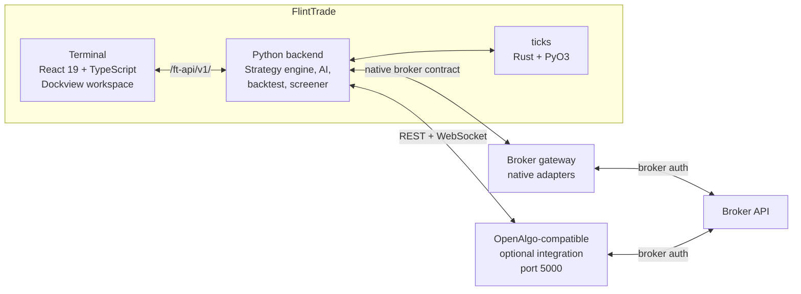

# FlintTrade

FlintTrade is an AGPL-3.0, self-hosted trading software project for local
manual, automated, algorithmic, and AI-assisted workflows. The repository is a
Python, React, TypeScript, and Rust monorepo with a Flask backend, Dockview
terminal, broker-gateway integration layer, sandbox mode, data services, and
developer documentation.

## Beta disclaimer

FlintTrade `v0.6.0-beta` is **not production ready**. It is educational,
self-hosted software for research, sandbox workflows, and contributor
development first. Nothing in this repository is financial, investment, tax,
legal, or regulatory advice. Read [disclaimer.md](disclaimer.md) before
connecting a broker or enabling Live mode.

## Project scope

- **Terminal app** — React 19, TypeScript, Dockview, Zustand, TanStack Query,
  and shadcn/ui components for a local workspace.
- **Backend services** — Python 3.12 Flask routes for auth, workspace state,
  broker-gateway orchestration, sandbox data, analytics, and automation.
- **Gateway integration** — adapter contracts, capability metadata, encrypted
  credential storage, WebSocket bridges, and optional OpenAlgo-compatible paths.
- **Safety model** — Explore, Practice, and Live modes with server-side checks,
  audit records, and a kill-switch boundary for order-capable routes.
- **Data and simulation** — DuckDB/Parquet storage, indicator packages,
  backtest services, and a Rust/PyO3 tick-processing engine.
- **Developer tooling** — Make targets, pytest/Vitest/Playwright suites,
  packaging scripts, CI notes, and package-level documentation.

## Supported brokers

FlintTrade's native broker gateway contract and routing are in beta. Broker
adapters are implemented as software integrations that require local credentials
and user-side validation before any live use. Optional OpenAlgo-compatible
integrations remain available for users who already run OpenAlgo separately;
see [docs/COMPATIBILITY.md](docs/COMPATIBILITY.md) for the current matrix.

## Quickstart (native desktop)

For normal use, install FlintTrade like any other desktop app. The installer
bundles the backend sidecar and terminal UI, creates the OS workspace on first
launch, and lets you configure native brokers or an optional OpenAlgo bridge
from Setup and Settings — no `.env` file or browser dev server required.

| OS | Packages | Architectures |
|---|---|---|
| macOS | `.dmg`, `.app` | Apple Silicon (arm64) + Intel (x64) |
| Windows | `.msi`, `.exe` (NSIS) | x64 |
| Linux | `.deb`, `.rpm`, `.AppImage` | x64 + arm64 |

Download an installer from the repository releases page, or build it yourself:

```bash
git clone https://github.com/navaneeshnagarajan/FlintTrade.git
cd FlintTrade
uv sync && uv pip install pyinstaller && pnpm install
make desktop-build
```

Install the generated package from
`packages/apps/desktop/src-tauri/target/release/bundle/`, launch FlintTrade,
and follow the welcome wizard.

> OpenAlgo is optional. Configure it from the app only if you want the
> OpenAlgo-compatible integration path; FlintTrade's native gateway and sandbox
> do not require a separate OpenAlgo process.

## Contributor development

```bash
make setup
make dev
```

The root `Makefile` is the main entry point:

- `make test` runs the Python pytest suites.
- `make lint` runs Ruff over Python packages and tests.
- `make full-check` runs a compact test, lint, and terminal typecheck pass.
- `cd packages/apps/terminal && npm run build` runs the terminal typecheck
  and Vite build.
- `cd packages/apps/terminal && npm run test` runs Vitest.

### Advanced server and Docker modes

Docker, Nginx, and systemd assets remain for contributors and advanced
self-host/server deployments. They are not the native desktop install path. In
those modes, `.env.example` is a dev/server fallback template only; in-app
Setup and Settings remain the preferred way to configure OpenAlgo for local
desktop use.

Architecture, per-OS install/uninstall, and the CI release matrix are documented
in **[docs/DESKTOP.md](docs/DESKTOP.md)**.

---

## For developers

### Architecture



FlintTrade runs its own backend, native sandbox, and broker gateway contract.
OpenAlgo remains an optional external integration for users who already rely on
its broker gateway.

### Package map

18 package surfaces — 13 Python packages, 3 applications (React terminal,
Tauri desktop shell, Next.js site), 1 shared TypeScript design-system package,
and 1 Rust/PyO3 tick engine.

| Package | Language | Purpose |
|---|---|---|
| `packages/apps/site` | Next.js + TS | Public documentation site and read-only docs MCP |
| `packages/apps/terminal` | React + TS | Single-page workspace, home widgets, routes, tools, and Dockview terminal |
| `packages/apps/desktop` | Tauri 2 (TS + Rust) | Native desktop shell — bundles the backend sidecar + terminal into one cross-OS installer (Linux/Windows/macOS) |
| `packages/core/core` | Python | Flask backend, auth, workspace, OpenAlgo-compatible client, route registration |
| `packages/core/data` | Python | Tick capture, audit log, trade logging, SQLite sandbox state, DuckDB analytics storage |
| `packages/core/design-system` | TypeScript | Shared FlintTrade tokens, brand primitives, layers, and React components |
| `packages/core/historical` | Python | OHLCV downloader, free-data sources, DuckDB/Parquet pipeline, expiry manager |
| `packages/core/indicators` | Python + Numba | TA-Lib batch indicators, Numba streaming variants, Pine conversion |
| `packages/core/ticks` | Rust + PyO3 | High-performance tick processing for tick-level backtests |
| `packages/integrations/gateway` | Python | Native broker gateway, adapter pattern, credential vault, WebSocket bridge |
| `packages/integrations/webhooks` | Python | TradingView, ChartInk, custom webhooks, visual flow builder |
| `packages/services/ai` | Python | LLM client, RAG, ML signals, sentiment, MCP bridge, advisor workflows |
| `packages/services/automation` | Python | Cron jobs, Telegram bot, OpenClaw bridge, post-market analysis |
| `packages/services/backtest` | Python | Event-driven simulator, 94 strategy templates, walk-forward optimiser |
| `packages/services/ditto` | Python | Multi-account mirroring, margin calculator, trailing stop-loss |
| `packages/services/engine` | Python | 5-layer safety system, order router, scheduler, strategy registry |
| `packages/services/journal` | Python | Trade journal, execution-quality analytics, realised P&L tracking |
| `packages/services/screener` | Python | Option chain, OI analysis, PCR, max-pain, portfolio Greeks, IV smile |

### Tech stack

| Layer | Tools |
|---|---|
| Frontend | React 19, TypeScript 5 (strict), Tailwind CSS v4, Dockview v5, shadcn/ui, Lightweight Charts v5, Glide Data Grid, Zustand 5, Jotai, TanStack Query 5 |
| Backend | Python 3.12, Flask, httpx (async), pydantic, DuckDB, structlog |
| Data | TA-Lib (batch indicators), Numba (streaming), Rust/PyO3 (tick engine), QuestDB (future) |
| AI | LM Studio (local LLM), ChromaDB (vector store), LightGBM (signals), MCP bridge |

### Three ways in

- **Try it locally** — install or build the [native desktop app](#quickstart-native-desktop) and explore in sandbox mode.
- **Build with it** — read the [Developer Guide](docs/DEVELOPER_GUIDE.md) for repo layout, adding widgets, and adding broker adapters.
- **Contribute** — see [contributing.md](contributing.md) for branch strategy, commit conventions, and good-first-issues.

---

## Project documentation

| Guide | What's inside |
|---|---|
| [User Guide](docs/USER_GUIDE.md) | Install, first connection, paper trade, workspace tour |
| [Developer Guide](docs/DEVELOPER_GUIDE.md) | Repo layout, dev setup, adding widgets and strategies |
| [Architecture](docs/ARCHITECTURE.md) | Diagrams, data flow, mode system, auth, WSGI |
| [API Reference](docs/API.md) | FlintTrade `/ft-api/v1/` endpoints plus broker/OpenAlgo-compatible bridge routes |
| [Disclaimer](disclaimer.md) | Beta-stage, no-advice, trading-risk, and user-responsibility notice |
| [Changelog](changelog.md) | Release notes by version |
| [Security](security.md) | Disclosure policy, supported versions, threat model |

## Community

- [GitHub Issues](https://github.com/navaneeshnagarajan/FlintTrade/issues) — bug reports, feature requests, and usage questions via the repository templates.
- [contributing.md](contributing.md) — how to propose changes, run tests, and open a PR.

## Independence & attribution

FlintTrade is native-first and **independently built**: its backend, native
gateway contract, safety/gating layer, and most application code are original
work — it is not a fork of another trading application. It interoperates with
[OpenAlgo](https://github.com/marketcalls/openalgo) through an optional bridge
adapter rather than bundling its source. Reference projects were studied for
inspiration; where a specific widget or module was adapted from an open-source
project it is marked in-source with an "Adapted from:" header, and its licence
and attribution are preserved in [notice](notice). Reducing the remaining
adapted surface to fully-original implementations is ongoing. See
[docs/REFERENCES.md](docs/REFERENCES.md) for the full influence notes.

## License

FlintTrade is released under [AGPL-3.0](LICENSE). If you modify and run
FlintTrade as a network service, you must publish your modified source.

## Code of Conduct

This project follows the Contributor Covenant. By participating you agree to abide by [code-of-conduct.md](code-of-conduct.md). Report unacceptable behaviour via GitHub.

## Contributing

Issues and pull requests are welcome. Please read [contributing.md](contributing.md) before opening a PR — it covers branch naming, commit conventions, testing, and the documentation expectations for every change.
