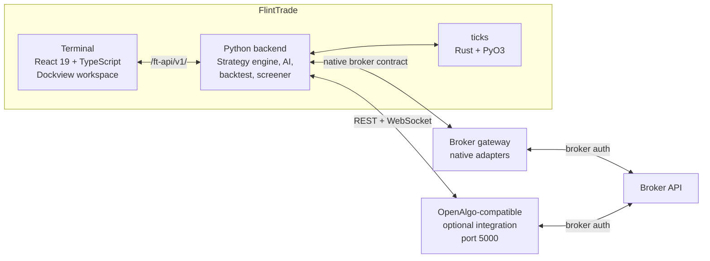

# FlintTrade

FlintTrade is an AGPL-3.0, self-hosted trading software project for local
manual, automated, algorithmic, and AI-assisted workflows. It is a **web app
first**: the FlintTrade backend serves the full terminal UI and API from a
single origin (port 5100), usable from any browser, with optional native
desktop apps as convenience wrappers around the same backend. The repository
is a Python, React, TypeScript, and Rust monorepo with a Flask backend,
Dockview terminal, broker-gateway integration layer, sandbox mode, data
services, and developer documentation.

## Beta disclaimer

FlintTrade `v0.6.0-beta.13` is **not production ready**. It is educational,
self-hosted software for research, sandbox workflows, and contributor
development first. Nothing in this repository is financial, investment, tax,
legal, or regulatory advice. Read [disclaimer.md](disclaimer.md) before
connecting a broker or enabling Live mode.

## Project scope

- **Terminal app** — React 19, TypeScript, Dockview, Zustand, TanStack Query,
  and shadcn/ui components for a local workspace.
- **Backend services** — Python 3.12 Flask routes for auth, workspace state,
  broker-gateway orchestration, sandbox data, analytics, and automation.
- **Gateway integration** — adapter contracts, capability metadata, encrypted
  credential storage, WebSocket bridges, the OpenAlgo-compatible primary bridge,
  and evidence-gated native adapter paths.
- **Safety model** — Explore, Practice, and Live modes with server-side checks,
  audit records, and a kill-switch boundary for order-capable routes.
- **Data and simulation** — DuckDB/Parquet storage, indicator packages,
  backtest services, and a Rust/PyO3 tick-processing engine.
- **Developer tooling** — Make targets, pytest/Vitest/Playwright suites,
  packaging scripts, CI notes, and package-level documentation.

## Supported brokers

FlintTrade supports the recommended OpenAlgo-compatible bridge plus a beta
native broker gateway. Native adapters are implemented as software integrations
that require local credentials and live-read evidence before they are exposed as
connectable. See [docs/COMPATIBILITY.md](docs/COMPATIBILITY.md) for the current
matrix.

## Quickstart

### Self-hosted web app (the primary path)

FlintTrade runs as a self-hosted web app: one backend process serves the
terminal UI and the API on a single origin, and you use it from any browser.

```bash
git clone https://github.com/navaneeshnagarajan/FlintTrade.git
cd FlintTrade
uv sync && pnpm install
make start        # backend + terminal UI on http://127.0.0.1:5100
```

Or run it in Docker with `make docker-up`. Either way, open the printed URL in
a browser and complete the in-app Setup flow — no `.env` file is required.

### Desktop app (Electron convenience shell)

The desktop app is a small Electron wrapper around the same backend, not a
separate product surface. On first launch it verifies pinned tools, builds an
inspectable local source checkout under `~/.flinttrade/src/FlintTrade`, starts
the source guardian, and opens the terminal only after its loopback health
check passes.

No complete, checksum-published Electron installer release exists yet. The
assets attached to `v0.6.0-beta.13` use the retired desktop packaging. Once
this branch is deployed, the
[download page](https://flinttrade.vercel.app/download) will withhold
one-command installs until all four Electron installers and `SHA256SUMS.txt`
are available together. The currently deployed beta.13 page predates that gate
and still advertises the retired install path; do not treat it as an Electron
source-bootstrap installer:

| OS | Electron installer | Architectures |
|---|---|---|
| macOS | universal `.dmg` | Apple Silicon (arm64) + Intel (x64) |
| Windows | `.exe` (NSIS, per-user) | x64; Windows 11 on ARM uses emulation |
| Linux | `.AppImage` | x64 + arm64 |

To build and verify the shell locally:

```bash
git clone https://github.com/navaneeshnagarajan/FlintTrade.git
cd FlintTrade
pnpm install --frozen-lockfile
make desktop-test
make desktop-package
```

Output lands in `packages/apps/desktop/release/electron/`. Local macOS packages
are always ad-hoc sealed; an ad-hoc seal verifies bundle integrity but is not
Developer ID trust. Distribution signing and notarisation are available only
in release CI when its complete Apple secret sets are configured. See
[docs/DESKTOP.md](docs/DESKTOP.md) for the source-bootstrap,
update, install and uninstall contracts.

> OpenAlgo is optional. Configure it from the app only if you want the
> OpenAlgo-compatible integration path; FlintTrade's native gateway and sandbox
> do not require a separate OpenAlgo process.

## Contributor development

```bash
make setup
make dev
```

The root `Makefile` is the main entry point:

- `make test` runs the Python pytest suites.
- `make lint` runs Ruff over Python packages and tests.
- `make full-check` runs a compact test, lint, and terminal typecheck pass.
- `cd packages/apps/terminal && npm run build` runs the terminal typecheck
  and Vite build.
- `cd packages/apps/terminal && npm run test` runs Vitest.

### Advanced server and Docker modes

Docker, Nginx, and systemd assets support long-running self-host/server
deployments of the web app (beyond the simple `make start`/`make docker-up`
quickstart). In those modes, `.env.example` is a dev/server fallback template
only; in-app Setup and Settings remain the preferred way to configure
OpenAlgo.

Architecture, per-OS install/uninstall, and the CI release matrix are documented
in **[docs/DESKTOP.md](docs/DESKTOP.md)**.

---

## For developers

### Architecture



FlintTrade runs its own backend, native sandbox, and broker gateway contract.
OpenAlgo remains an optional external integration for users who already rely on
its broker gateway.

### Package map

18 package surfaces — 13 Python packages, 3 applications (React terminal,
Electron desktop shell, Next.js site), 1 shared TypeScript design-system package,
and 1 Rust/PyO3 tick engine.

| Package | Language | Purpose |
|---|---|---|
| `packages/apps/site` | Next.js + TS | Public documentation site and read-only docs MCP |
| `packages/apps/terminal` | React + TS | Single-page workspace, home widgets, routes, tools, and Dockview terminal |
| `packages/apps/desktop` | Electron 40 + TypeScript | Sandboxed desktop shell; verifies tools, builds managed local source, supervises the source guardian, and loads only its selected loopback origin |
| `packages/core/core` | Python | Flask backend, auth, workspace, OpenAlgo-compatible client, route registration |
| `packages/core/data` | Python | Tick capture, audit log, trade logging, SQLite sandbox state, DuckDB analytics storage |
| `packages/core/design-system` | TypeScript | Shared FlintTrade tokens, brand primitives, layers, and React components |
| `packages/core/historical` | Python | OHLCV downloader, free-data sources, DuckDB/Parquet pipeline, expiry manager |
| `packages/core/indicators` | Python | Pure-NumPy batch indicators (110 exports), streaming classes, Pine conversion |
| `packages/core/ticks` | Rust + PyO3 | High-performance tick processing for tick-level backtests |
| `packages/integrations/gateway` | Python | Native broker gateway, adapter pattern, credential vault, WebSocket bridge |
| `packages/integrations/webhooks` | Python | TradingView, ChartInk, GoCharting, custom webhooks, visual flow builder |
| `packages/services/ai` | Python | LLM client, RAG, ML signals, sentiment, MCP bridge, advisor workflows |
| `packages/services/automation` | Python | Cron jobs, Telegram bot, post-market analysis, voice-order intent extraction |
| `packages/services/backtest` | Python | Event-driven simulator, 94 strategy templates, walk-forward optimiser |
| `packages/services/ditto` | Python | Multi-account mirroring, margin calculator, trailing stop-loss |
| `packages/services/engine` | Python | 5-layer safety system, order router, scheduler, strategy registry |
| `packages/services/journal` | Python | Trade journal, execution-quality analytics, realised P&L tracking |
| `packages/services/screener` | Python | Option chain, OI analysis, PCR, max-pain, portfolio Greeks, IV smile |

### Tech stack

| Layer | Tools |
|---|---|
| Frontend | React 19, TypeScript 5 (strict), Tailwind CSS v4, Dockview v5, shadcn/ui, Lightweight Charts v5, Glide Data Grid, Zustand 5, Jotai, TanStack Query 5 |
| Backend | Python 3.12, Flask, httpx (async), pydantic, DuckDB, structlog |
| Data | NumPy (batch indicators; optional Numba on 3 kernels), Rust/PyO3 (tick engine), QuestDB (future) |
| AI | Managed Ollama sidecar, optional ChromaDB vector store, LightGBM (signals), MCP bridge |

### Three ways in

- **Try it locally** — run the [self-hosted web app or a desktop convenience install](#quickstart) and explore in sandbox mode.
- **Build with it** — read the [Developer Guide](docs/DEVELOPER_GUIDE.md) for repo layout, adding widgets, and adding broker adapters.
- **Contribute** — see [contributing.md](contributing.md) for branch strategy, commit conventions, and good-first-issues.

---

## Project documentation

| Guide | What's inside |
|---|---|
| [User Guide](docs/USER_GUIDE.md) | Install, first connection, paper trade, workspace tour |
| [Developer Guide](docs/DEVELOPER_GUIDE.md) | Repo layout, dev setup, adding widgets and strategies |
| [Architecture](docs/ARCHITECTURE.md) | Diagrams, data flow, mode system, auth, WSGI |
| [API Reference](docs/API.md) | FlintTrade `/ft-api/v1/` endpoints plus broker/OpenAlgo-compatible bridge routes |
| [Disclaimer](disclaimer.md) | Beta-stage, no-advice, trading-risk, and user-responsibility notice |
| [Changelog](changelog.md) | Release notes by version |
| [Security](security.md) | Disclosure policy, supported versions, threat model |

## Community

- [GitHub Issues](https://github.com/navaneeshnagarajan/FlintTrade/issues) — bug reports, feature requests, and usage questions via the repository templates.
- [contributing.md](contributing.md) — how to propose changes, run tests, and open a PR.

## Independence & attribution

FlintTrade is native-first and **independently built**: its backend, native
gateway contract, safety/gating layer, and most application code are original
work — it is not a fork of another trading application. It interoperates with
[OpenAlgo](https://github.com/marketcalls/openalgo) through an optional bridge
adapter rather than bundling its source. Reference projects were studied for
inspiration; where a specific widget or module was adapted from an open-source
project it is marked in-source with an "Adapted from:" header, and its licence
and attribution are preserved in [notice](notice). Reducing the remaining
adapted surface to fully-original implementations is ongoing. See
[docs/REFERENCES.md](docs/REFERENCES.md) for the full influence notes.

## License

FlintTrade is released under [AGPL-3.0](LICENSE). If you modify and run
FlintTrade as a network service, you must publish your modified source.

## Code of Conduct

This project follows the Contributor Covenant. By participating you agree to abide by [code-of-conduct.md](code-of-conduct.md). Report unacceptable behaviour via GitHub.

## Contributing

Issues and pull requests are welcome. Please read [contributing.md](contributing.md) before opening a PR — it covers branch naming, commit conventions, testing, and the documentation expectations for every change.
